# Informe CyberOps — Práctica CyberChef

📺 **Video:** [https://youtu.be/RQ0RHVz_pC0](https://youtu.be/RQ0RHVz_pC0)

---

## 1. Introducción y Metodología

Este reporte documenta el análisis de una aplicación distribuida como ejecutable Windows (`WinFormsApp1.exe`) junto a su biblioteca de enlace dinámico (`.dll`), desarrollada como parte de la práctica **CyberOps**. El objetivo principal fue descubrir funcionalidades ocultas relacionadas con comunicaciones de red, servicios locales, codificaciones (encodings) y un mecanismo de validación de contraseña, aplicando técnicas de ingeniería inversa, análisis de tráfico y enumeración de servicios.

### Herramientas utilizadas

| Herramienta | Uso |
|---|---|
| **TCPView** | Identificación inicial de puertos activos y conexiones en tiempo real |
| **Strings.exe** | Extracción de cadenas de texto legibles dentro del binario |
| **dnSpy** | Análisis, descompilación y revisión del código fuente de la DLL |
| **Wireshark** | Captura y análisis del tráfico de red generado por la aplicación |
| **Telnet (Cliente de Windows)** | Interacción directa con el servicio local de pistas |
| **CyberChef** | Análisis y decodificación de la contraseña secreta |

---

## 2. Desarrollo — Paso a Paso

### Paso 1: El programa inicia y carga la DLL

El archivo ejecutable `WinFormsApp1.exe` inicia, carga su librería DLL asociada e inicializa en memoria las funciones internas junto con los fragmentos codificados de la contraseña.

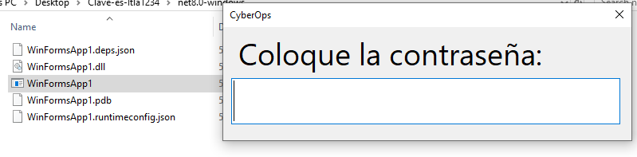

### Paso 2: Abre el puerto 50173

La aplicación abre un socket TCP en el puerto local 50173 para escuchar conexiones entrantes.


### Paso 3: Wireshark — Descubrimiento de la conexión con GitHub

Mediante Wireshark se capturó el tráfico generado por la aplicación durante su ejecución. Se identificó la resolución DNS de `raw.githubusercontent.com`, confirmando que el programa establece una conexión con GitHub para descargar el archivo de validación remota.

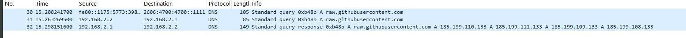

### Paso 4: Activación del Telnet y conexión al Hint Server

Para interactuar con el servicio local en el puerto 50173, se activó el cliente Telnet en Windows (**Panel de Control → Activar o desactivar características de Windows → Telnet Client**) y se ejecutó `telnet 127.0.0.1 50173`, obteniendo 9 pistas del **CyberOps Lab Hint Server**.

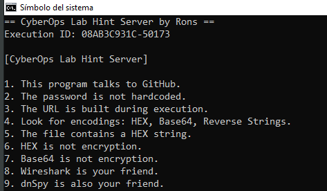

### Paso 5: Construye la URL en memoria

Con `strings.exe` se localizó el repositorio base (`https://raw.githubusercontent.com/JonathanERC/ScriptsPOC/`) y el nombre del archivo objetivo (`rons_sr.txt`). El programa genera la URL completa dinámicamente en memoria, sin almacenarla de forma estática en el binario.

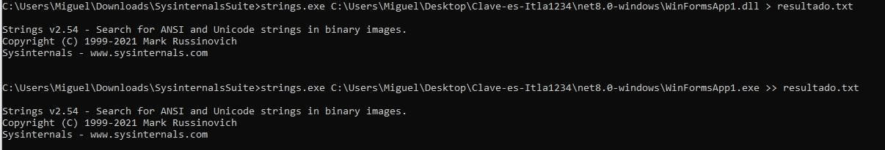

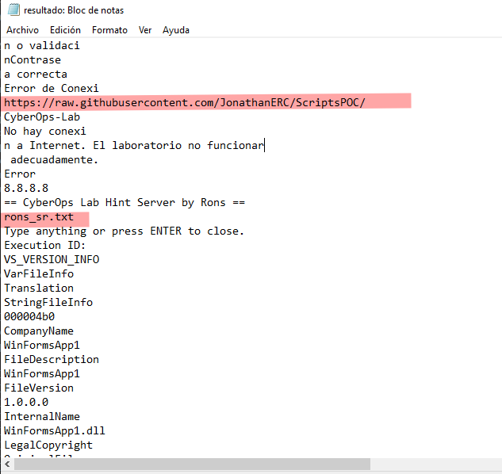

### Paso 6: Encodings encontrados y su utilización

En dnSpy se identificaron cuatro tipos de encoding aplicados sobre los fragmentos de la contraseña, cada uno en una función distinta de la DLL (`A435`, `A853`, `A904`, `A504`, `A672`).

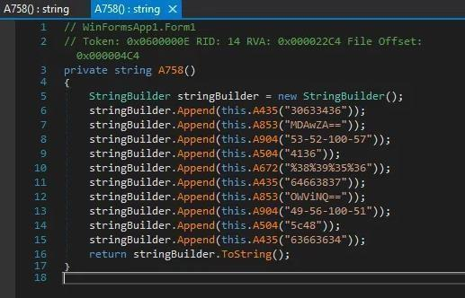

### Paso 7: Decodifica los fragmentos en CyberChef

Cada fragmento se decodificó en CyberChef con el método correspondiente: **From Hex**, **From Base64**, **From Decimal**, **Reverse** y **URL Decode**.

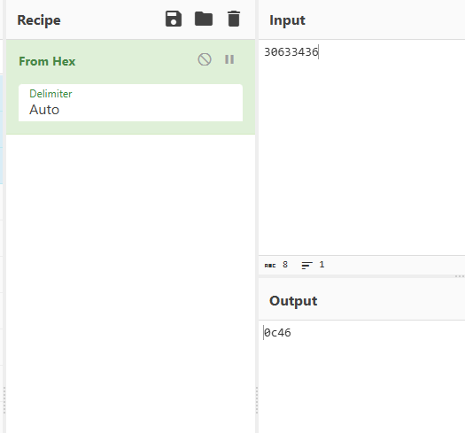
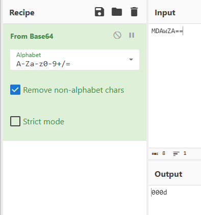
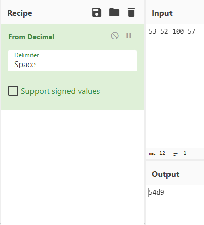
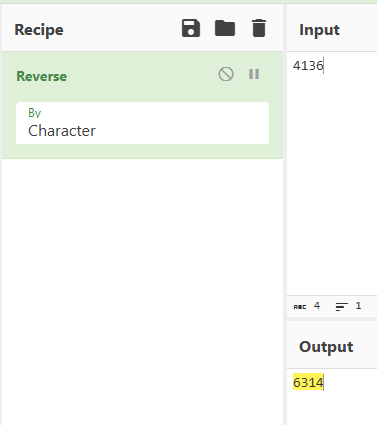
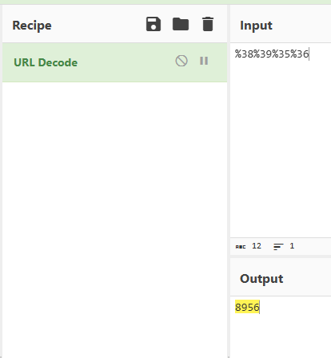
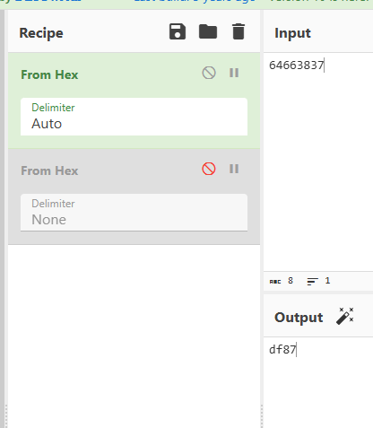
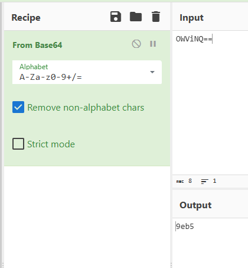
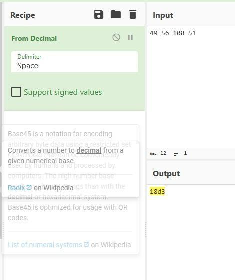
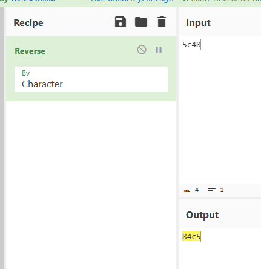
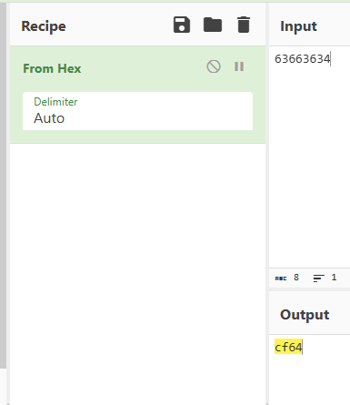

#### Tabla de decodificación

| Función | Valor Codificado | Método (CyberChef) | Resultado |
|---|---|---|---|
| A435 | `30633436` | From Hex | `0c46` |
| A853 | `MDAwZA==` | From Base64 | `000d` |
| A904 | `53-52-100-57` | From Decimal | `54d9` |
| A504 | `4136` | Reverse | `6314` |
| A672 | `%38%39%35%36` | URL Decode | `8956` |
| A435 | `64663837` | From Hex | `df87` |
| A853 | `OWViNQ==` | From Base64 | `9eb5` |
| A904 | `49-56-100-51` | From Decimal | `18d3` |
| A504 | `5c48` | Reverse | `84c5` |
| A435 | `63663634` | From Hex | `cf64` |

**Todo unido:** `0c46000d54d963148956df879eb518d384c5cf64`

### Paso 8: Concatena el hash y reconstruye la URL

La función `A758` ensambla todos los resultados parciales en el orden estricto establecido por el código, formando la URL completa:

```
https://raw.githubusercontent.com/JonathanERC/ScriptsPOC/0c46000d54d963148956df879eb518d384c5cf64/rons_sr.txt
```

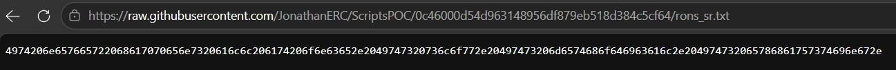

### Paso 9: Valida la contraseña

El archivo `rons_sr.txt` mostró un texto en formato hexadecimal. Decodificado en CyberChef con **From Hex**, reveló la contraseña en texto plano:

> *"It never happens all at once. Its slow. Its methodical. Its exhausting."*

Al ingresar esta contraseña en la aplicación, el sistema confirmó el acceso con el mensaje **"Contraseña correcta"**.

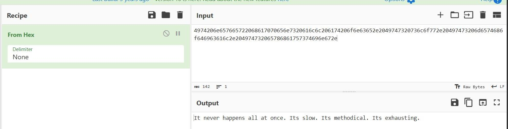

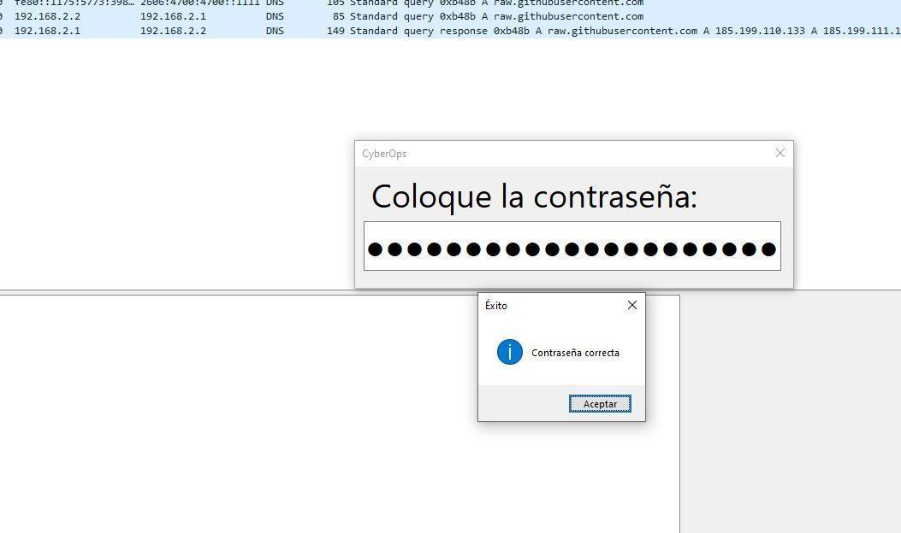

---

## 3. Flujo resumido del programa

1. **Inicio del programa:** `WinFormsApp1.exe` inicia, carga la DLL e inicializa los fragmentos codificados de la contraseña.
2. **Apertura del servicio de pistas:** socket TCP en el puerto local 50173, activando el CyberOps Lab Hint Server.
3. **Construcción dinámica de la URL:** se genera en memoria la dirección hacia GitHub, sin almacenarla de forma estática.
4. **Conexión hacia GitHub:** comunicación hacia el servidor remoto para descargar el archivo de referencia.
5. **Decodificación interna:** las funciones de la DLL procesan los fragmentos con operaciones inversas de HEX, Base64, Decimal y URL Encode.
6. **Concatenación:** la función `A758` ensambla los resultados parciales en el orden correcto.
7. **Validación:** se compara la contraseña generada internamente contra el valor obtenido desde GitHub.

---

## 4. Conclusiones

El análisis reveló un mecanismo de validación que conecta con GitHub, usa un servidor de pistas por Telnet y divide la contraseña en fragmentos codificados en HEX, Base64, Decimal y URL Encode.

La práctica demostró que combinar herramientas de ingeniería inversa y análisis de red — dnSpy, TCPView, Wireshark y Telnet — es fundamental para auditar software. Como conclusión de seguridad, se evidenció el riesgo de dejar credenciales expuestas dentro del código fuente de un binario sin protección.

---

## 5. Referencias

- GCHQ. (2024). *CyberChef – The cyber swiss army knife* [Software]. GitHub. https://github.com/gchq/CyberChef
- Graylin, J. (2023). *dnSpy documentation* [Software]. GitHub. https://github.com/dnSpy/dnSpy
- Microsoft. (2024). *Strings v2.54*. Sysinternals. https://learn.microsoft.com/en-us/sysinternals/downloads/strings
- Microsoft. (2024). *TCPView v4.19*. Sysinternals. https://learn.microsoft.com/en-us/sysinternals/downloads/tcpview
- Microsoft. (2024). *Telnet client*. Microsoft Documentation. https://learn.microsoft.com/en-us/windows-server/administration/windows-commands/telnet
- Wireshark Foundation. (2024). *Wireshark user's guide*. https://www.wireshark.org/docs/wsug_html/
