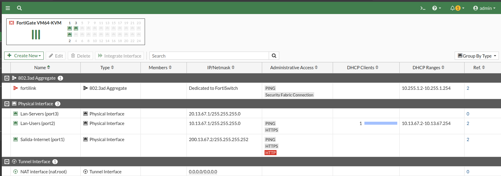
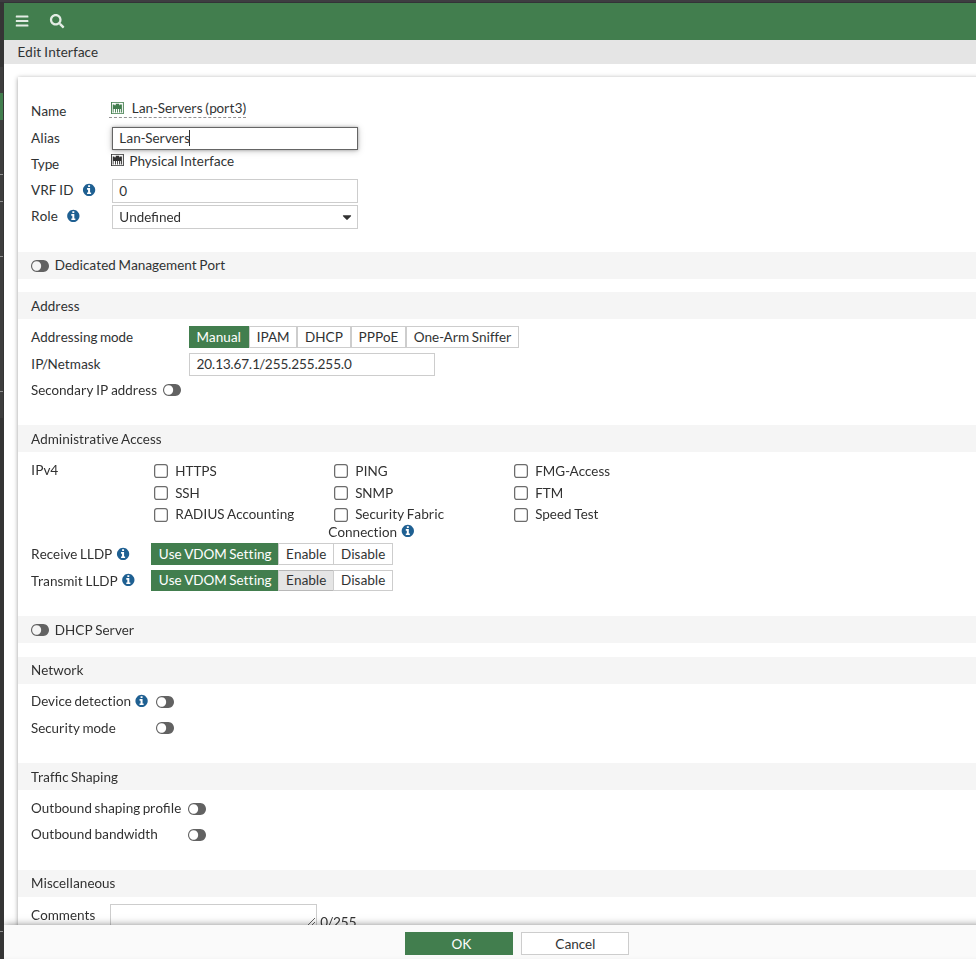
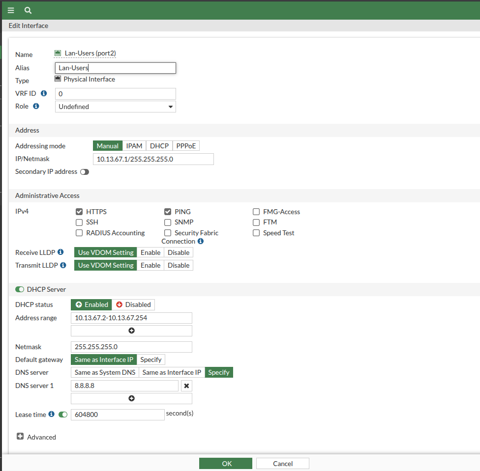
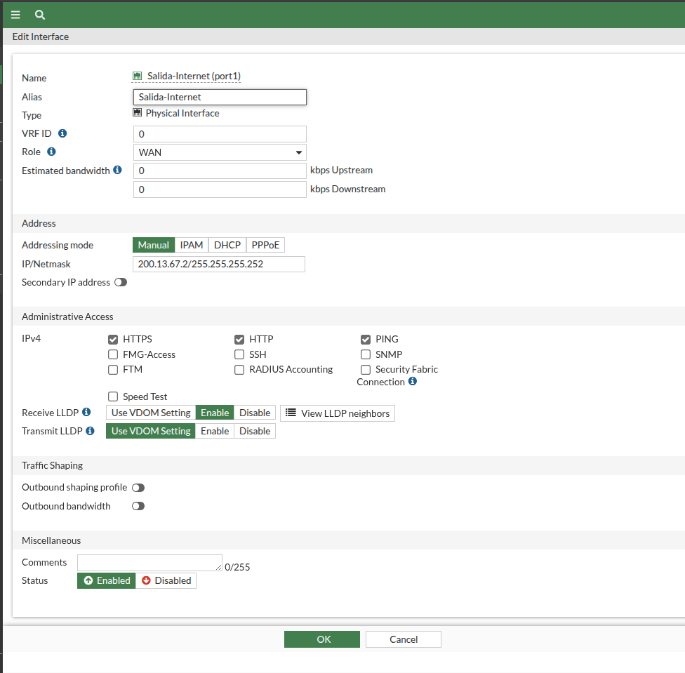
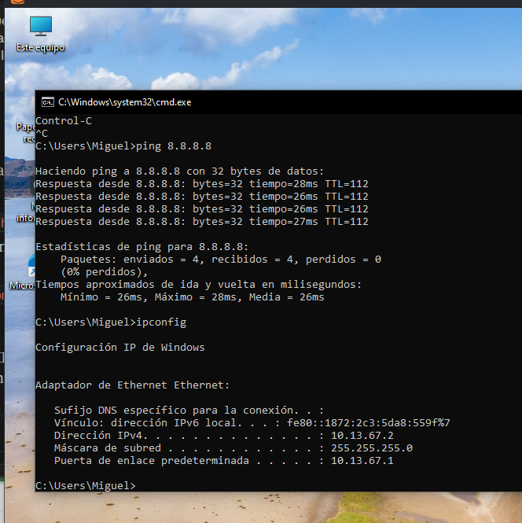
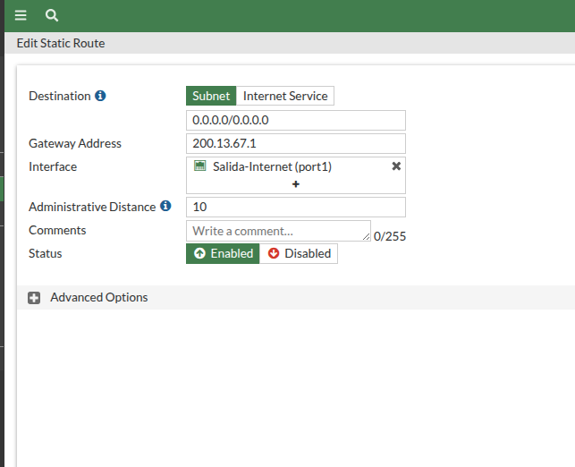
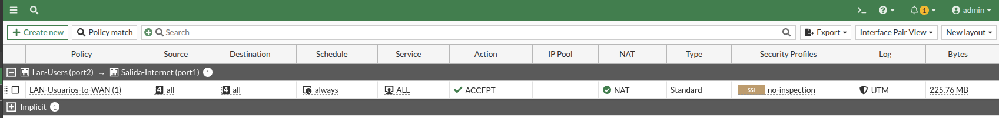
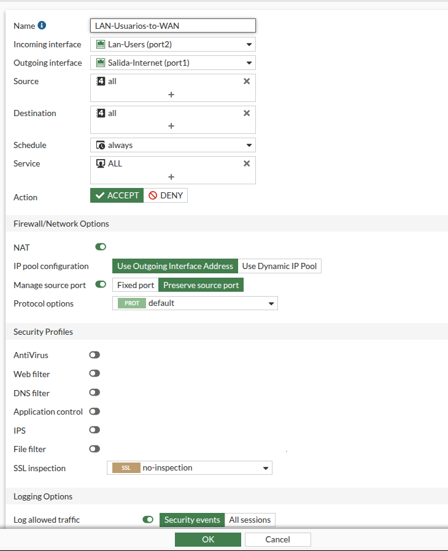
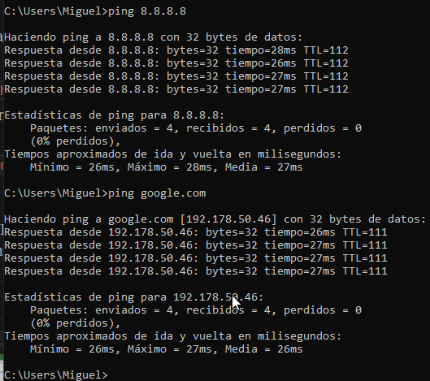

# 🌐 Acceso a Internet — Demostración

## Topología

## IP en interfaces

Resumen de interfaces con las IPs aplicadas en Port1, Port2 y Port3.

IP aplicada en Lan-Servers (port3): 20.13.67.1/24.

IP aplicada en Lan-Users (port2): 10.13.67.1/24.

IP aplicada en Salida-Internet (port1): 200.13.67.2/30.

## DHCP en LAN de usuarios

DHCP habilitado en port2, rango 10.13.67.2 - 10.13.67.254.

Cliente Windows recibe IP por DHCP correctamente.

## Ruta por defecto

Ruta estática 0.0.0.0/0 aplicada por port1 hacia el gateway 200.13.67.1.

## NAT

Política de NAT activa entre LAN de usuarios y salida a Internet.

Detalle de la política con NAT habilitado (Use Outgoing Interface Address).

## Conectividad a Internet

Ping exitoso desde el cliente hacia 8.8.8.8 y google.com, confirmando salida a Internet.

