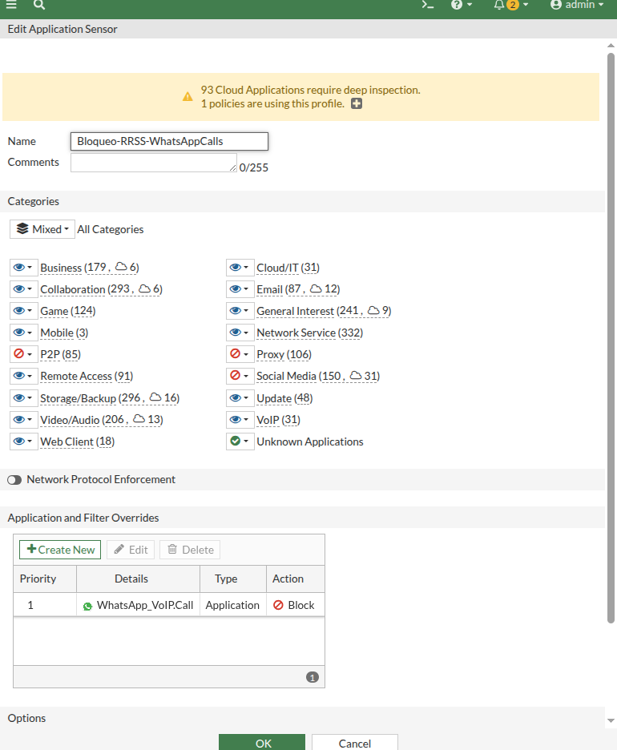
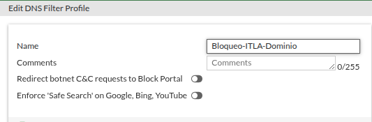
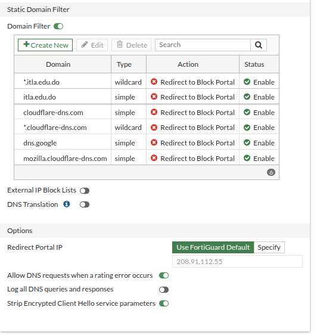
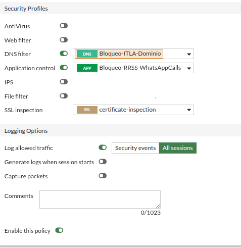
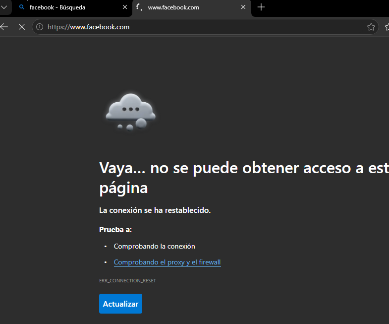
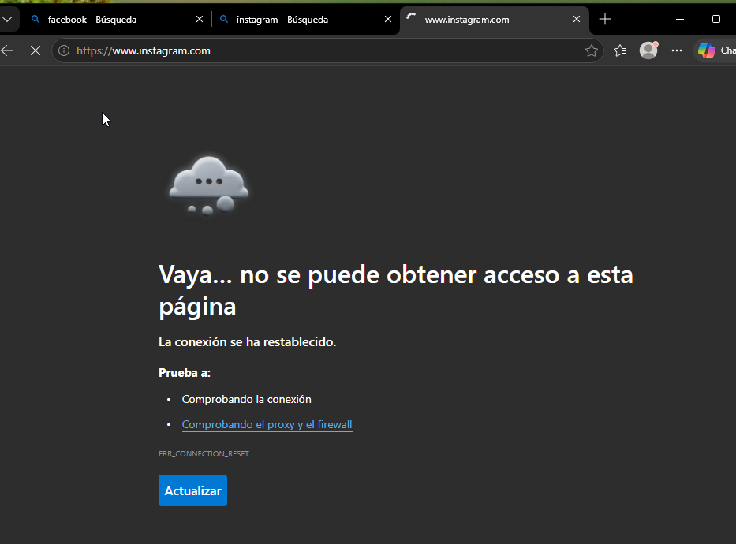
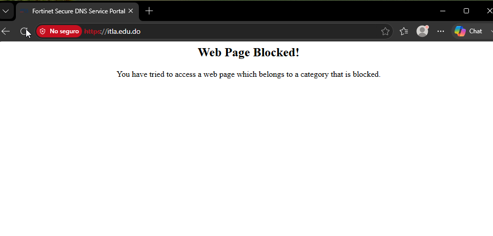
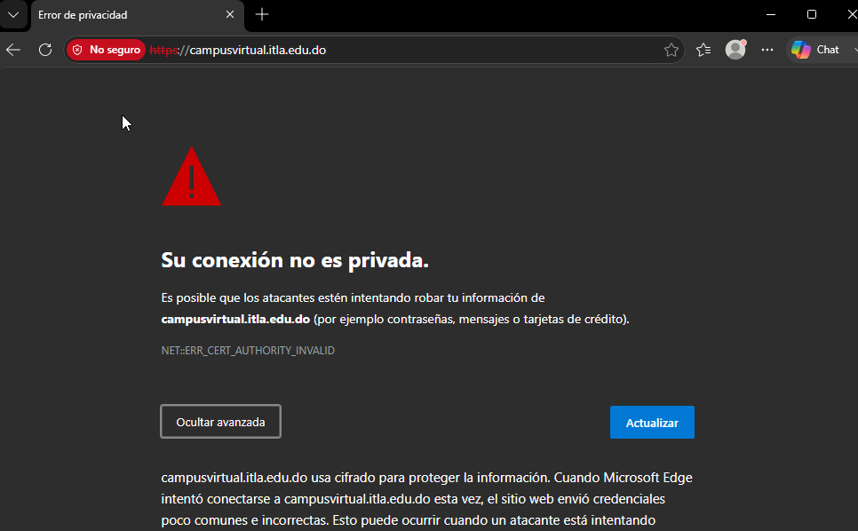
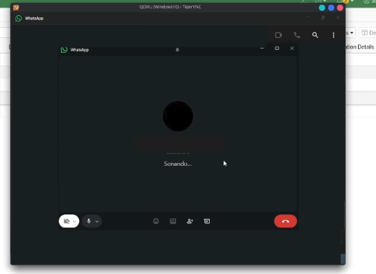
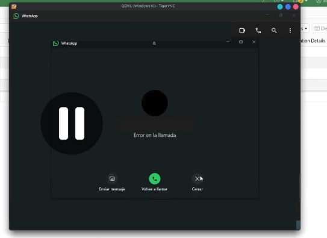

# 🚫 Bloqueo de Redes Sociales, WhatsApp e ITLA — Demostración

## Application Control

Perfil `Bloqueo-RRSS-WhatsAppCalls`: Social Media en Block, y override de `WhatsApp_VoIP.Call` en Block.

## DNS Filter

Perfil `Bloqueo-ITLA-Dominio`.

Tabla completa: `itla.edu.do`, `*.itla.edu.do`, y los proveedores de DNS-over-HTTPS bloqueados para forzar el uso del DNS del FortiGate.

## Política de salida

`LAN-Usuarios-to-WAN` con los tres perfiles aplicados: DNS filter, Application control y SSL inspection (certificate-inspection).

## Redes sociales bloqueadas

Facebook bloqueado por Application Control (`ERR_CONNECTION_RESET`).

Instagram bloqueado por Application Control.

## Dominio ITLA bloqueado

`itla.edu.do` bloqueado por el DNS Filter, mostrando el portal de bloqueo.

Subdominio `campusvirtual.itla.edu.do` también bloqueado (la conexión nunca llega al sitio real).

## Llamadas de WhatsApp bloqueadas

Intento de llamada de voz en WhatsApp.

La llamada falla, confirmando el bloqueo de `WhatsApp_VoIP.Call`, mientras la mensajería sigue funcionando.

