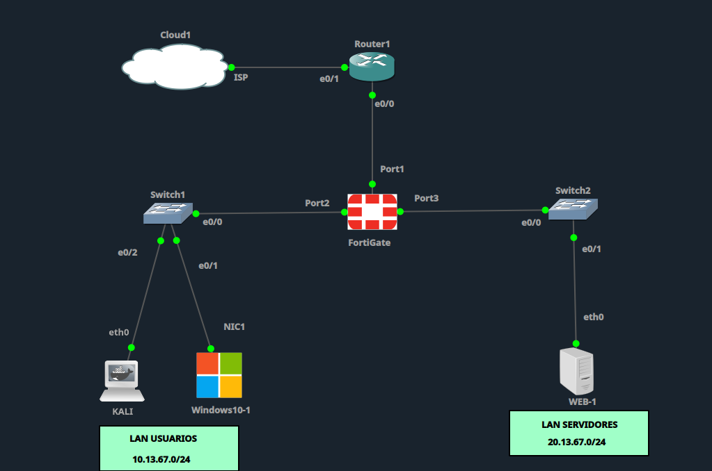
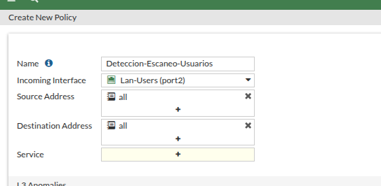
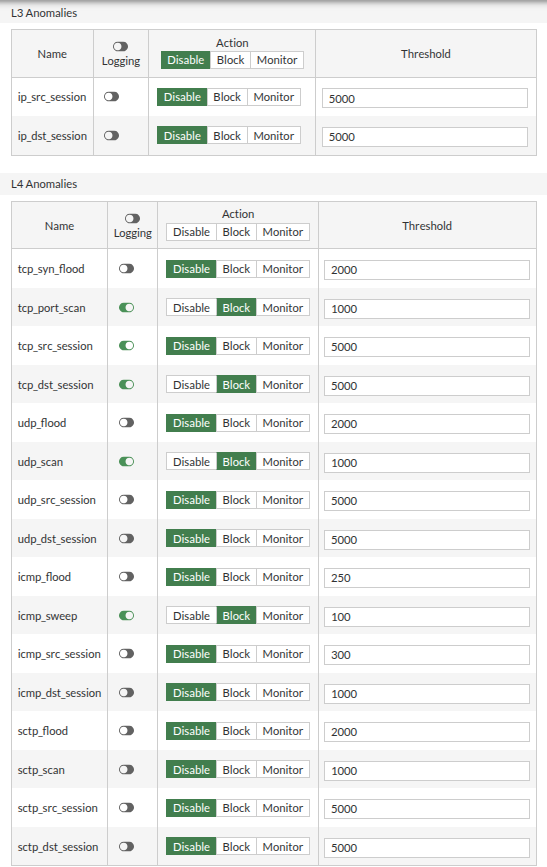
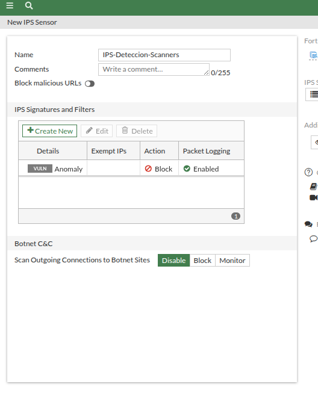
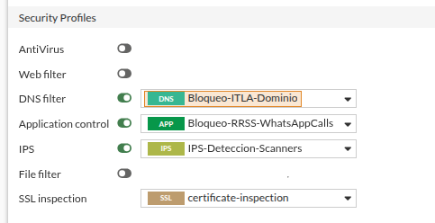
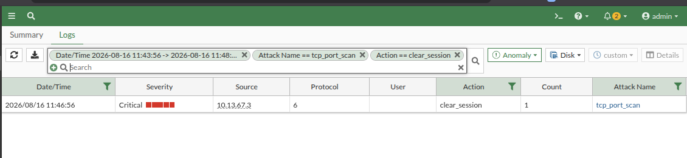
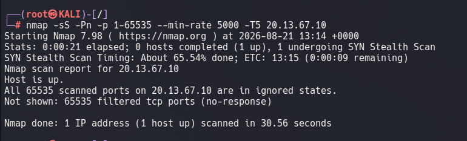

# 🛡️ Detección y Bloqueo de Escáneres de Red — Demostración

## Topología

Kali agregado a la LAN de Usuarios como origen del escaneo.

## DoS Policy

Nombre e interfaz de entrada configurados.

Anomalías activas: `tcp_port_scan` (threshold 3), `tcp_src_session`, `tcp_dst_session`, `udp_scan`, `icmp_sweep`, todas en Block con logging.

## IPS Sensor

Filtro por Vulnerability Type `Anomaly` aplicado con Action Block y Quarantine sobre el atacante.

Perfil IPS asignado a la política `LAN-Usuarios-to-WAN`.

## Detección confirmada

Evento `tcp_port_scan` capturado en Security Events, severidad Critical, origen Kali (10.13.67.3).

## Bloqueo total por Quarantine

Con la IP de Kali en cuarentena, un nuevo escaneo contra cualquier destino queda completamente filtrado, no solo la sesión que disparó la alerta.

