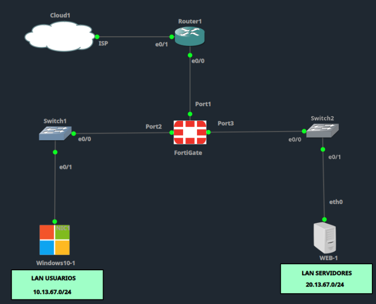

# Laboratorios de Seguridad de Redes

Repositorio de prácticas de laboratorio de la materia **Seguridad de Redes**, realizadas sobre una topología simulada en GNS3/EVE-NG con **FortiGate**, **Cisco**, **Windows Server** y clientes Windows/Kali.

## Topología base del laboratorio

| Segmento | Red |
|---|---|
| WAN Router1 – FortiGate (Port1) | `200.13.67.0/30` |
| LAN Usuarios (Port2 → Switch1: Windows10-1) | `10.13.67.0/24` |
| LAN Servidores (Port3 → Switch2: WEB-1) | `20.13.67.0/24` |

## Prácticas realizadas

| Carpeta | Descripción |
|---|---|
| [`AccesoInternet-LAN-DHCP-NAT`](./AccesoInternet-LAN-DHCP-NAT) | Configuración de acceso a Internet: NAT, DHCP y ruta estática/por defecto desde la LAN hacia el ISP. |
| [`RestriccionHTTP-LAN-DNS`](./RestriccionHTTP-LAN-DNS) | Restricción de tráfico entre LANs a solo HTTP, con resolución mediante DNS local. |
| [`Bloqueo-RRSS-WhatsApp-ITLA`](./Bloqueo-RRSS-WhatsApp-ITLA) | Bloqueo de redes sociales, llamadas de WhatsApp y del dominio `itla.edu.do`. |
| [`Deteccion-Bloqueo-Escaneres`](./Deteccion-Bloqueo-Escaneres) | Detección y bloqueo de escáneres de red mediante DoS Policy e IPS con Quarantine. |
| [`WAF-ProteccionWeb-SQLi-XSS`](./WAF-ProteccionWeb-SQLi-XSS) | Protección de aplicaciones web contra ataques SQL Injection y XSS mediante WAF. |

Cada carpeta contiene:

- Una guía `.md` con badges (autor, matrícula, docente, materia, estado) y, para cada sección, primero los pasos por **GUI** y luego el equivalente en **CLI**.
- Un ZIP de evidencia con un `README.md` corto y una carpeta `images/` con las capturas (topología → configuración paso a paso → pruebas de conectividad/verificación).

## Herramientas utilizadas

- FortiGate (firewall / políticas de seguridad)
- Cisco IOS (routers y switches)
- Windows Server (Active Directory, roles de red)
- GNS3 / EVE-NG (simulación de topología)
