# 🔒 Restricción HTTP (Usuarios → Servidores) + DNS Local — Demostración

## Topología

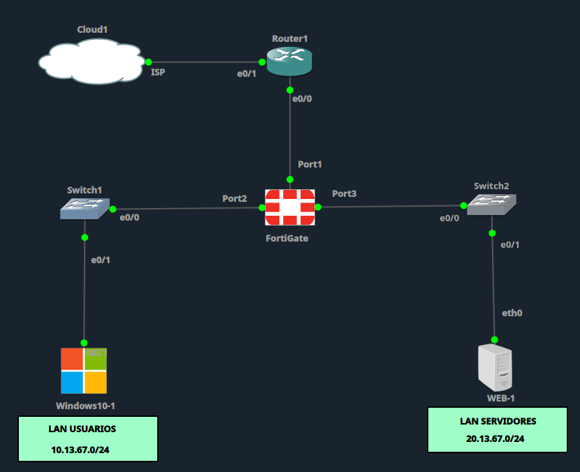

## Políticas de firewall

Lista de políticas: `Usuarios-to-Servidores-HTTP` (ACCEPT, sin NAT) por encima de `Usuarios-to-Servidores-DENY` (DENY).

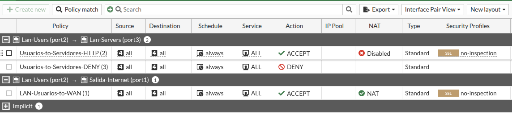

Detalle de la política HTTP, con Service limitado a `HTTP` únicamente.

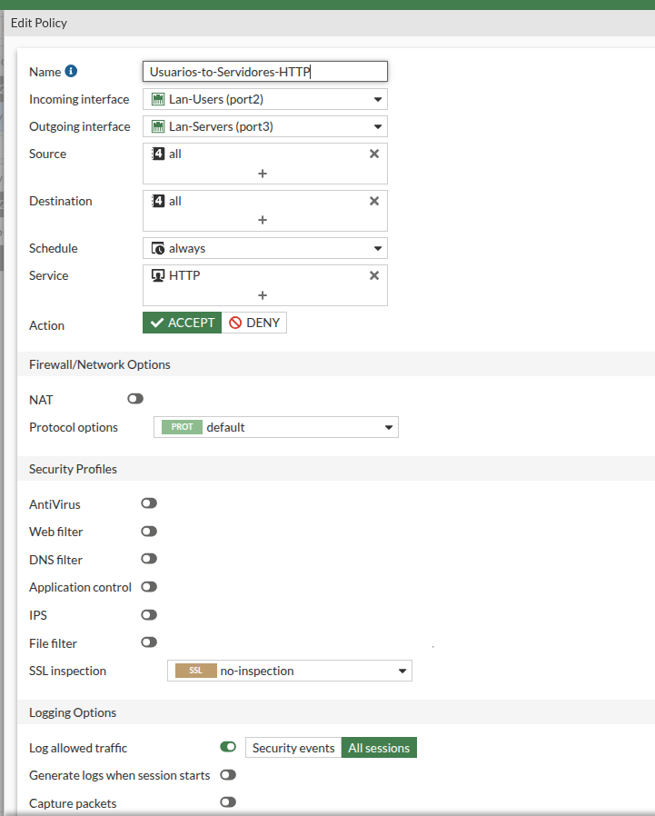

Detalle de la política DENY, bloqueando todo lo demás entre las dos LAN.

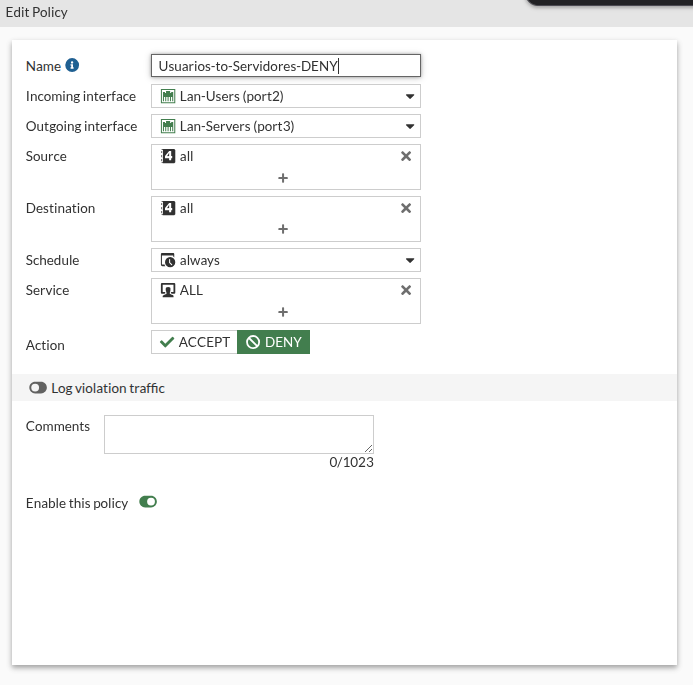

## DNS local

DNS Service on Interface en modo Recursive sobre port2, y DNS Database con la zona `miguel.edu.do` creada.

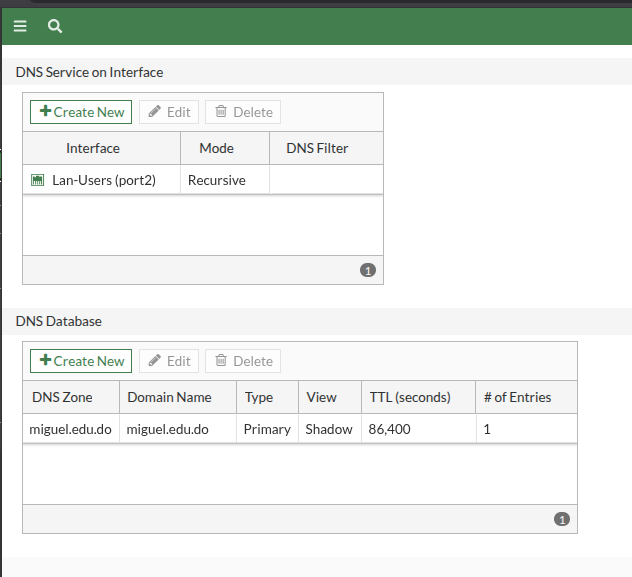

Detalle de la zona DNS `miguel.edu.do`.

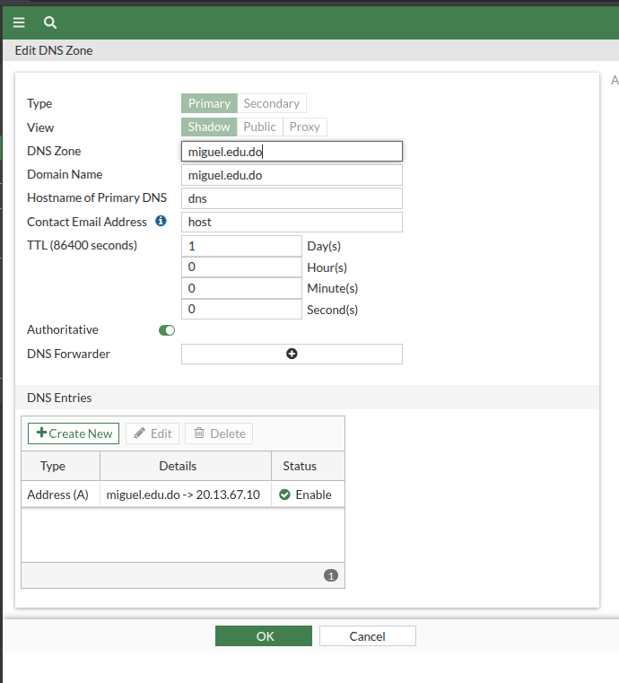

Registro A: `miguel.edu.do` → `20.13.67.10`.

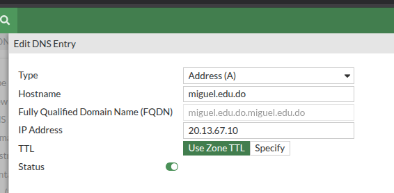

DHCP de port2 con el FortiGate (10.13.67.1) como DNS server 1.

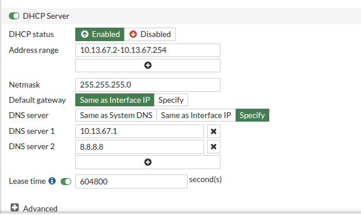

## Verificación desde el cliente

`nslookup miguel.edu.do` resolviendo correctamente a `20.13.67.10`.

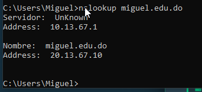

Ping bloqueado hacia el servidor — 100% de paquetes perdidos.

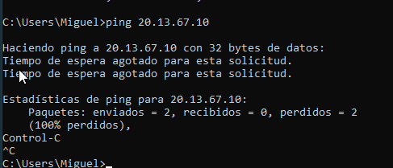

Acceso HTTP permitido a `http://miguel.edu.do`.

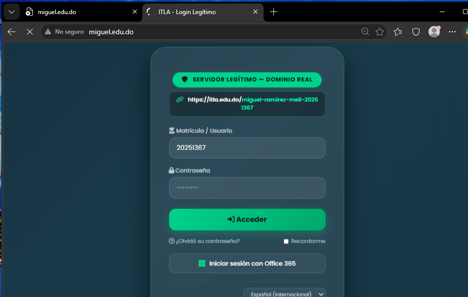

Acceso HTTPS bloqueado a `https://miguel.edu.do`.

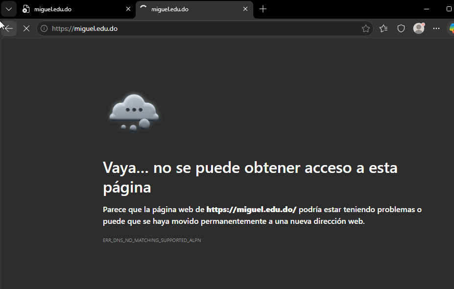

## Logs de Forward Traffic

Sesión de ping bloqueada por la política DENY.

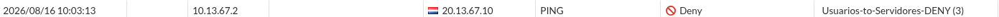

Sesión HTTPS bloqueada por la política DENY.

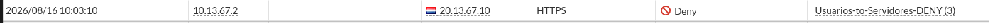
