# Evidencia — WAF en Servidor Web (WEB-1)

Evidencia fotográfica de la práctica: aplicación de un perfil **Web Application Firewall** sobre la política `Usuarios-to-Servidores-HTTP` en FortiGate, protegiendo a **WEB-1** (`20.13.67.10`) contra SQL Injection y Cross Site Scripting.

## images/

**1. Topología**

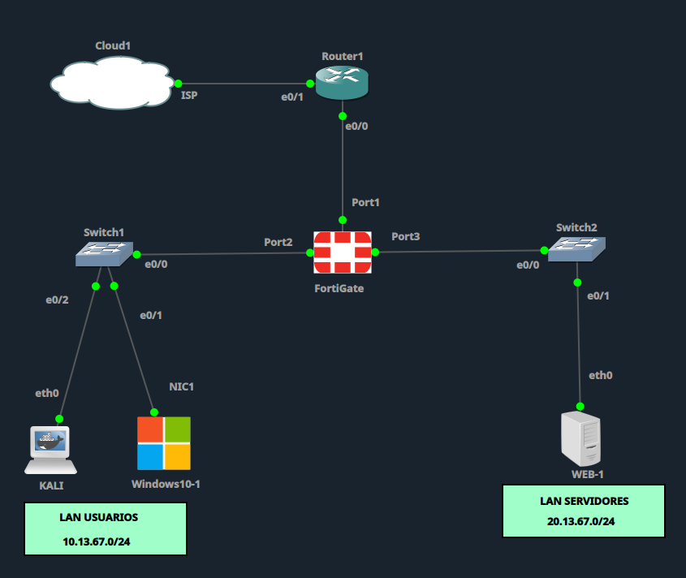

`01-topologia.png` — Topología base del laboratorio en GNS3: Cloud1–Router1–FortiGate–Switch1(Kali+Win10)–Switch2(WEB-1).

**2. Interfaces del FortiGate**

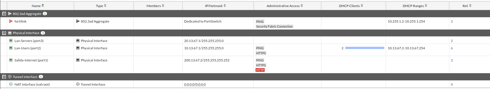

`02-interfaces-lan-wan.png` — Interfaces configuradas: Lan-Users (port2), Lan-Servers (port3) y Salida-Internet (port1).

**3. Políticas antes de aplicar WAF**

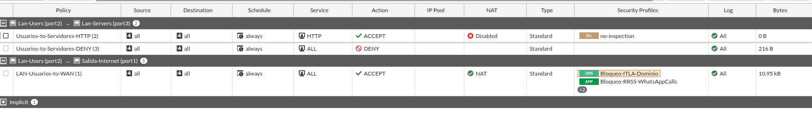

`03-politicas-firewall-antes.png` — Estado inicial de las políticas de firewall, previo a la configuración del WAF.

**4. Feature Visibility bloqueada**

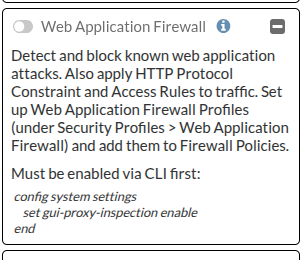

`04-feature-visibility-bloqueada.png` — El toggle de Web Application Firewall aparece bloqueado porque el firewall aún está en modo Flow-based.

**5. Habilitando modo Proxy por CLI**

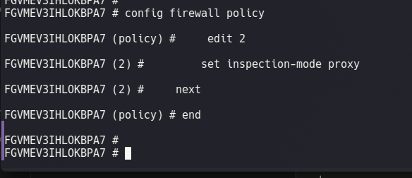

`05-cli-gui-proxy-inspection.png` — Comandos `set gui-proxy-inspection enable` e `inspection-mode proxy` aplicados sobre la política.

**6. Feature Visibility habilitada**

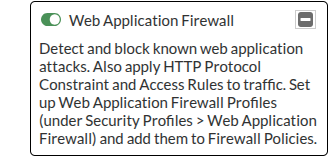

`06-feature-visibility-habilitada.png` — Toggle de Web Application Firewall ya activo tras el cambio a modo Proxy-based.

**7. Perfil WAF — Signatures**

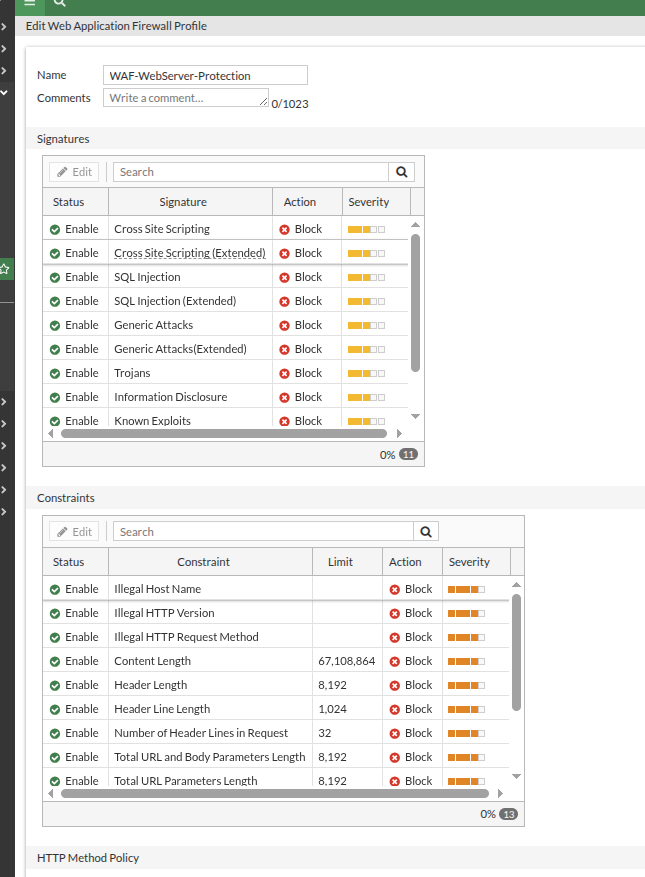

`07-perfil-waf-signatures-100.png` — Perfil `WAF-WebServer-Protection` con Signatures al 100%: SQL Injection, XSS, Generic Attacks, Trojans y Known Exploits en Block.

**8. Perfil WAF — Constraints**

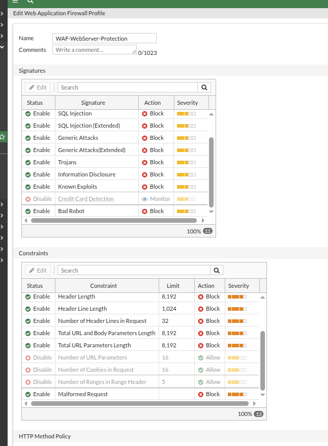

`08-perfil-waf-constraints-100.png` — Constraints al 100%: límites de Header, URL, Método y longitud de petición, todos en Block.

**9. Política con WAF aplicado**

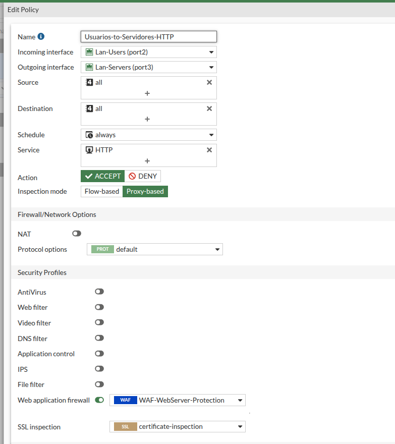

`09-politica-waf-aplicada.png` — Política `Usuarios-to-Servidores-HTTP` en modo Proxy-based con el perfil `WAF-WebServer-Protection` asignado.

**10. Bloqueo desde Kali (navegador)**

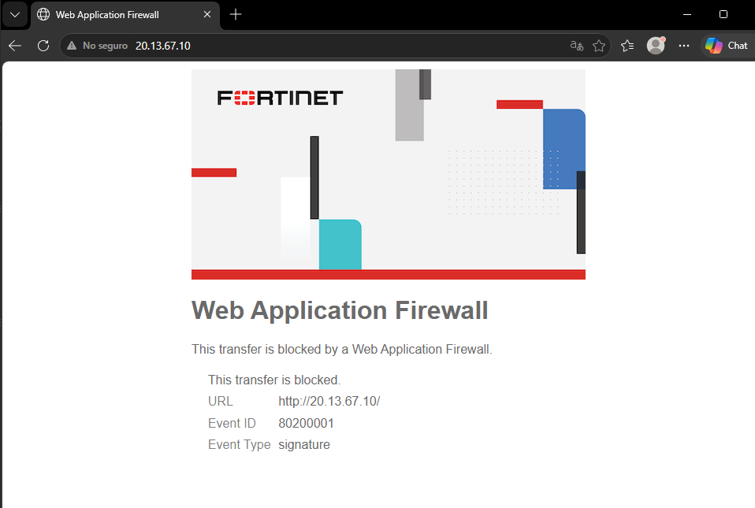

`10-prueba-bloqueo-navegador.png` — Página de bloqueo del WAF mostrada al intentar acceder a WEB-1 desde Kali.

**11. Acceso legítimo desde Windows10-1**

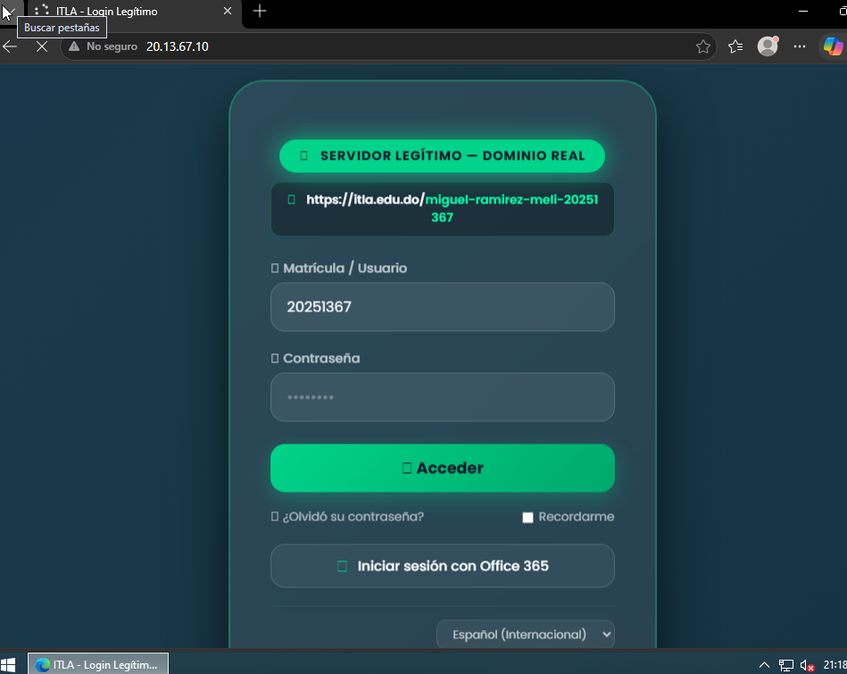

`11-navegador-legitimo-carga-ok.png` — El mismo sitio carga con normalidad desde un navegador legítimo en Windows10-1, confirmando que el WAF no afecta tráfico normal.

**12. Resumen de Security Events**

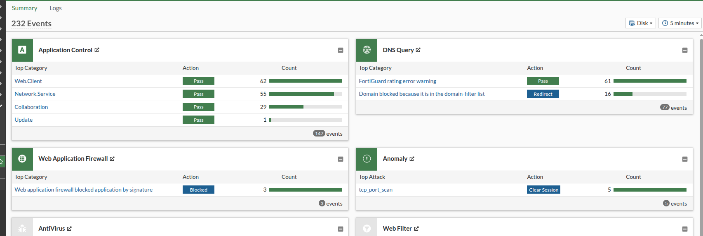

`12-logs-waf-resumen.png` — Panel resumen de Security Events mostrando los eventos bloqueados por el módulo Web Application Firewall.

**13. Detalle de log — Bad Robot**

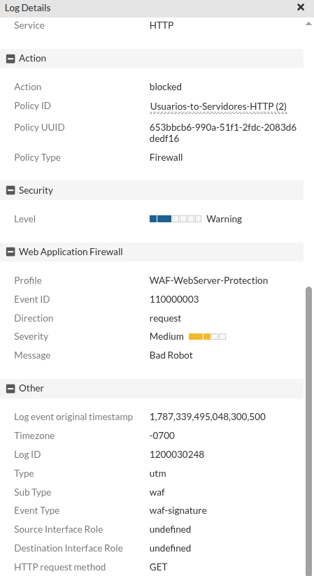

`13-log-detalle-bad-robot.png` — Detalle de un evento bloqueado por la firma "Bad Robot", disparada por el uso de curl como herramienta automatizada.

**14. Pruebas curl iniciales**

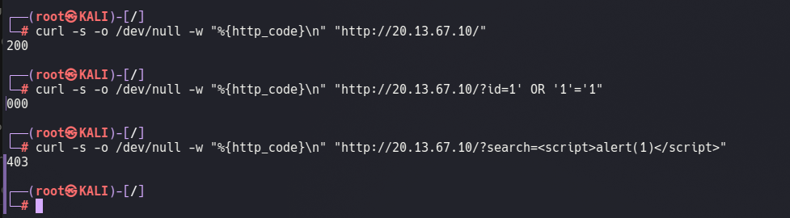

`14-curl-pruebas-iniciales.png` — Resultados: tráfico limpio (200), intento de SQLi sin codificar URL (000) y XSS bloqueado (403).

**15. SQLi codificado, bloqueado**

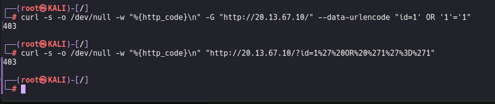

`15-curl-sqli-encoded-bloqueado.png` — Con la URL correctamente codificada, el intento de SQL Injection es bloqueado (403).

**16. Detalle de log — XSS**

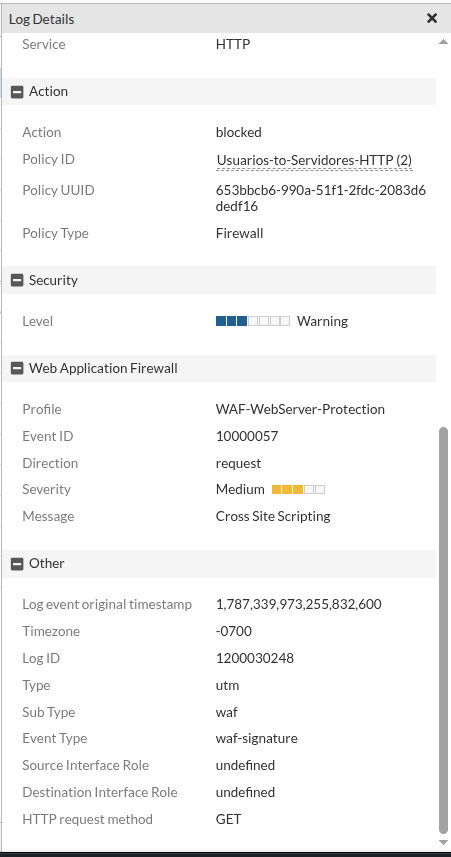

`16-log-detalle-xss.png` — Detalle del evento de bloqueo, firma "Cross Site Scripting", política `Usuarios-to-Servidores-HTTP`.

**17. Detalle de log — SQL Injection**

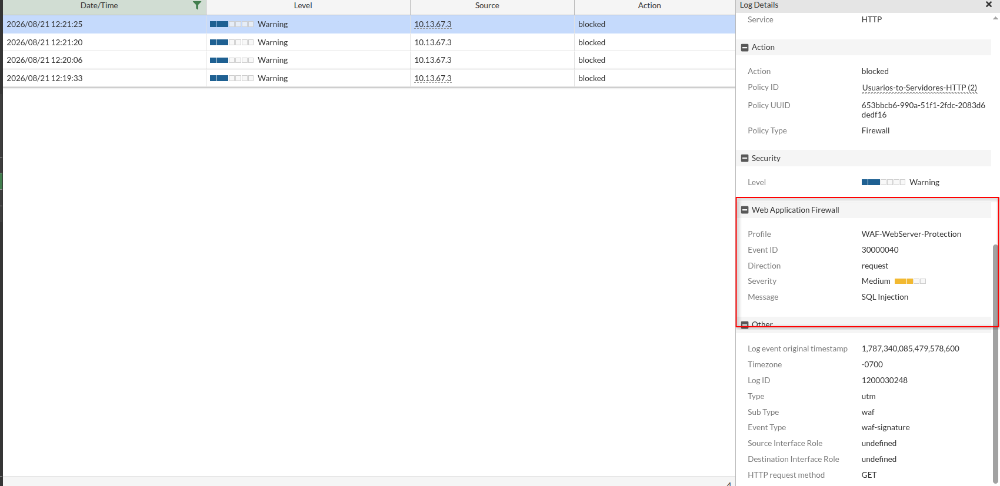

`17-log-detalle-sqli.png` — Detalle del evento de bloqueo, firma "SQL Injection", confirmando la detección del payload.

---

# Resultado final

| Prueba | Resultado | Firma / Evento |
|---|---|---|
| Navegador legítimo (Windows10-1) | ✅ 200 OK | — |
| curl sin payload | ✅ 200 OK | — |
| SQL Injection (`' OR '1'='1`) | ⛔ 403 Bloqueado | SQL Injection |
| XSS (``) | ⛔ 403 Bloqueado | Cross Site Scripting |

El WAF protege activamente a WEB-1 contra SQL Injection y XSS sin afectar el tráfico legítimo de usuarios ni de herramientas de administración.
