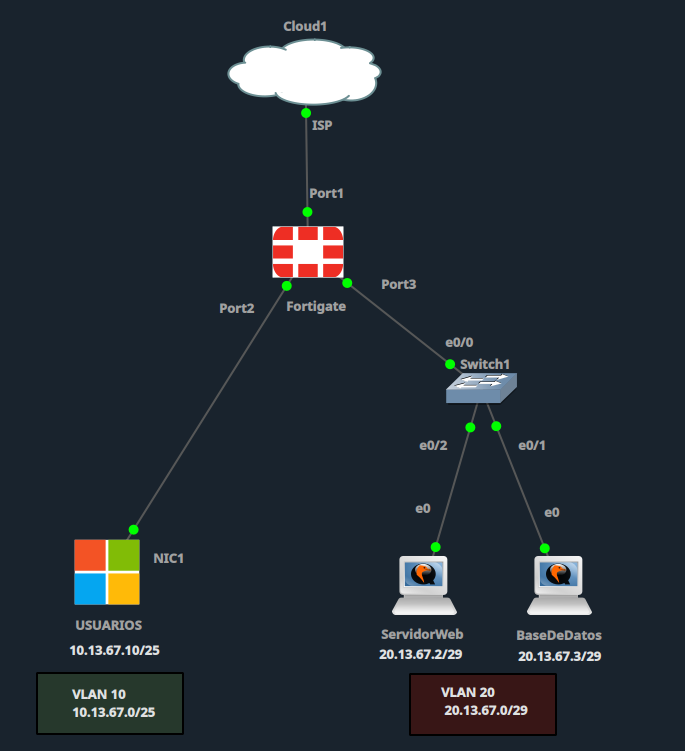
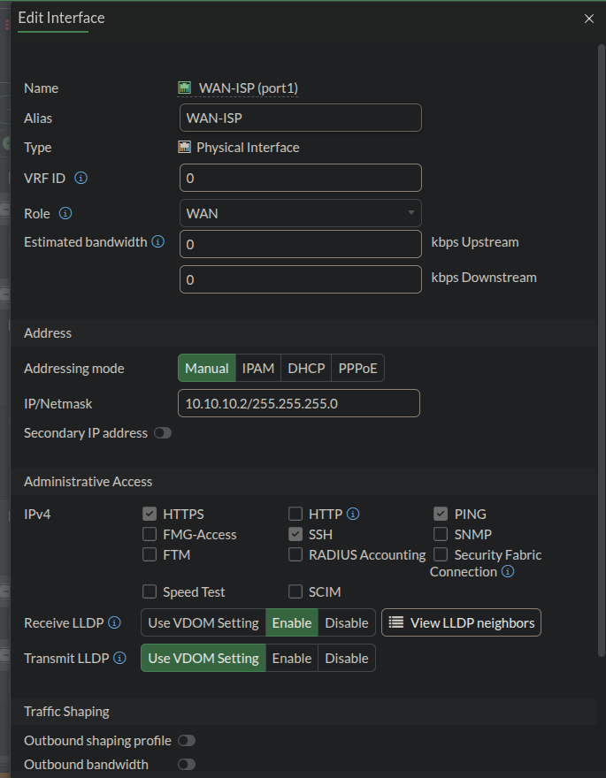
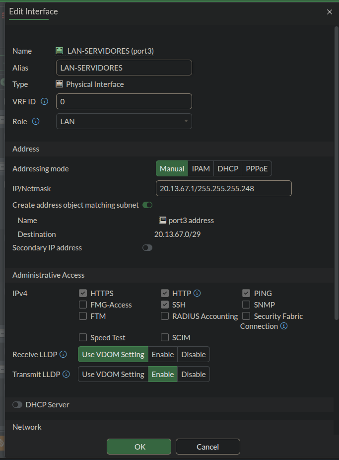
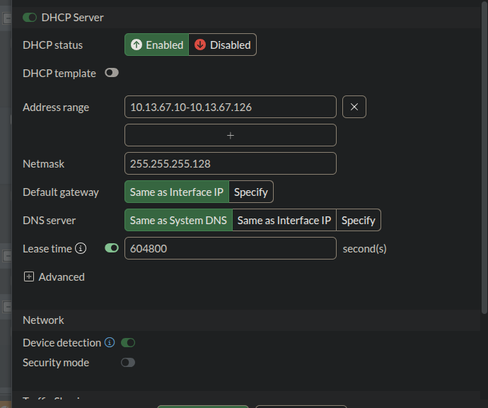
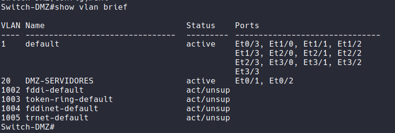
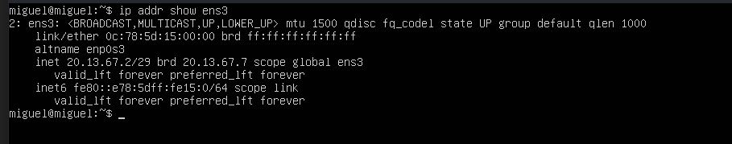
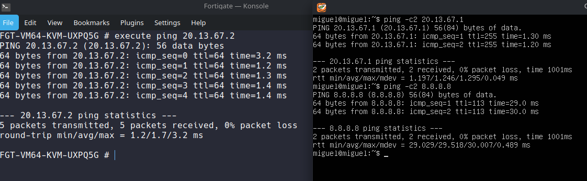
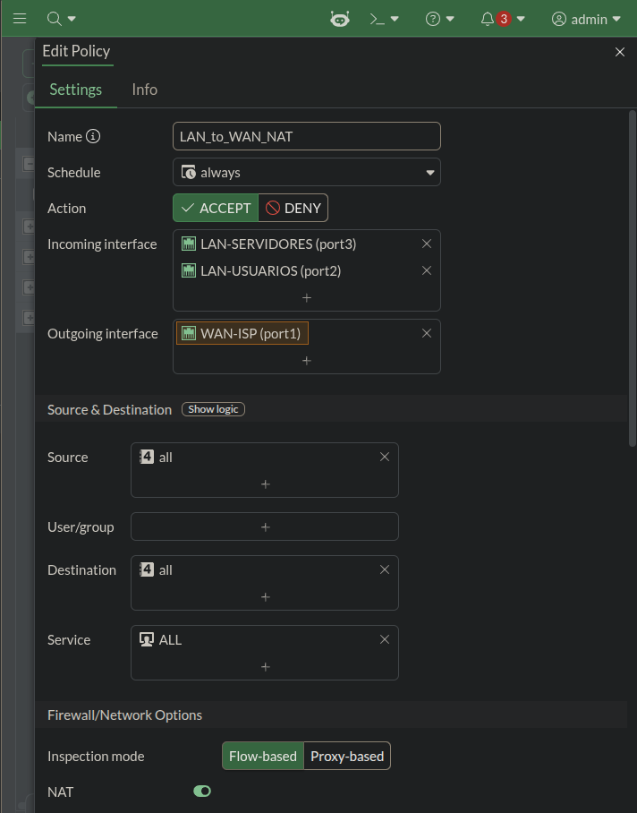
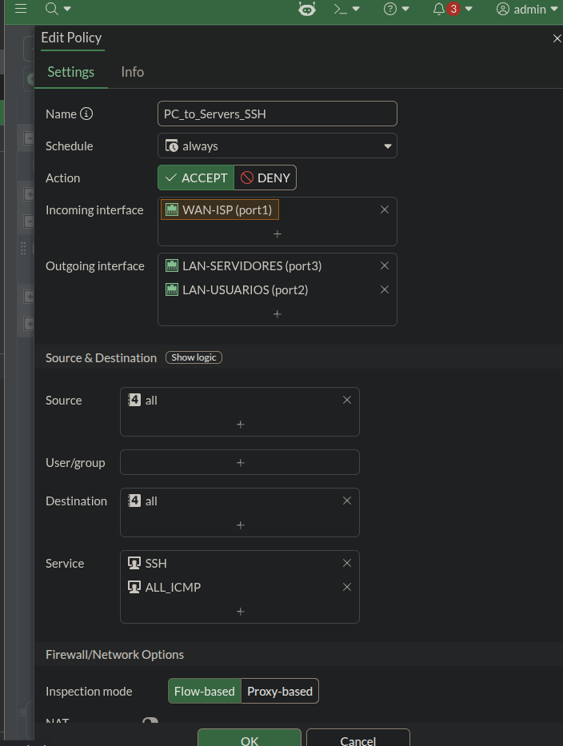

# 📑 Reporte de Laboratorio: Configuración FortiGate con Topología WAN/LAN/DMZ

---

## 📋 Descripción del Reporte

Este documento presenta las evidencias visuales (capturas de pantalla) del laboratorio realizado en **GNS3/EVE-NG** con un **FortiGate VM64**, demostrando la configuración completa de una topología con:

- 🔴 **WAN** conectada a la PC Host (Cloud/ISP)
- 🔵 **LAN de Usuarios** (VLAN 10) con DHCP
- 🟠 **DMZ de Servidores** (VLAN 20) con IPs estáticas
- 🟢 **Políticas de Firewall** con NAT y acceso SSH

---

## 🖼️ Evidencia 1: Topología Completa del Laboratorio

Vista general de la topología en GNS3, mostrando todos los dispositivos interconectados: **Cloud1 (PC Host)**, **FortiGate**, **Switch-DMZ**, **Windows (Usuarios)**, **ServidorWeb** y **BaseDeDatos**.

---

## 🖼️ Evidencia 2: Configuración de la Interfaz WAN (Port1)

Configuración de la interfaz `port1` del FortiGate conectada a la Cloud/ISP con IP estática `10.10.10.2/24` y gateway `10.10.10.1`.

---

## 🖼️ Evidencia 3: Configuración de la LAN de Servidores (Port3 - DMZ)

Configuración de la interfaz `port3` del FortiGate para la red de servidores (VLAN 20 / DMZ) con IP `20.13.67.1/29`.

---

## 🖼️ Evidencia 4: Configuración de la LAN de Usuarios (Port2) con DHCP

Configuración de la interfaz `port2` del FortiGate para la red de usuarios (VLAN 10) con IP `10.13.67.1/25` y servidor DHCP habilitado con rango `10.13.67.10 - 10.13.67.126`.

---

## ️ Evidencia 5: Configuración del Switch-DMZ (VLANs)

Salida del comando `show vlan brief` en el Switch-DMZ, mostrando la VLAN 20 (`DMZ-SERVIDORES`) activa en los puertos `Et0/1` y `Et0/2`, y el puerto `Et0/0` en modo trunk con Native VLAN 20.

---

## 🖼️ Evidencia 6: Configuración de Red en Ubuntu Server

Salida del comando `ip a` en el servidor Ubuntu (ServidorWeb), mostrando la IP estática `20.13.67.2/29` configurada en la interfaz `ens3`, con gateway `20.13.67.1`.

---

## ️ Evidencia 7: Pruebas de Conectividad (Ping)

Pruebas de ping realizadas desde el servidor Ubuntu hacia el gateway del FortiGate (`20.13.67.1`), confirmando la conectividad de capa 3 entre la DMZ y el firewall.

---

## ️ Evidencia 8: Política de Firewall - NAT (Salida a Internet)

Política `LAN_to_WAN_NAT` configurada en el FortiGate, permitiendo el tráfico desde las interfaces LAN (`port2` y `port3`) hacia la WAN (`port1`) con **NAT habilitado**, para que los usuarios y servidores puedan acceder a Internet.

---

## 🖼️ Evidencia 9: Política de Firewall - Acceso SSH desde PC Host

Política `PC_to_Servers_SSH` configurada en el FortiGate, permitiendo el tráfico SSH (puerto 22) desde la WAN (`port1` - PC Host) hacia la DMZ (`port3` - Servidores), **sin NAT**, para administración remota de los servidores.

---

## ✅ Resumen de Validación

| # | Evidencia | Estado |
| :---: | :--- | :---: |
| 1 | Topología completa en GNS3 | ✅ |
| 2 | Interfaz WAN configurada (`10.10.10.2/24`) | ✅ |
| 3 | Interfaz DMZ configurada (`20.13.67.1/29`) | ✅ |
| 4 | Interfaz LAN Usuarios con DHCP (`10.13.67.1/25`) | ✅ |
| 5 | Switch-DMZ con VLAN 20 y Native VLAN correcta | ✅ |
| 6 | Ubuntu Server con IP estática (`20.13.67.2/29`) | ✅ |
| 7 | Conectividad ping entre Ubuntu y FortiGate | ✅ |
| 8 | Política NAT para salida a Internet | ✅ |
| 9 | Política SSH para acceso remoto desde PC Host | ✅ |

---

## 📊 Tabla Resumen de Direccionamiento IP

| Dispositivo | Interfaz | IP | Máscara | Gateway |
| :--- | :--- | :--- | :--- | :--- |
| **PC Host (Cloud)** | - | `10.10.10.1` | `/24` | - |
| **FortiGate** | port1 (WAN) | `10.10.10.2` | `/24` | `10.10.10.1` |
| **FortiGate** | port2 (LAN Usuarios) | `10.13.67.1` | `/25` | - |
| **FortiGate** | port3 (DMZ Servidores) | `20.13.67.1` | `/29` | - |
| **Windows (Usuarios)** | NIC1 | `10.13.67.10` | `/25` | `10.13.67.1` |
| **ServidorWeb (Ubuntu)** | ens3 | `20.13.67.2` | `/29` | `20.13.67.1` |
| **BaseDeDatos (Ubuntu)** | ens3 | `20.13.67.3` | `/29` | `20.13.67.1` |

---

 

### 👨‍💻 Realizado por: **Miguel Ramirez Meli**

