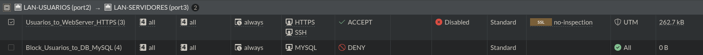
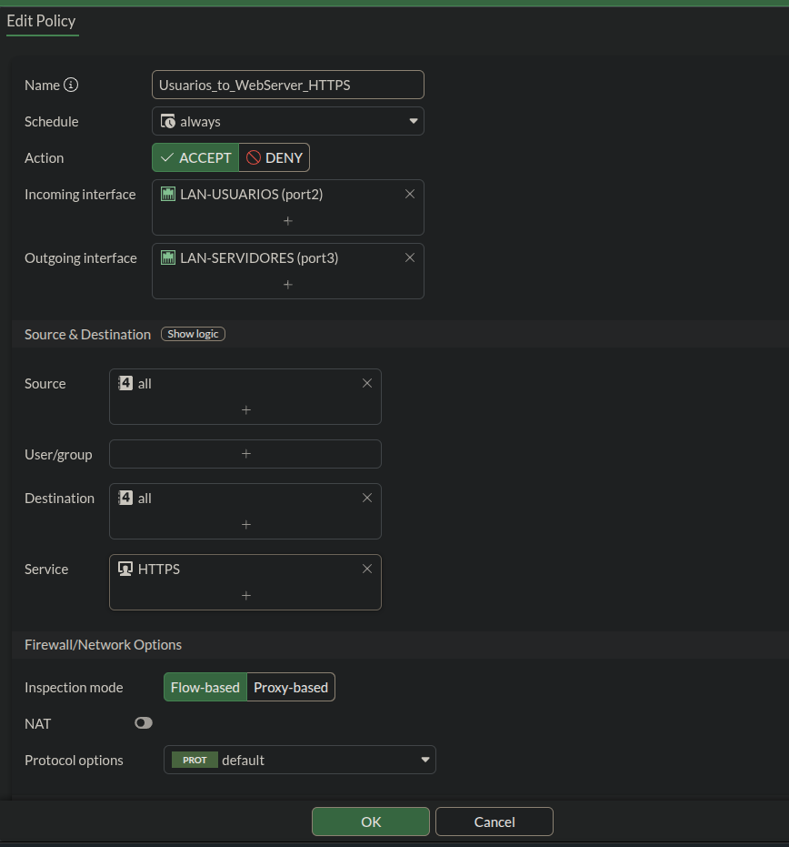
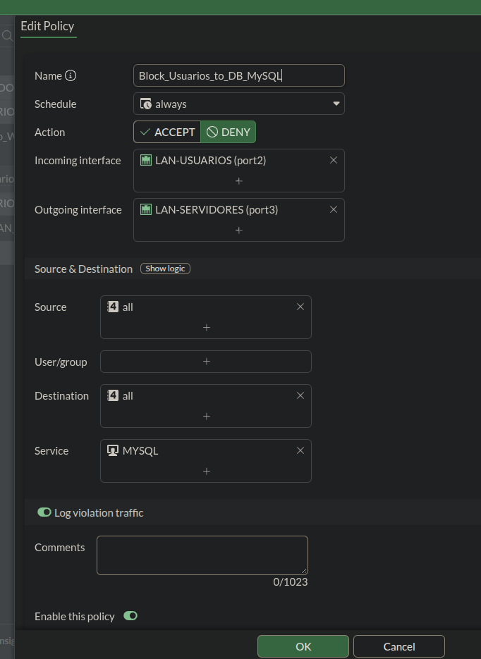
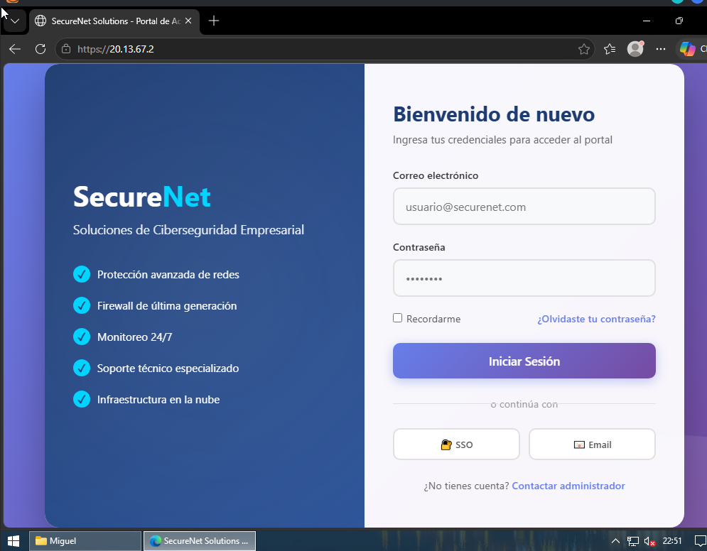
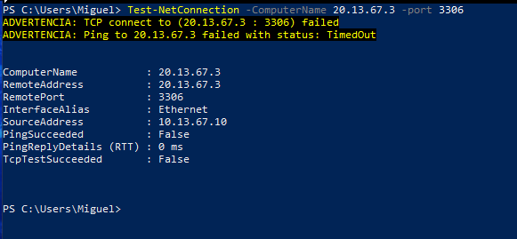
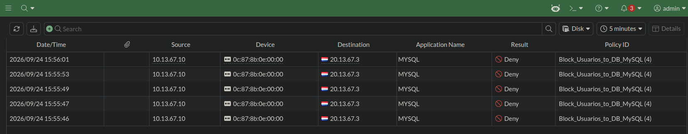

# 🛡️ Reporte de Evidencias: Políticas de Firewall y Control de Acceso


---

##  Descripción del Reporte
El presente documento exhibe las evidencias visuales y técnicas que validan la correcta implementación y aplicación de las políticas de seguridad en el FortiGate VM64. El objetivo es demostrar la segmentación efectiva del tráfico entre la **VLAN 10 (Usuarios)** y la **VLAN 20 (Servidores/DMZ)** mediante las siguientes reglas:

- ✅ **Política 1:** Permitir tráfico HTTPS (Puerto 443) desde la red de Usuarios hacia el ServidorWeb.
- ❌ **Política 2:** Bloquear tráfico MySQL (Puerto 3306) desde la red de Usuarios hacia el servidor de Base de Datos.

---

## 🖼️ EVIDENCIA 1: Configuración de las Políticas en FortiGate

### 1.1 Lista de Políticas y Orden de Evaluación
Vista detallada del menú **Policy & Objects > Firewall Policy** en la interfaz gráfica (GUI) del FortiGate. La captura demuestra la correcta jerarquía de las reglas, donde la política de restricción (`Block_Usuarios_to_DB_MySQL`) está posicionada estratégicamente **por encima** de las reglas de tráfico general. Esto asegura que el motor de firewall evalúe y aplique el bloqueo en primera instancia (siguiendo el orden de arriba hacia abajo), cumpliendo estrictamente con el principio de menor privilegio.



### 1.2 Detalle de la Política de Permiso (HTTPS)
Detalle de la configuración de la política `Usuarios_to_WebServer_HTTPS`. La captura valida los parámetros de la regla, asegurando que el tráfico originado en la interfaz `port2` (LAN-USUARIOS) con destino a `port3` (LAN-SERVIDORES) sea permitido exclusivamente para el servicio `HTTPS` (puerto 443), manteniendo el NAT desactivado para preservar la IP original del origen.



### 1.3 Detalle de la Política de Bloqueo (MySQL)
Detalle de la configuración de la política `Block_Usuarios_to_DB_MySQL`. Se evidencia la acción `DENY` aplicada al servicio `MYSQL` (puerto 3306). Adicionalmente, se destaca la activación de la función `Log Traffic`, fundamental para la auditoría y el monitoreo de intentos de acceso no autorizados a la infraestructura de base de datos.



---

## 🖥️ EVIDENCIA 2: Pruebas de Conectividad desde el PC Host (Windows)

Las pruebas de conectividad se ejecutaron desde el **PC Host (Windows)** mediante **PowerShell**, simulando el rol de un equipo ubicado en la red de Usuarios. Se utilizó el comando nativo `Test-NetConnection` de PowerShell, ya que ni el cliente `telnet` ni el cliente `mysql` se encontraban instalados en el sistema operativo host.

### 2.1 Prueba de Acceso Permitido: HTTPS (Puerto 443)
Ejecución de la prueba de conectividad dirigida al ServidorWeb (`20.13.67.2`) a través del puerto 443. El resultado confirma que la conexión se establece exitosamente (`TcpTestSucceeded: True`), demostrando que la política de permisos (`ACCEPT`) está siendo aplicada correctamente por el firewall.

**Comando ejecutado en PowerShell (Windows):**
```powershell
Test-NetConnection -ComputerName 20.13.67.2 -Port 443
```

**Salida esperada:**
```text
ComputerName     : 20.13.67.2
RemotePort       : 443
InterfaceAlias   : Ethernet
SourceAddress    : 10.10.10.1
TcpTestSucceeded : True    ✅ Conexión exitosa
```



### 2.2 Prueba de Acceso Bloqueado: MySQL (Puerto 3306)
Ejecución de la prueba de conectividad dirigida al servidor de Base de Datos (`20.13.67.3`) a través del puerto 3306. El resultado muestra un fallo en la conexión (`TcpTestSucceeded: False`), validando que la política de restricción (`DENY`) está descartando los paquetes de manera efectiva y protegiendo el servidor de base de datos de accesos externos no autorizados.

**Comando ejecutado en PowerShell (Windows):**
```powershell
Test-NetConnection -ComputerName 20.13.67.3 -Port 3306
```

**Salida obtenida:**
```text
ComputerName     : 20.13.67.3
RemotePort       : 3306
InterfaceAlias   : Ethernet
SourceAddress    : 10.10.10.1
TcpTestSucceeded : False   ❌ Conexión bloqueada por el FortiGate
```

> ⚠️ **Nota:** Inicialmente se intentó usar los comandos `telnet` y `mysql` desde PowerShell, pero el sistema no los reconoció porque no están instalados por defecto en Windows. Se optó por `Test-NetConnection`, que es un cmdlet nativo de PowerShell y cumple la misma función de validación de puertos TCP.



---

## 🖼️ EVIDENCIA 3: Validación de Logs en FortiGate

Registro de eventos en el **Log Forward** (o FortiView) del FortiGate. Esta evidencia es crucial, ya que demuestra en tiempo real cómo el motor de firewall identifica y bloquea explícitamente el tráfico MySQL, asociándolo a la política `Block_Usuarios_to_DB_MySQL`. Esto confirma que la regla no solo está configurada, sino que está activa y procesando el tráfico de la red.



---

## ✅ Resumen de Validación de Políticas

| # | Regla Validada | Origen (Src) | Destino (Dst) | Servicio | Resultado Esperado | Estado |
| :---: | :--- | :--- | :--- | :---: | :--- | :---: |
| 1 | Acceso Web Seguro | PC Host (Windows) | ServidorWeb | 443 (HTTPS) | Conexión Exitosa (`True`) | ✅ |
| 2 | Bloqueo de Base de Datos | PC Host (Windows) | BaseDeDatos | 3306 (MySQL) | Conexión Rechazada (`False`) | ✅ |
| 3 | Orden de Políticas | N/A | N/A | N/A | DENY evalúa antes que ALLOW | ✅ |

---

##  Notas Técnicas de la Implementación

1. **Principio de Menor Privilegio:** Las políticas no utilizan el servicio genérico `ALL`. Se crearon reglas específicas para `HTTPS` y `MYSQL`, limitando drásticamente la superficie de ataque entre las VLANs.
2. **Orden de Evaluación del Firewall:** El FortiGate evalúa las políticas de arriba hacia abajo. La política de `DENY` para MySQL debe estar posicionada antes que cualquier regla genérica que permita tráfico entre `port2` y `port3` para evitar que el tráfico de base de datos sea permitido por una regla posterior.
3. **Auditoría y Monitoreo:** La política de bloqueo tiene habilitado el `Log Traffic`, lo que permite a los administradores de red rastrear cuándo y desde qué dirección IP se están realizando intentos de acceso no autorizados a la base de datos.
4. **Herramienta de Prueba en Windows:** Se utilizó el cmdlet nativo `Test-NetConnection` de PowerShell en lugar de `telnet` o `mysql`, ya que estos últimos no están instalados por defecto en Windows. `Test-NetConnection` es equivalente funcional para validar la apertura o cierre de puertos TCP.

---

<br>

### ‍💻 Realizado por: **Miguel Ramirez Meli**


