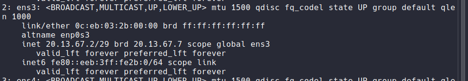
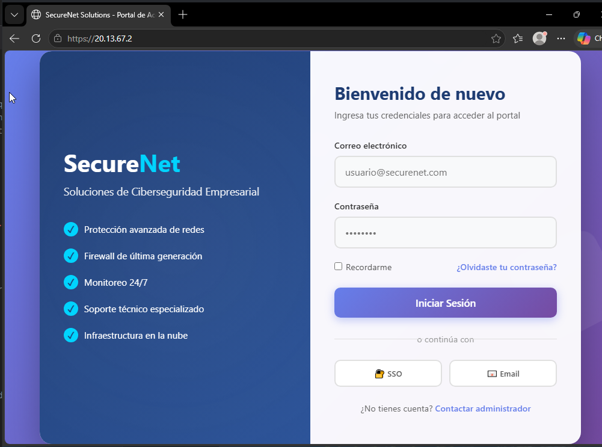
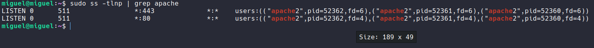
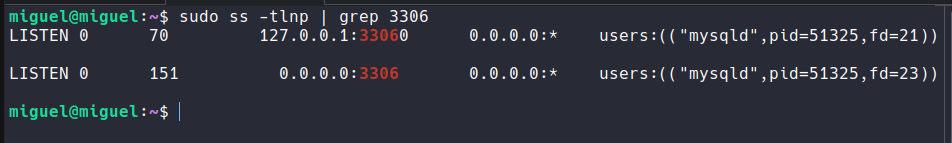
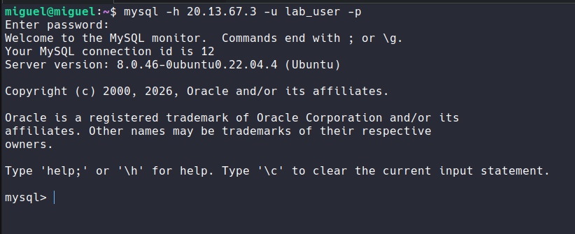

# 📸 Reporte de Evidencias: Validación de Servicios Web y Base de Datos


---

## 📋 Descripción del Reporte
Este documento presenta las evidencias visuales (capturas de pantalla) que validan el correcto funcionamiento, configuración y conectividad de los servidores ubicados en la **VLAN 20 (DMZ)**:
- **ServidorWeb** (`20.13.67.2`): Apache con HTTPS y certificado SSL con extensión SAN.
- **BaseDeDatos** (`20.13.67.3`): MySQL Server con acceso remoto habilitado (`bind-address = 0.0.0.0`).

---

## 🌐 EVIDENCIA 1: ServidorWeb (Apache HTTPS)

### 1.1 Configuración de Red e Interfaz
Verificación de que el servidor cuenta con la IP estática correcta (`20.13.67.2/29`) en la interfaz de red `ens3`.



### 1.2 Acceso Web Seguro (HTTPS)
Navegador accediendo a `https://20.13.67.2`. Se observa la página corporativa de "SecureNet Solutions" cargando correctamente y, lo más importante, el **candado de "Conexión segura"**, validando que el certificado con extensión SAN fue instalado correctamente en el almacén de confianza de Windows.



### 1.3 Detalles del Certificado SSL
Vista de las propiedades del certificado instalado, confirmando que:
- **Emitido para:** `20.13.67.2`
- **Organización:** `Lab`
- **Extensión SAN:** Incluye explícitamente `IP:20.13.67.2` (requisito de navegadores modernos).


### 1.4 Verificación de Puertos en Servidor (CLI)
Comando `sudo ss -tlnp | grep apache` ejecutado en el ServidorWeb, demostrando que el servicio Apache está activo y escuchando en los puertos 80 (HTTP) y 443 (HTTPS).



---

## 🗄️ EVIDENCIA 2: BaseDeDatos (MySQL Remote Access)

### 2.1 Verificación de Escucha en Red (CLI)
Comando `sudo ss -tlnp | grep 3306` ejecutado en el servidor de Base de Datos. La salida muestra `0.0.0.0:3306`, confirmando que MySQL está configurado para aceptar conexiones remotas desde cualquier interfaz de red (no solo localhost).



### 2.2 Prueba de Conectividad Remota Exitosa
Comando ejecutado **desde el ServidorWeb** (`20.13.67.2`) conectándose al servidor de **BaseDeDatos** (`20.13.67.3`):
```bash
mysql -h 20.13.67.3 -u lab_user -p
```
La captura muestra el mensaje de bienvenida de MySQL y la ejecución exitosa del comando `SHOW DATABASES;`, probando que la comunicación a través de la red (y las políticas del FortiGate) funciona correctamente.



---

## ✅ Resumen de Validación de Evidencias

| # | Componente Validado | Evidencia | Estado |
| :---: | :--- | :--- | :---: |
| 1 | IP Estática configurada en ServidorWeb | Captura 1.1 | ✅ |
| 2 | Servicio Apache activo (Puertos 80/443) | Captura 1.4 | ✅ |
| 3 | Certificado SSL con SAN instalado y funcional | Captura 1.2 y 1.3 | ✅ |
| 4 | Página web corporativa cargando por HTTPS | Captura 1.2 | ✅ |
| 5 | MySQL escuchando en `0.0.0.0:3306` | Captura 2.1 | ✅ |
| 6 | Conectividad remota Web → BaseDeDatos | Captura 2.2 | ✅ |

---

## 🔍 Notas Técnicas del Laboratorio

1. **Extensión SAN (Subject Alternative Name):** Fue necesaria para evitar la advertencia "No seguro" en navegadores modernos, ya que estos ya no confían únicamente en el campo "Nombre Común" (CN) del certificado.
2. **Bind-Address en MySQL:** El cambio de `127.0.0.1` a `0.0.0.0` en `/etc/mysql/mysql.conf.d/mysqld.cnf` fue crucial para permitir que el ServidorWeb (y futuras VLANs) pudieran autenticarse contra la base de datos a través del FortiGate.
3. **Políticas de Firewall:** El tráfico fluye correctamente gracias a las políticas configuradas en el FortiGate que permiten el tráfico específico (HTTPS:443, MySQL:3306) entre las interfaces correspondientes.

---

<br>

### 👨‍💻 Realizado por: **Miguel Ramirez Meli**


