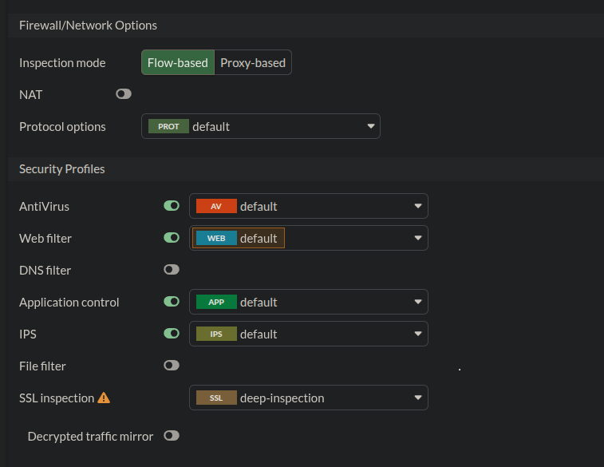
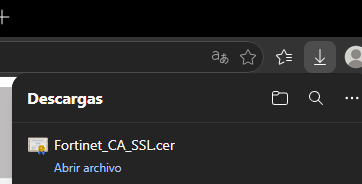
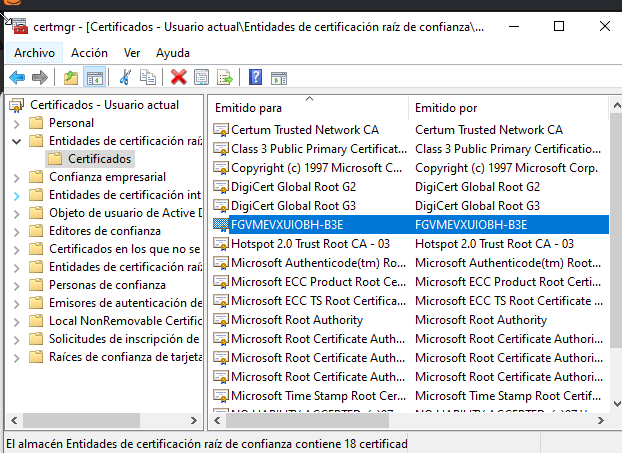
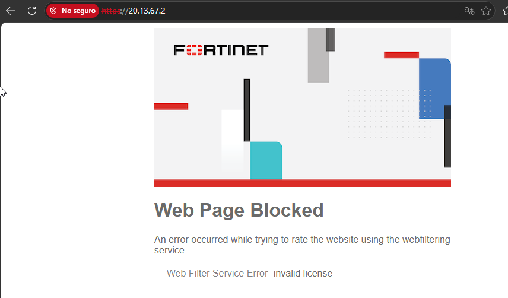
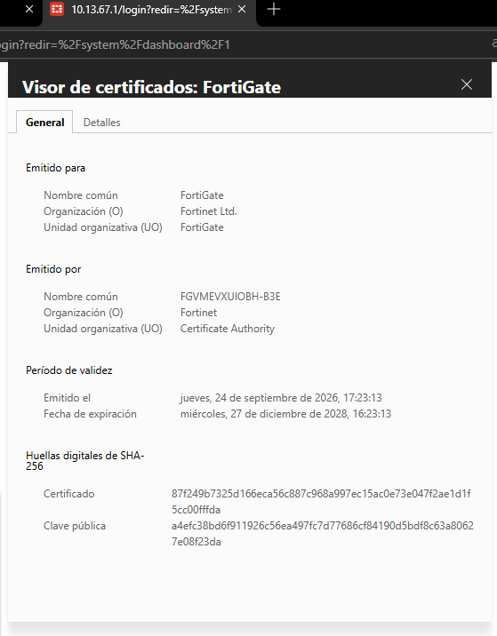

# 🛡️ Reporte de Evidencias: Implementación de Deep Packet Inspection (DPI)


---

## 📋 Descripción del Reporte
Este documento presenta las evidencias técnicas y visuales que validan la correcta implementación de **Deep Packet Inspection (DPI)** en el FortiGate VM64. Se demuestra la configuración de perfiles de seguridad (SSL Inspection, IPS, Antivirus) tanto por GUI como por CLI, la gestión de certificados CA y la validación final de la desencriptación SSL en el tráfico HTTPS.

---

## ️ EVIDENCIA 1: Configuración de DPI en el FortiGate

### 1.1 Configuración vía GUI (Interfaz Gráfica)
Captura de la política `Usuarios_to_WebServer_HTTPS` en el FortiGate. Se evidencia la activación de los **Security Profiles**, destacando el cambio de SSL Inspection a **`deep-inspection`**, junto con los perfiles de Antivirus, IPS y Application Control en modo `default`.



### 1.2 Configuración vía CLI (Línea de Comandos)
Captura de la consola del FortiGate mostrando la aplicación de los mismos perfiles de seguridad mediante comandos CLI, validando la consistencia entre la interfaz gráfica y el motor del firewall.

```bash
config firewall policy
    edit 3
        set ssl-ssh-profile "deep-inspection"
        set av-profile "default"
        set ips-sensor "default"
        set application-list "default"
    next
end
```


---

## 🖼️ EVIDENCIA 2: Gestión del Certificado CA de Fortinet

### 2.1 Descarga del Certificado desde el FortiGate
Evidencia de la descarga del certificado de la Autoridad Certificadora local (`FORTINET_CA_SSL` o `FGVM...`) desde el menú **System > Certificates** de la GUI del FortiGate.



### 2.2 Instalación en el Almacén de Confianza de Windows
Captura del administrador de certificados de Windows (`certlm.msc`) mostrando el certificado del FortiGate instalado correctamente en **Equipo local > Entidades de certificación raíz de confianza**. Este paso es crítico para establecer la cadena de confianza y evitar errores de seguridad en el navegador.



---

## ️ EVIDENCIA 3: Validación de Desencriptación SSL (Prueba de Fuego)

### 3.1 Acceso HTTPS con DPI Activo
Navegador accediendo a la página del ServidorWeb (`https://20.13.67.2`). Se observa que la conexión se establece exitosamente gracias a la confianza depositada en el CA del FortiGate.



### 3.2 Verificación del Certificado Emitido por Fortinet
Detalle de las propiedades del certificado SSL visto desde el navegador. Se confirma que el tráfico fue desencriptado y re-firmado por el FortiGate, ya que el campo **"Emitido por"** muestra el nombre del certificado CA local del firewall (`FGVMEXVUIOBH-B3E` o `FORTINET_CA_SSL`) en lugar del certificado original del servidor Apache.



---

## ✅ Resumen de Validación de DPI

| # | Componente Validado | Método | Resultado Esperado | Estado |
| :---: | :--- | :---: | :--- | :---: |
| 1 | Perfiles de Seguridad (SSL, IPS, AV) | GUI | `deep-inspection` activado | ✅ |
| 2 | Perfiles de Seguridad (SSL, IPS, AV) | CLI | Comandos aplicados sin errores | ✅ |
| 3 | Instalación de CA en Windows | `certlm.msc` | Certificado en "Raíz de confianza" | ✅ |
| 4 | Desencriptación SSL (MITM autorizado) | Navegador | "Emitido por" muestra CA de FortiGate | ✅ |

---

## 🔍 Notas Técnicas de la Evidencia

1. **Comportamiento en VM de Laboratorio:** En entornos sin licencia de FortiGuard activa, el perfil **Web Filter** puede generar un error de "invalid license" al intentar calificar el sitio. Esto es un comportamiento esperado y no afecta la funcionalidad de la desencriptación SSL (Deep Inspection).
2. **Cadena de Confianza:** La validación exitosa del candado verde (o la ausencia de errores de certificado fatales) depende estrictamente de que el certificado se haya instalado en el almacén de **Equipo local (Máquina local)** y no en el de "Usuario actual".
3. **Seguridad Empresarial:** Esta configuración simula un entorno corporativo real donde el firewall debe inspeccionar el tráfico cifrado (que representa más del 80% del tráfico actual) para detectar amenazas ocultas, malware o exfiltración de datos.

---

<br>

### 👨‍💻 Realizado por: **Miguel Ramirez Meli**


