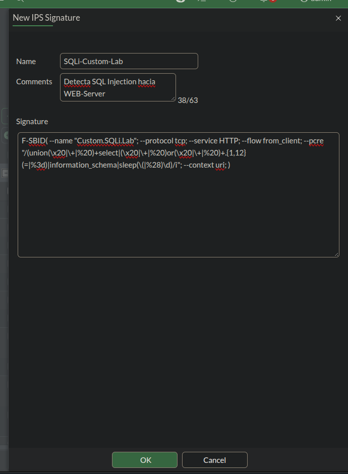
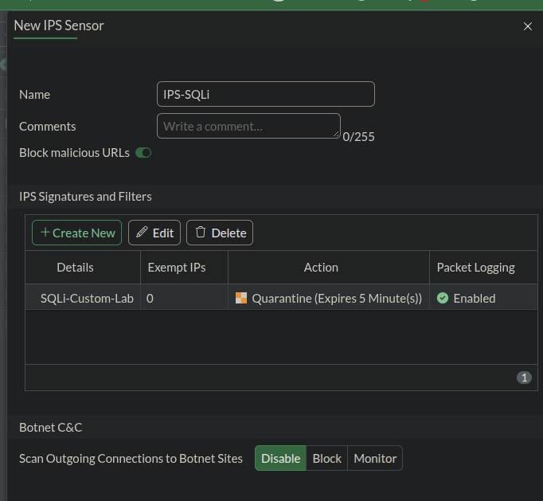
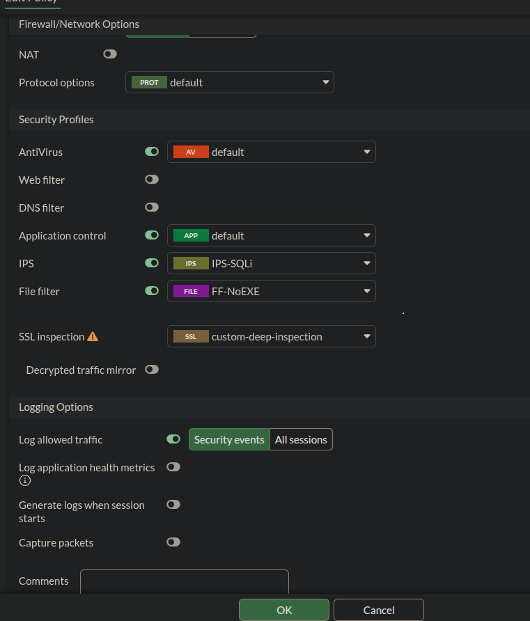
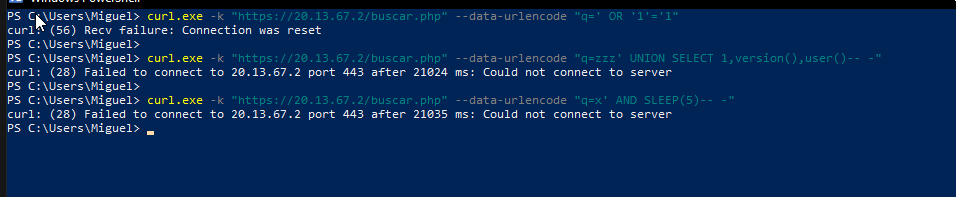
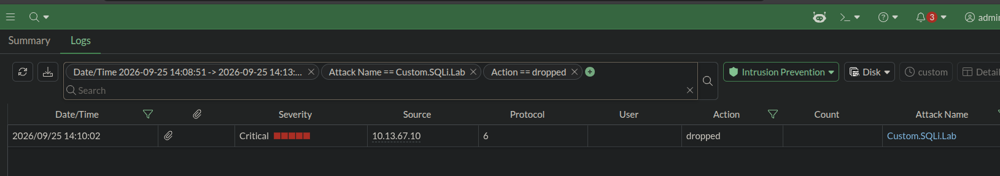

# 🛡️ Reporte de Laboratorio: IPS Anti-SQLi con Cuarentena en FortiGate


---

## 📋 Descripción del Reporte

Este documento presenta las evidencias visuales (capturas de pantalla) de la configuración de un sensor **IPS (Intrusion Prevention System)** en **FortiGate VM64**, con una firma personalizada capaz de detectar intentos de **SQL Injection** hacia el WEB-Server, bloquear el ataque y colocar al atacante en **cuarentena**.

El laboratorio demuestra:

- 🔴 **Firma IPS personalizada** (`Custom.SQLi.Lab`) mediante sintaxis F-SBID
- 🟠 **Sensor IPS** (`IPS-SQLi`) con acción de **Cuarentena** (5 minutos)
- 🟡 **Aplicación del sensor** a la política de firewall Usuarios → WEB-Server
- 🟢 **Inyección de payloads SQLi reales** desde la red de Usuarios
- 🔵 **Bloqueo y registro** confirmado en los logs de seguridad del FortiGate

---

## 📸 Evidencia 1: Creación de la Firma IPS Personalizada

Firma personalizada creada en `Security Profiles > IPS Signatures`, con sintaxis **F-SBID**, diseñada para detectar patrones de SQL Injection (`UNION SELECT`, `OR 1=1`, `SLEEP()`, `information_schema`) en el tráfico HTTP/HTTPS dirigido al WEB-Server.



```
F-SBID( --name "Custom.SQLi.Lab"; --protocol tcp; --service HTTP; --flow from_client; --pcre "/(union(\x20|\+|%20)+select|(\x20|\+|%20)or(\x20|\+|%20)+.{1,12}(=|%3d)|information_schema|sleep(\(|%28)\d)/i"; --context uri; )
```

---

## 📸 Evidencia 2: Sensor IPS con Acción de Cuarentena

Sensor `IPS-SQLi` configurado con la firma `SQLi-Custom-Lab`, acción **`Quarantine (Expires 5 Minute(s))`** y `Packet Logging: Enabled`, para que el atacante quede bloqueado a nivel de IP durante 5 minutos tras el primer intento detectado.



---

## 📸 Evidencia 3: Sensor Aplicado a la Política de Firewall

Perfil `IPS-SQLi` activado dentro de `Security Profiles` en la política **`Usuarios_to_WebServer_HTTPS`**, junto con `SSL Inspection (custom-deep-inspection)` para descifrar el tráfico HTTPS, y `File Filter (FF-NoEXE)` para el bloqueo de descargas `.exe`.



| Perfil | Valor aplicado |
|---|---|
| IPS | `IPS-SQLi` |
| SSL Inspection | `custom-deep-inspection` |
| File Filter | `FF-NoEXE` |

---

## 📸 Evidencia 4: Inyección de Payloads y Bloqueo en Tiempo Real

Ejecución de tres payloads de SQL Injection desde la red de Usuarios (`buscar.php`), con el sensor `IPS-SQLi` ya aplicado a la política de firewall. El primer payload dispara la firma y corta la conexión (`Connection was reset`); los siguientes ya no logran conectar (`Could not connect to server`), confirmando que la IP atacante quedó en **cuarentena**.



**Payloads utilizados:**
```powershell
curl.exe -k -G "https://20.13.67.2/buscar.php" --data-urlencode "q=' OR '1'='1"
curl.exe -k -G "https://20.13.67.2/buscar.php" --data-urlencode "q=zzz' UNION SELECT 1,version(),user()-- -"
curl.exe -k -G "https://20.13.67.2/buscar.php" --data-urlencode "q=x' AND SLEEP(5)-- -"
```

---

## 📸 Evidencia 5: Log de Detección en el FortiGate

Registro confirmado en `Log & Report > Security Events > Intrusion Prevention`, mostrando la firma disparada, la severidad crítica, la IP de origen del atacante y la acción de bloqueo aplicada.



| Campo | Valor |
|---|---|
| Date/Time | 2026-09-25 14:10:02 |
| Severity | Critical |
| Source | `10.13.67.10` |
| Protocol | 6 (TCP) |
| Action | `dropped` |
| Attack Name | `Custom.SQLi.Lab` |

---

## ✅ Resumen de Validación

| Requisito | Estado |
|---|:---:|
| Firma IPS personalizada creada | ✅ |
| Sensor IPS con acción de Cuarentena | ✅ |
| Aplicado a la política Usuarios → WEB-Server | ✅ |
| Payloads de SQL Injection inyectados | ✅ |
| Bloqueo confirmado (`Connection was reset`) | ✅ |
| Cuarentena confirmada (peticiones posteriores fallan) | ✅ |
| Evento registrado en logs de seguridad | ✅ |

---

### 👨‍💻 Realizado por: **Miguel Ramirez Meli**


