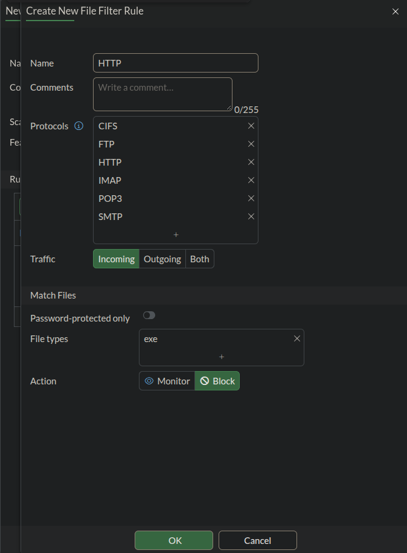
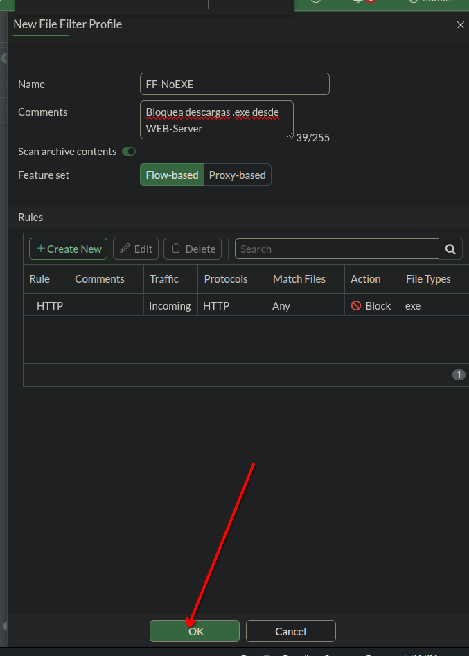
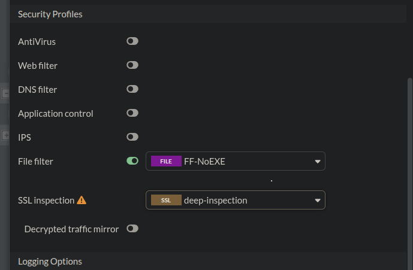
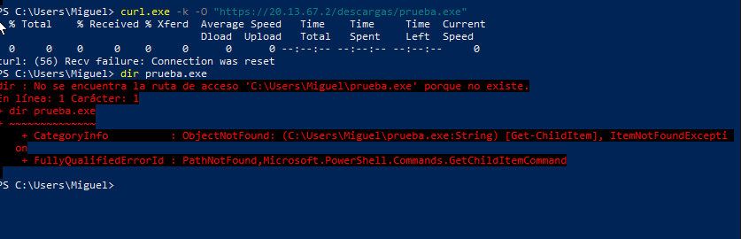
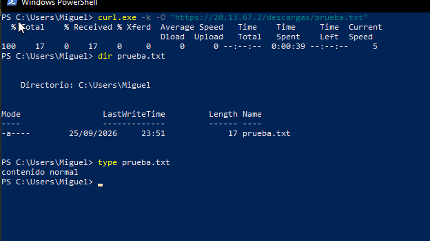

# 🚫 Reporte de Laboratorio: File Filter — Bloqueo de Descargas .exe en FortiGate


---

## 📋 Descripción del Reporte

Este documento presenta las evidencias visuales (capturas de pantalla) de la configuración de un perfil **File Filter** en **FortiGate VM64**, diseñado para bloquear descargas de archivos `.exe` desde la web, tanto hacia el WEB-Server del laboratorio como en la navegación general de Usuarios hacia Internet.

El laboratorio demuestra:

- 🟣 **Regla de filtro** por tipo de archivo (`exe`) sobre protocolo HTTP
- 🟠 **Perfil File Filter** (`FF-NoEXE`) con acción de bloqueo
- 🟡 **Aplicación del perfil** a la política de salida a Internet (`LAN_to_WAN_NAT`)
- 🔴 **Bloqueo confirmado** de una descarga `.exe` real
- 🟢 **Prueba de control** con un archivo `.txt`, para demostrar que el bloqueo es específico al tipo de archivo

---

## 📸 Evidencia 1: Regla de Filtro para Archivos .exe

Regla creada dentro del perfil File Filter, sobre protocolo `HTTP`, tráfico `Incoming` (descargas), con `File types: exe` y acción **`Block`**.



---

## 📸 Evidencia 2: Perfil File Filter Completo

Perfil `FF-NoEXE` con la regla `HTTP` aplicada, mostrando `Match Files`, `Action: Block` y `File Types: exe` en la tabla de reglas del perfil.



---

## 📸 Evidencia 3: Perfil Aplicado a la Política de Salida a Internet

Perfil `FF-NoEXE` activado dentro de `Security Profiles` en la política **`LAN_to_WAN_NAT`**, junto con `SSL Inspection (deep-inspection)` para poder inspeccionar también las descargas realizadas por HTTPS.



| Perfil | Valor aplicado |
|---|---|
| File filter | `FF-NoEXE` |
| SSL inspection | `deep-inspection` |

---

## 📸 Evidencia 4: Descarga de .exe Bloqueada

Intento de descarga de `prueba.exe` desde el equipo de Usuarios. La conexión se corta activamente (`Recv failure: Connection was reset`) y el archivo nunca llega a crearse en el disco del cliente.



```powershell
curl.exe -k -O "https://20.13.67.2/descargas/prueba.exe"
```

---

## 📸 Evidencia 5: Prueba de Control con Archivo .txt

Para confirmar que el bloqueo es específico al tipo de archivo `.exe` (y no una restricción general de descargas), se repite la prueba con un archivo `.txt`. La descarga se completa sin problema, con el contenido íntegro.



```powershell
curl.exe -k -O "https://20.13.67.2/descargas/prueba.txt"
dir prueba.txt
type prueba.txt
```

---

## ✅ Resumen de Validación

| Requisito | Estado |
|---|:---:|
| Perfil File Filter creado (`FF-NoEXE`) | ✅ |
| Regla de bloqueo por tipo de archivo `exe` | ✅ |
| Aplicado a la política de salida a Internet | ✅ |
| SSL Inspection habilitado para ver dentro de HTTPS | ✅ |
| Descarga de `.exe` bloqueada y verificada | ✅ |
| Prueba de control (`.txt`) sin afectación | ✅ |

---

### 👨‍💻 Realizado por: **Miguel Ramirez Meli**


