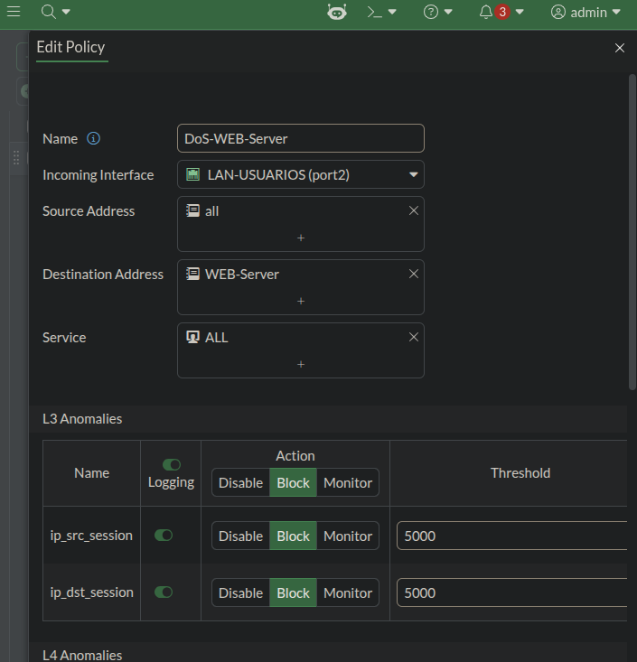
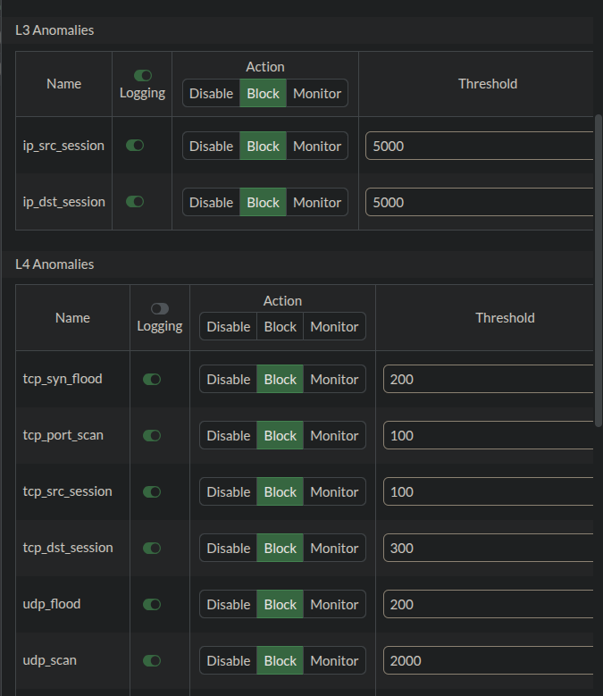
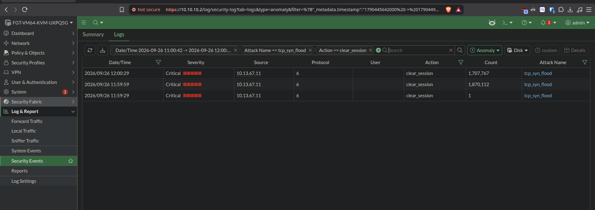
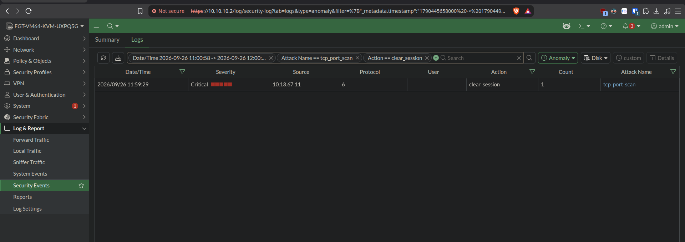

# 🚦 Reporte de Laboratorio: Rate Limiting — Protección contra DoS en FortiGate


---

## 📋 Descripción del Reporte

Este documento presenta las evidencias visuales (capturas de pantalla) de la configuración de una **DoS Policy** en **FortiGate VM64**, con umbrales de anomalías (rate limiting) para detectar y mitigar ataques de denegación de servicio hacia el WEB-Server.

El laboratorio demuestra:

- 🔵 **Política DoS** (`DoS-WEB-Server`) aplicada sobre el tráfico de Usuarios hacia el WEB-Server
- 🟡 **Umbrales de anomalías** configurados para TCP, UDP e ICMP
- 🔴 **Ataque de SYN Flood real** inyectado con `hping3`
- 🟢 **Detección y mitigación** confirmada en los logs de seguridad, con la acción `clear_session`

---

## 📸 Evidencia 1: Configuración General de la Política DoS

Política `DoS-WEB-Server` creada en `Policy & Objects > DoS Policy`, con `Incoming Interface: LAN-USUARIOS (port2)`, `Destination Address: WEB-Server` y `Service: ALL`. Se muestran también los umbrales de anomalías de capa 3 (`ip_src_session`, `ip_dst_session`).



| Campo | Valor |
|---|---|
| Name | `DoS-WEB-Server` |
| Incoming Interface | `LAN-USUARIOS (port2)` |
| Source Address | `all` |
| Destination Address | `WEB-Server` (`20.13.67.2/32`) |
| Service | `ALL` |

---

## 📸 Evidencia 2: Umbrales de Anomalías TCP (L4)

Configuración de los umbrales de detección para tráfico TCP, con acción `Block` y `Logging` habilitado en cada anomalía.



| Anomalía | Threshold | Acción |
|---|---|---|
| `tcp_syn_flood` | 200 | Block |
| `tcp_port_scan` | 100 | Block |
| `tcp_src_session` | 100 | Block |
| `tcp_dst_session` | 300 | Block |

---

## 📸 Evidencia 3: Detección de SYN Flood en los Logs

Ataque de tipo **SYN Flood** inyectado desde el equipo de Usuarios mediante `hping3`, detectado y mitigado por la política DoS. El conteo de paquetes supera el millón en pocos segundos, confirmando un volumen de tráfico anómalo real.



```bash
sudo hping3 -S -p 443 --flood -c 3000 20.13.67.2
```

| Campo | Valor |
|---|---|
| Severity | Critical |
| Source | `10.13.67.11` |
| Protocol | 6 (TCP) |
| Action | `clear_session` |
| Count | Hasta 1,870,112 paquetes |
| Attack Name | `tcp_syn_flood` |

> **Sobre la acción `clear_session`:** para la anomalía `tcp_syn_flood`, el FortiGate no descarta cada paquete de forma individual; al superar el umbral, limpia las sesiones y tablas de estado relacionadas para liberar recursos y cortar el ataque de raíz. Esta es la acción correcta y esperada para este tipo de anomalía.

---

## 📸 Evidencia 4: Detección Adicional de Port Scan

Como efecto colateral del volumen de tráfico generado por el flood, la política también detectó y mitigó un patrón de escaneo de puertos (`tcp_port_scan`) desde el mismo origen.



| Campo | Valor |
|---|---|
| Severity | Critical |
| Source | `10.13.67.11` |
| Protocol | 6 (TCP) |
| Action | `clear_session` |
| Attack Name | `tcp_port_scan` |

---

## ✅ Resumen de Validación

| Requisito | Estado |
|---|:---:|
| Política DoS creada y aplicada al WEB-Server | ✅ |
| Umbrales de rate limiting configurados (TCP/UDP/ICMP) | ✅ |
| Ataque de SYN Flood inyectado | ✅ |
| Detección confirmada en logs (`Critical`) | ✅ |
| Mitigación aplicada (`clear_session`) | ✅ |
| Detección secundaria de port scan | ✅ |

---

### 👨‍💻 Realizado por: **Miguel Ramirez Meli**


