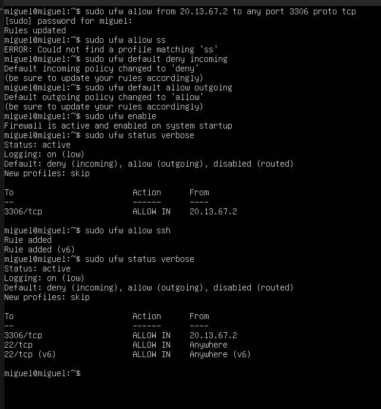
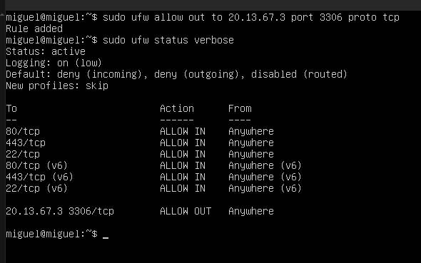
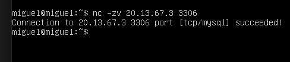

# 🔒 Reporte de Laboratorio: Restricción WEB-Server ↔ DB-Server (Solo Puerto 3306)


---

## 📋 Descripción del Reporte

Este documento presenta las evidencias visuales (capturas de pantalla) de la configuración de firewalls locales (**UFW**) en el **ServidorWeb** y el **BaseDeDatos**, para garantizar que el ServidorWeb solo pueda comunicarse con el BaseDeDatos a través del puerto `3306` (MySQL), y ninguna otra conexión.

> ⚠️ **Por qué se usa UFW y no una política del FortiGate:** ServidorWeb (`20.13.67.2`) y BaseDeDatos (`20.13.67.3`) están en la misma VLAN, conectados al mismo switch. Su tráfico se resuelve en capa 2 y **nunca cruza el FortiGate**, por lo que una política de firewall en el FortiGate no puede filtrarlo. La restricción se implementa a nivel de host con `ufw`, que sí ve todo el tráfico que entra y sale de cada máquina.

El laboratorio demuestra:

- 🔵 **BaseDeDatos** configurado para aceptar conexiones al puerto 3306 únicamente desde el ServidorWeb
- 🟡 **ServidorWeb** configurado con salida bloqueada por defecto, con una única excepción hacia la base de datos
- 🟢 **Verificación de conectividad** exitosa en el puerto permitido

---

## 📸 Evidencia 1: BaseDeDatos Restringido a Aceptar Solo al ServidorWeb

Configuración de UFW en el BaseDeDatos: solo se acepta tráfico entrante al puerto `3306/tcp` si proviene de `20.13.67.2` (el ServidorWeb). Todo el resto del tráfico entrante queda bloqueado por defecto.



```bash
sudo ufw allow from 20.13.67.2 to any port 3306 proto tcp
sudo ufw allow ssh
sudo ufw default deny incoming
sudo ufw default allow outgoing
sudo ufw enable
```

**Resultado (`ufw status verbose`):**
```text
Default: deny (incoming), allow (outgoing), disabled (routed)

To                         Action      From
--                         ------      ----
3306/tcp                   ALLOW IN    20.13.67.2
22/tcp                     ALLOW IN    Anywhere
```

---

## 📸 Evidencia 2: ServidorWeb con Salida Restringida Solo a la Base de Datos

Configuración de UFW en el ServidorWeb: la salida se bloquea por defecto (`deny outgoing`), con una única excepción explícita hacia `20.13.67.3` en el puerto `3306/tcp`. El resto de conexiones salientes (a cualquier otro destino o puerto) queda bloqueado.



```bash
sudo ufw allow 80/tcp
sudo ufw allow 443/tcp
sudo ufw allow ssh
sudo ufw default deny incoming
sudo ufw default deny outgoing
sudo ufw allow out to 20.13.67.3 port 3306 proto tcp
sudo ufw enable
```

**Resultado (`ufw status verbose`):**
```text
Default: deny (incoming), deny (outgoing), disabled (routed)

To                         Action      From
--                         ------      ----
80/tcp                     ALLOW IN    Anywhere
443/tcp                    ALLOW IN    Anywhere
22/tcp                     ALLOW IN    Anywhere

20.13.67.3 3306/tcp        ALLOW OUT   Anywhere
```

---

## 📸 Evidencia 3: Verificación de Conectividad Permitida

Prueba de conexión desde el ServidorWeb hacia el BaseDeDatos en el puerto `3306`, confirmando que la única excepción de salida configurada funciona correctamente.



```bash
nc -zv 20.13.67.3 3306
```
```text
Connection to 20.13.67.3 3306 port [tcp/mysql] succeeded!
```

---

## ✅ Pruebas Adicionales de Bloqueo (Verificadas)

Además de la conexión permitida, se verificó que **ninguna otra conexión saliente** desde el ServidorWeb es posible:

```bash
# Hacia la propia BaseDeDatos, en un puerto distinto a 3306
nc -zv 20.13.67.3 22
# Resultado: Falla (bloqueado)

# Hacia Internet, cualquier destino
nc -zv 8.8.8.8 443
# Resultado: Falla (bloqueado)
```

Y desde la red de Usuarios hacia el BaseDeDatos, el bloqueo por política del FortiGate (Política 2) también se mantiene:

```bash
nc -zv 20.13.67.3 3306
# Resultado: Falla (bloqueado por el FortiGate)
```

---

## ✅ Resumen de Validación

| Origen | Destino | Puerto | Resultado esperado | Estado |
|---|---|---|---|:---:|
| ServidorWeb | BaseDeDatos | 3306 | Permitido | ✅ |
| ServidorWeb | BaseDeDatos | 22 | Bloqueado | ✅ |
| ServidorWeb | Internet | 443 | Bloqueado | ✅ |
| Usuarios | BaseDeDatos | 3306 | Bloqueado (FortiGate) | ✅ |

Con esto, el ServidorWeb queda completamente aislado: solo puede hablar con la base de datos, y únicamente en el puerto que necesita para funcionar.

---

### 👨‍💻 Realizado por: **Miguel Ramirez Meli**


