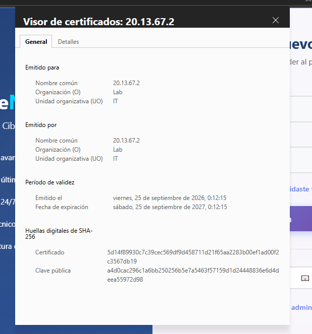

# ✅ Validación de Servicios: ServidorWeb y BaseDeDatos


## 📋 Descripción
Este documento valida el correcto funcionamiento de los dos servidores configurados en la **VLAN 20 (DMZ)**:
- **ServidorWeb** (`20.13.67.2`) - Apache con HTTPS (certificado autofirmado con SAN)
- **BaseDeDatos** (`20.13.67.3`) - MySQL Server con acceso remoto habilitado

---

## 🌐 1. ServidorWeb - Apache HTTPS (Puerto 443)

### Configuración Realizada
- Servidor Apache instalado y activo en Ubuntu
- Certificado SSL autofirmado generado con OpenSSL **incluyendo la extensión SAN** (Subject Alternative Name)
- Puerto 443 (HTTPS) habilitado y escuchando
- Certificado instalado en el almacén **"Entidades de certificación raíz de confianza"** de Windows (Máquina Local)

###  Generación del Certificado con SAN

Para que los navegadores modernos reconozcan el certificado como válido (mostrando el candado de "Conexión segura"), es necesario incluir la extensión **Subject Alternative Name (SAN)** con la IP del servidor:

```bash
sudo openssl req -x509 -nodes -days 365 -newkey rsa:2048 \
  -keyout /etc/ssl/private/apache-selfsigned.key \
  -out /etc/ssl/certs/apache-selfsigned.crt \
  -subj "/C=CO/ST=Bogota/L=Bogota/O=Lab/OU=IT/CN=20.13.67.2" \
  -addext "subjectAltName = IP:20.13.67.2"
```

> ⚠️ **Nota técnica:** Los navegadores modernos (Chrome, Edge, Firefox) ya no confían únicamente en el campo "Nombre Común" (CN) del certificado. Exigen que la IP o dominio esté declarado explícitamente en la extensión `subjectAltName`. Sin esta extensión, el navegador muestra "No seguro" aunque el certificado esté instalado como confiable.

### Reinicio de Apache
```bash
sudo systemctl restart apache2
```

### 📥 Exportación e Instalación del Certificado en Windows

**1. Descargar el certificado desde Windows (PowerShell):**
```powershell
scp miguel@20.13.67.2:/etc/ssl/certs/apache-selfsigned.crt .\servidorweb.crt
```

**2. Instalar el certificado en el almacén de Máquina Local:**
- Doble clic en `servidorweb.crt`
- Clic en **Instalar certificado...**
- Seleccionar: **Máquina local** (requiere permisos de administrador)
- Elegir: **Colocar todos los certificados en el siguiente almacén**
- Clic en **Examinar...** y seleccionar: **Entidades de certificación raíz de confianza**
- **Aceptar** → **Siguiente** → **Finalizar** → **Sí** a la advertencia de seguridad

###  Evidencia de Funcionamiento

#### Captura 1: Acceso HTTPS con "Conexión Segura"
Acceso exitoso a `https://20.13.67.2` desde el navegador, mostrando el **candado cerrado** y la página web personalizada del ServidorWeb en la VLAN 20 DMZ.


#### Captura 2: Información del Certificado
Detalle del certificado instalado, mostrando:
- **Emitido para:** `20.13.67.2`
- **Organización:** `Lab`
- **Unidad organizativa:** `IT`
- **Válido desde:** 24/09/2026 hasta 24/09/2027
- **Extensión SAN:** `IP:20.13.67.2`



#### Captura 3: Verificación desde la CLI del ServidorWeb
Comandos ejecutados en el servidor para confirmar que Apache está activo y los puertos 80 y 443 están escuchando:

```bash
# Verificar estado del servicio Apache
sudo systemctl status apache2

# Verificar puertos abiertos
sudo ss -tlnp | grep apache
```

**Salida esperada:**
```text
● apache2.service - The Apache HTTP Server
   Loaded: loaded (/lib/systemd/system/apache2.service; enabled)
   Active: active (running)

LISTEN 0  511  0.0.0.0:80   0.0.0.0:*  users:(("apache2",...))
LISTEN 0  511  0.0.0.0:443  0.0.0.0:*  users:(("apache2",...))
```

---

## 🗄️ 2. BaseDeDatos - MySQL Remote Access (Puerto 3306)

### Configuración Realizada
- MySQL Server 8.0 instalado y activo en Ubuntu
- Base de datos `lab_db` creada
- Usuario remoto `lab_user` creado con acceso desde cualquier IP (`%`)
- `bind-address` configurado en `0.0.0.0` para aceptar conexiones remotas
- Puerto 3306 escuchando en todas las interfaces

### ⚠️ Solución al Error de Política de Contraseñas (ERROR 1819)
MySQL 8.0 incluye el componente `validate_password` que exige contraseñas complejas. Para el laboratorio, se relajó la política temporalmente:

```sql
SET GLOBAL validate_password.policy = LOW;
SET GLOBAL validate_password.length = 4;
```

### Creación de Base de Datos y Usuario Remoto
```sql
CREATE DATABASE lab_db;
CREATE USER 'lab_user'@'%' IDENTIFIED BY 'lab123';
GRANT ALL PRIVILEGES ON lab_db.* TO 'lab_user'@'%';
FLUSH PRIVILEGES;
EXIT;
```

### Configuración de bind-address
```bash
sudo nano /etc/mysql/mysql.conf.d/mysqld.cnf
```
Cambiar:
```ini
bind-address = 0.0.0.0
```

### Reinicio y Verificación
```bash
sudo systemctl restart mysql
sudo ss -tlnp | grep 3306
```

**Salida obtenida:**
```text
LISTEN 0  70  127.0.0.1:33060  0.0.0.0:*  users:(("mysqld",pid=51325,fd=21))
LISTEN 0  151  0.0.0.0:3306   0.0.0.0:*  users:(("mysqld",pid=51325,fd=23))
```

> ✅ La línea `0.0.0.0:3306` confirma que MySQL acepta conexiones remotas desde cualquier interfaz de red.

### Evidencia de Funcionamiento

#### Captura 4: Conexión Remota Exitosa desde el ServidorWeb
Comando ejecutado desde el **ServidorWeb** (`20.13.67.2`) para conectarse al servidor de **BaseDeDatos** (`20.13.67.3`):

```bash
mysql -h 20.13.67.3 -u lab_user -p
```

**Salida esperada:**
```text
Welcome to the MySQL monitor.  Commands end with ; or \g.
Your MySQL connection id is 20
Server version: 8.0.46-0ubuntu0.22.04.4 (Ubuntu)

mysql> SHOW DATABASES;
+--------------------+
| Database           |
+--------------------+
| information_schema |
| lab_db             |
+--------------------+

mysql> EXIT;
Bye
```

---

## ✅ Resumen de Validación

| Servicio | Servidor | IP | Puerto | Estado | Evidencia |
| :--- | :--- | :--- | :---: | :---: | :---: |
| **Apache HTTPS** | ServidorWeb | `20.13.67.2` | 443 | ✅ Activo | Captura 1, 2 y 3 |
| **MySQL Remote** | BaseDeDatos | `20.13.67.3` | 3306 | ✅ Activo | Captura 4 |

---

## 🔍 Comandos de Verificación Rápida

### Desde el ServidorWeb (`20.13.67.2`):
```bash
# Verificar que Apache está corriendo
sudo systemctl status apache2

# Verificar puertos HTTP y HTTPS
sudo ss -tlnp | grep -E '80|443'

# Probar acceso local a la web
curl -k https://localhost
```

### Desde la BaseDeDatos (`20.13.67.3`):
```bash
# Verificar que MySQL está corriendo
sudo systemctl status mysql

# Verificar puerto 3306
sudo ss -tlnp | grep 3306

# Verificar usuarios y bases de datos
sudo mysql -u root -e "SHOW DATABASES; SELECT user, host FROM mysql.user;"
```

### Prueba de Conectividad entre Servidores:
```bash
# Desde ServidorWeb hacia BaseDeDatos
mysql -h 20.13.67.3 -u lab_user -p
```

---

<br>

### 👨‍💻 Realizado por: **Miguel Ramirez Meli**


