

  
  
  
  
  
  

<h1 align="center">Configuración NPS (RADIUS)</h1>
<h3 align="center">Niveles de acceso 15, 1 y 0</h3>

<i>Evidencia de laboratorio — Miguel Ramirez Meli (20251367)</i>

 

## Paso 1 — Topología

  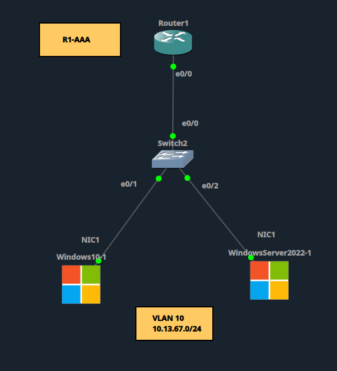 
  <i>Router1 — Switch2 — Windows10-1 / WindowsServer2022-1, VLAN 10 (10.13.67.0/24).</i>

 

## Paso 2 — WindowsServer2022-1: Red y Active Directory (`miguel.local`)

Se asignó la IP `10.13.67.10` al servidor y se promovió a controlador de dominio, creando el bosque `miguel.local`.

  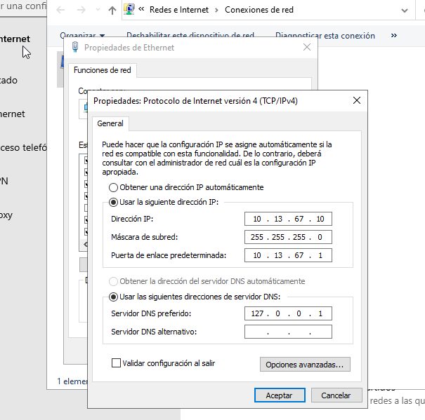 
  <i>Configuración IP del WindowsServer2022-1.</i>

  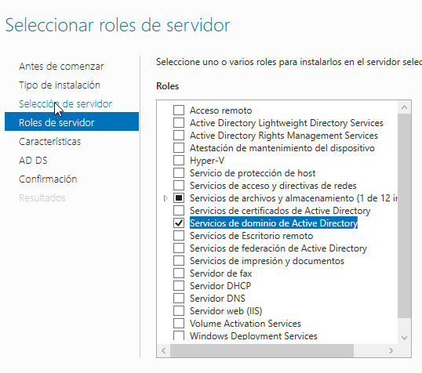 
  <i>Instalación del rol Servicios de dominio de Active Directory.</i>

  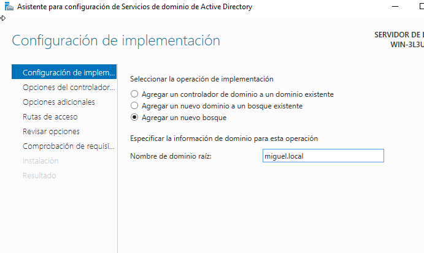 
  <i>Creación del bosque y dominio miguel.local.</i>

 

## Paso 3 — Grupos y usuarios de dominio

Se crearon los grupos `Admins-Nivel15`, `Users-Nivel1` y `Users-Nivel0`, y los usuarios `miguel`, `carlos` y `emily`, cada uno asignado a su grupo.

  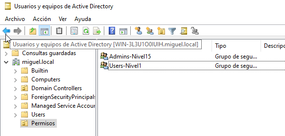 
  <i>Grupos de seguridad Admins-Nivel15 y Users-Nivel1 creados en AD.</i>

  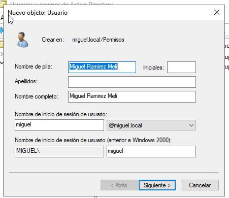 
  <i>Creación del usuario Miguel Ramirez Meli.</i>

  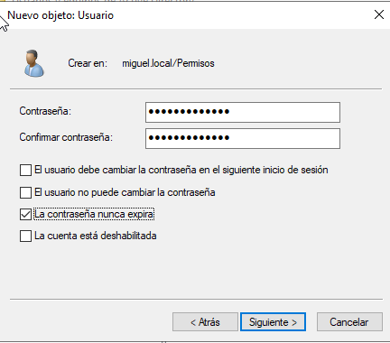 
  <i>Configuración de contraseña para el usuario creado.</i>

  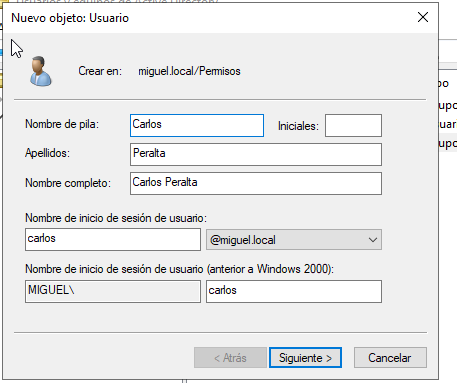 
  <i>Creación del usuario Carlos Peralta.</i>

  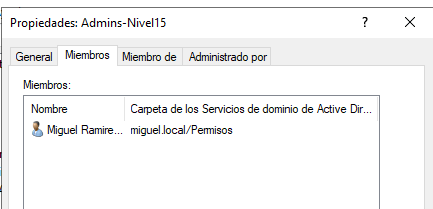 
  <i>Miguel Ramirez Meli agregado como miembro de Admins-Nivel15.</i>

  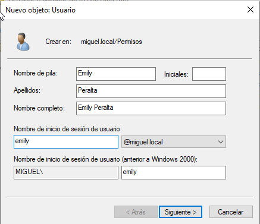 
  <i>Creación del usuario Emily Peralta.</i>

  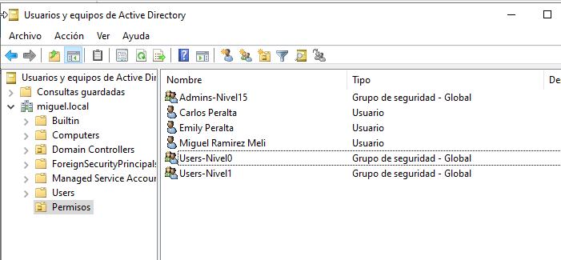 
  <i>Listado final de usuarios y grupos en el dominio.</i>

  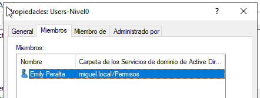 
  <i>Emily Peralta agregada como miembro de Users-Nivel0.</i>

 

## Paso 4 — Instalación del rol NPS

  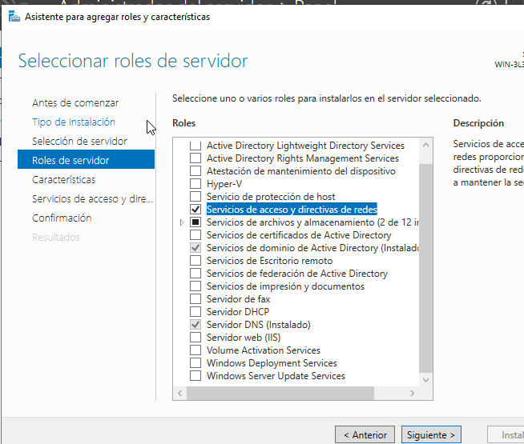 
  <i>Instalación del rol Servicios de acceso y directivas de redes (NPS).</i>

 

## Paso 5 — Router1 como cliente RADIUS

  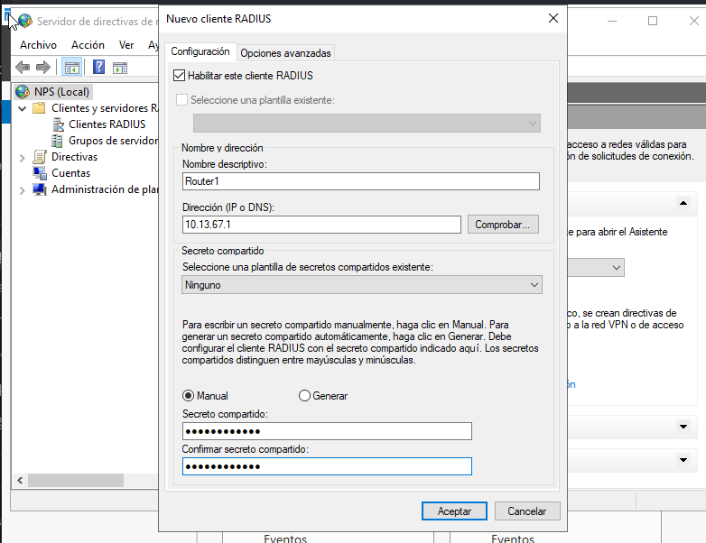 
  <i>Registro de Router1 como cliente RADIUS en NPS.</i>

 

## Paso 6 — Directivas de red: Nivel 15, Nivel 1 y Nivel 0

Se crearon las tres directivas de red, cada una condicionada a su grupo de dominio, con `Service-Type = NAS Prompt` y el `Cisco-AV-Pair` correspondiente.

  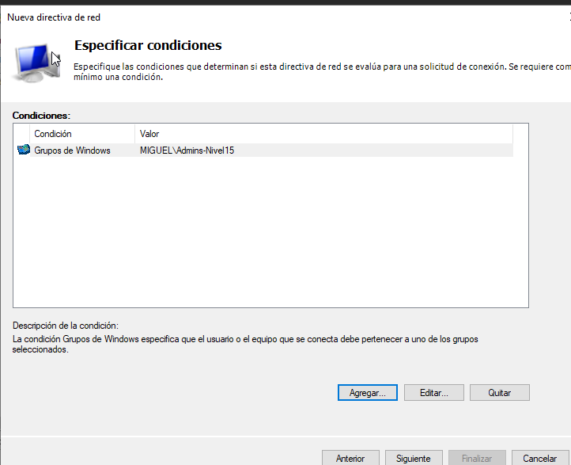 
  <i>Condición de directiva: grupo MIGUEL\Admins-Nivel15.</i>

  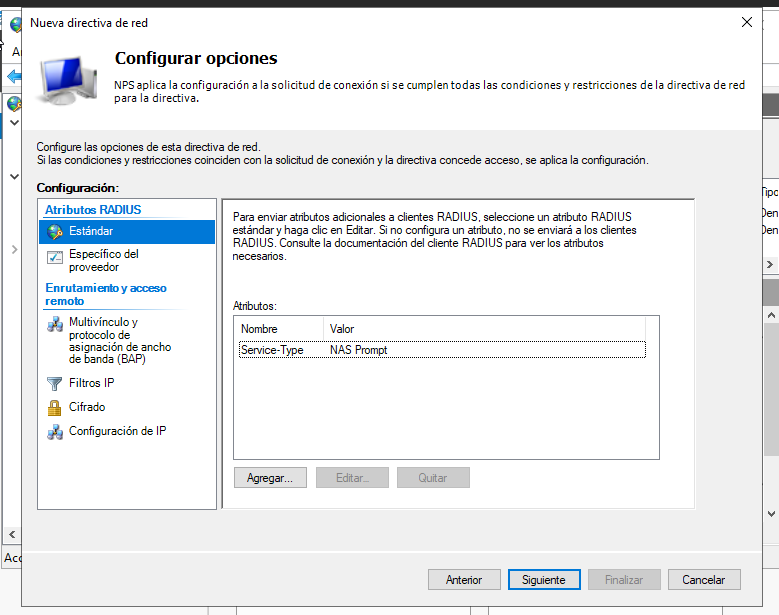 
  <i>Service-Type = NAS Prompt configurado (Framed-Protocol removido).</i>

  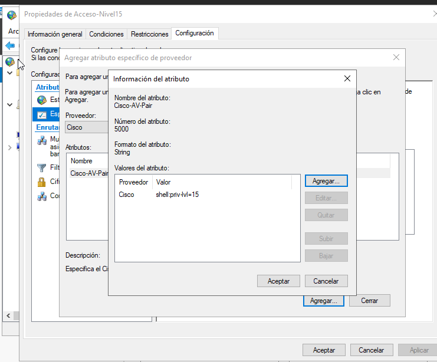 
  <i>Cisco-AV-Pair = shell:priv-lvl=15 agregado a Acceso-Nivel15.</i>

  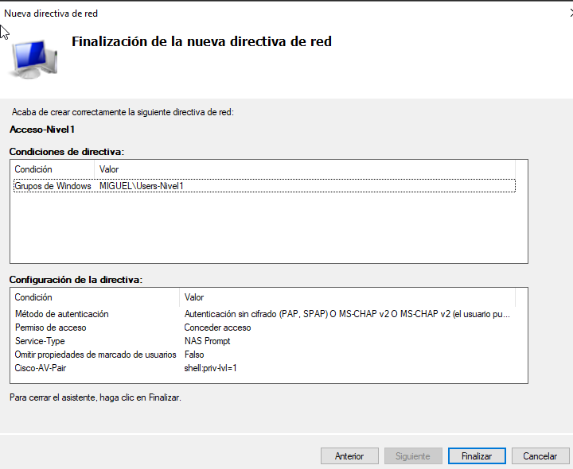 
  <i>Directiva Acceso-Nivel1 finalizada (Users-Nivel1, shell:priv-lvl=1).</i>

  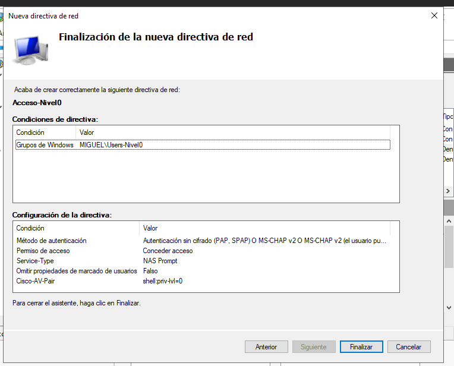 
  <i>Directiva Acceso-Nivel0 finalizada (Users-Nivel0, shell:priv-lvl=0).</i>

  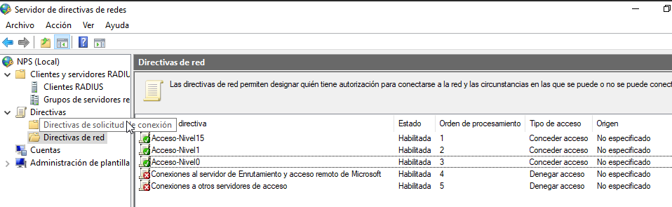 
  <i>Las tres directivas habilitadas y en orden de procesamiento.</i>

 

## Paso 7 — Pruebas de conectividad y verificación

Se validó el acceso SSH de los tres usuarios y su nivel de privilegio exacto, tanto por sesión SSH como por prueba directa de autenticación (`test aaa`) desde Router1.

  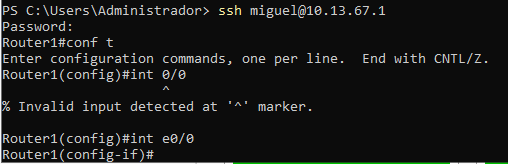 
  <i>miguel inicia sesión en Router1 con privilegio 15.</i>

  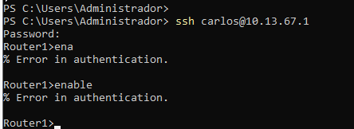 
  <i>carlos inicia sesión con privilegio restringido (no puede usar enable).</i>

  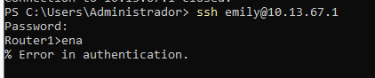 
  <i>emily inicia sesión con privilegio restringido (no puede usar enable).</i>

  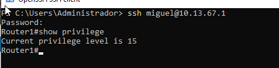 
  <i>show privilege confirma nivel 15 para miguel.</i>

  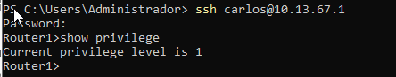 
  <i>show privilege confirma nivel 1 para carlos.</i>

  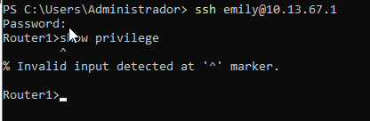 
  <i>En nivel 0, ni show está permitido (confirma la restricción máxima).</i>

  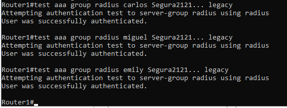 
  <i>test aaa group radius confirma autenticación exitosa contra el NPS para los tres usuarios.</i>

