# 🖥️ Evidencia: RemoteApp · RemoteApp Web Client · Página Personalizada IIS

> Documento demostrativo — evidencia de que los tres servicios fueron configurados y probados exitosamente sobre el dominio `miguel.local`. No es una guía de instalación; muestra la configuración final en el servidor y el resultado real desde el cliente **Windows10-1**.

---

## 📋 Resumen

| Servicio | Estado | Evidencia |
|---|---|---|
| RDP RemoteApp | ✅ Funcional | [Ir a sección](#1-rdp-remoteapp) |
| RDP RemoteApp Web Client | ✅ Funcional | [Ir a sección](#2-rdp-remoteapp-web-client) |
| Página personalizada de IIS | ✅ Funcional | [Ir a sección](#3-página-personalizada-de-iis) |

---

## 1. RDP RemoteApp

### 1.1 Configuración en el servidor

**Figura 1** — *Información general de la implementación de Servicios de Escritorio remoto, con los roles instalados (Agente de conexión, Host de sesión, Puerta de enlace y Acceso web) sobre `WIN-GLS36OR7EQI.miguel.local`.*

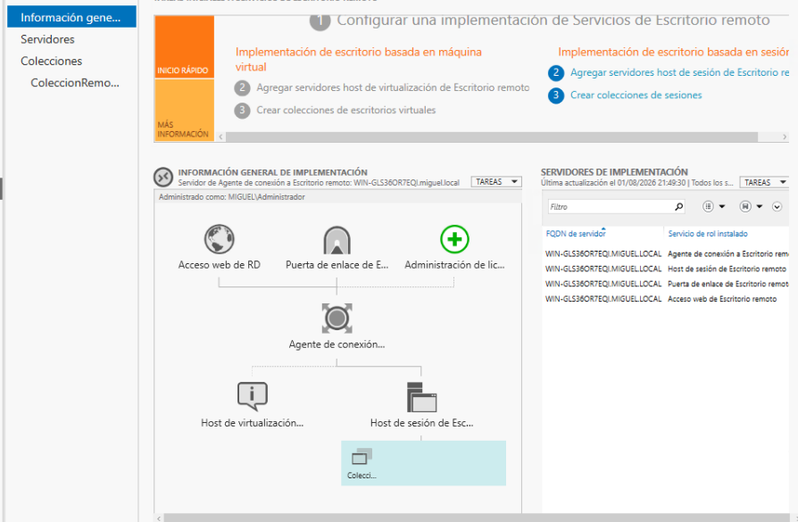

**Figura 2** — *Colección de sesiones `ColeccionRemoteApp`, con los programas RemoteApp publicados (Bloc de notas y Calculadora) y el servidor host asociado.*

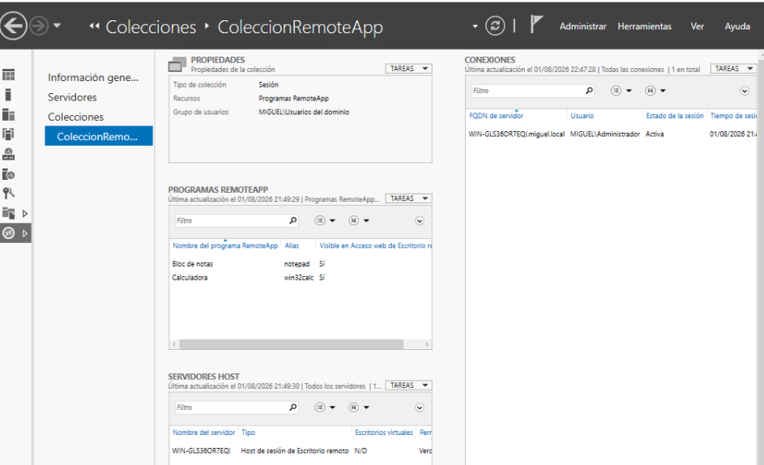

### 1.2 Demostración desde el cliente (Windows10-1)

**Figura 3** — *Inicio de sesión en el portal de Acceso web de RD (`https://miguel.local/RDWeb`) desde Windows10-1.*

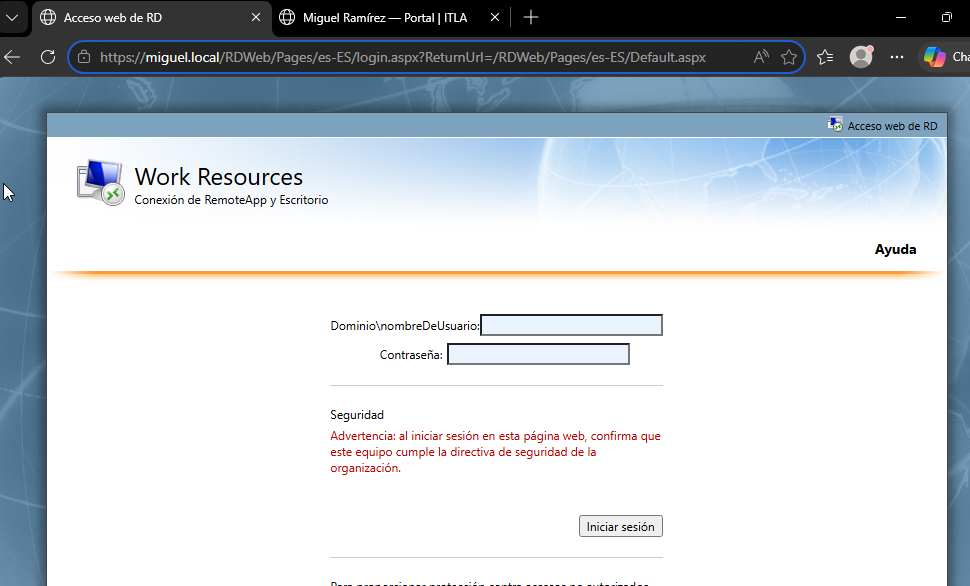

**Figura 4** — *Portal tras iniciar sesión, mostrando las apps publicadas: Bloc de notas y Calculadora.*

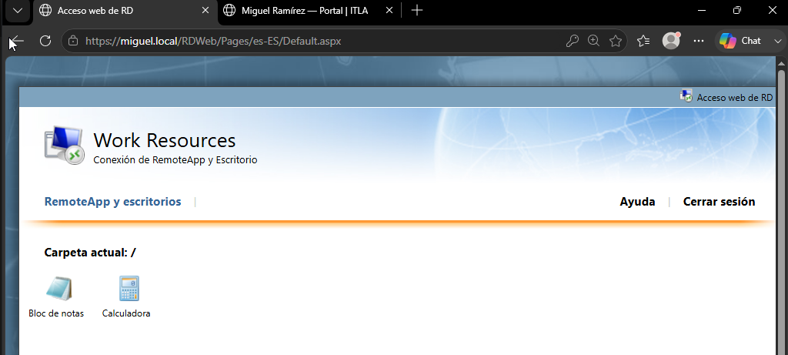

**Figura 5** — *Inicio de la app RemoteApp "Bloc de notas", con la sesión remota configurándose.*

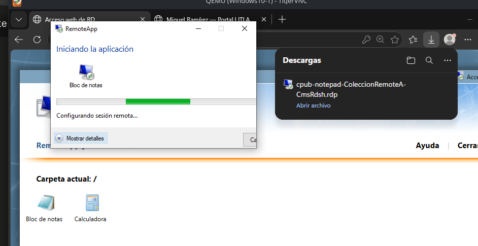

**Figura 6** — *Bloc de notas corriendo como ventana individual en el cliente, confirmando la conexión activa a `WIN-GLS36OR7EQI.miguel.local`.*

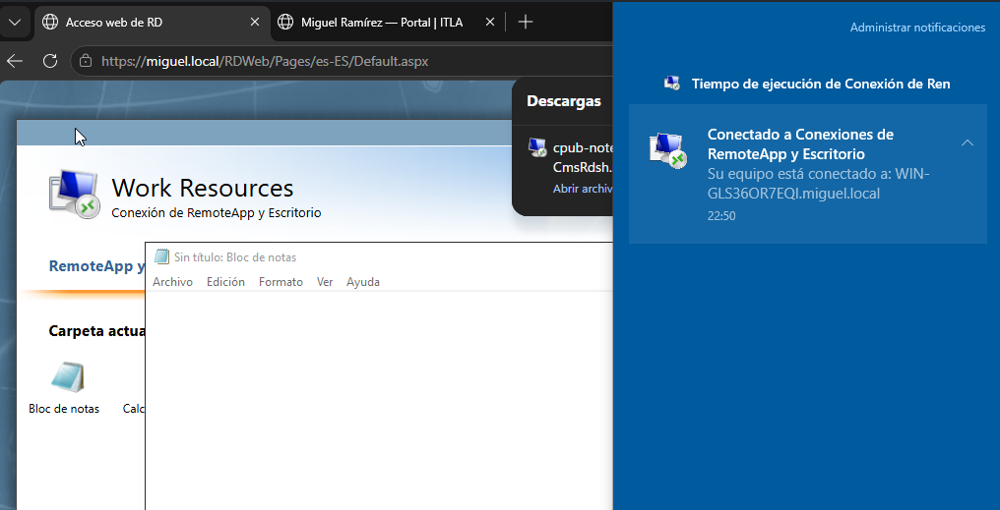

---

## 2. RDP RemoteApp Web Client

### 2.1 Acceso al portal Web Client

**Figura 7** — *Inicio de sesión del Cliente web del Escritorio remoto (`https://miguel.local/RDWeb/webclient/`) desde el navegador del cliente.*

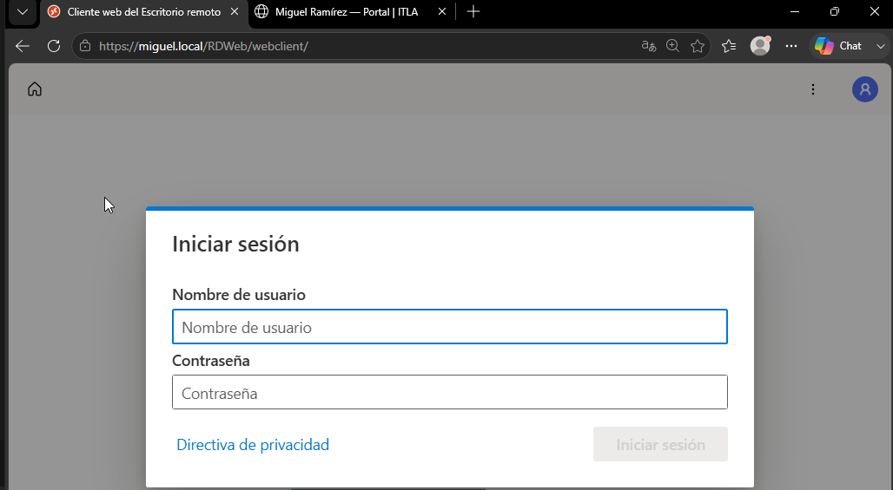

**Figura 8** — *Panel "Work Resources" del RD Web Client, mostrando las apps disponibles (Bloc de notas y Calculadora).*

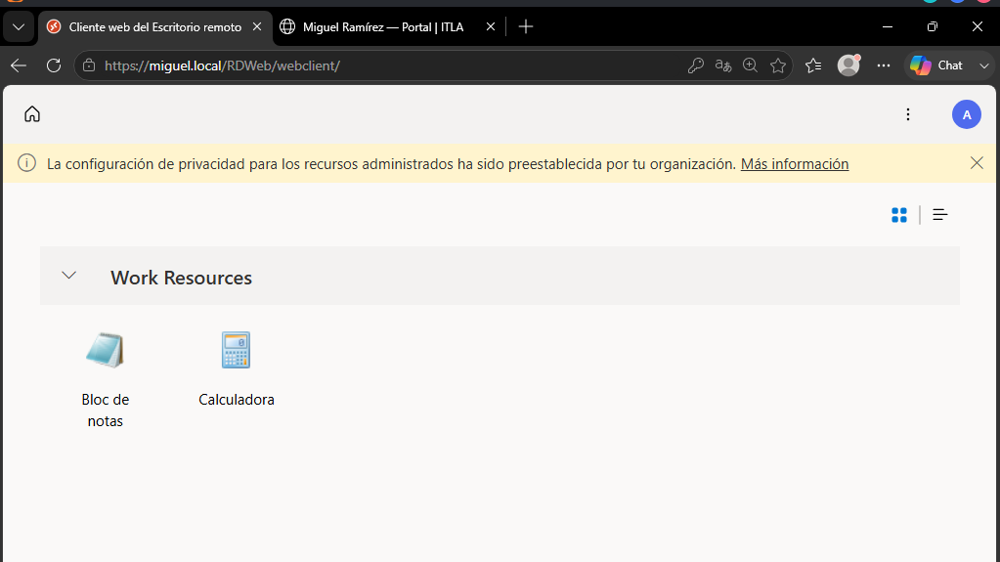

### 2.2 Demostración de funcionamiento

**Figura 9** — *Conexión e inicio de la app "Calculadora" directamente dentro del navegador, sin descarga de archivos.*

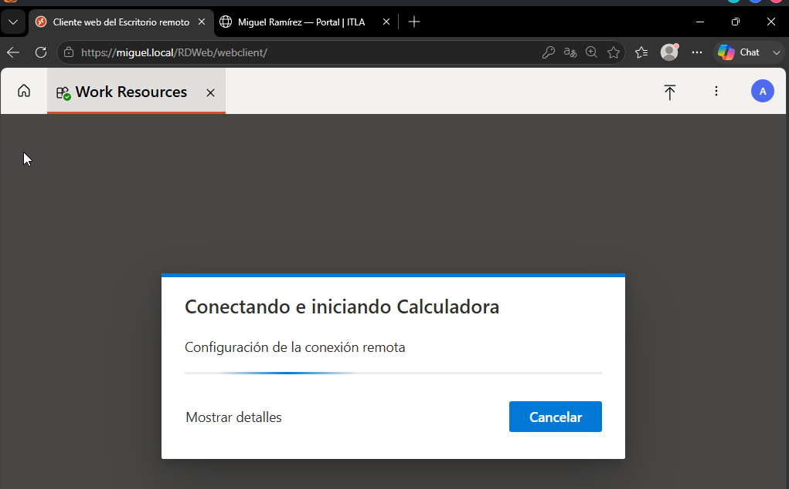

**Figura 10** — *Bloc de notas ejecutándose embebido dentro de la pestaña del navegador vía RD Web Client (HTML5), confirmando el funcionamiento del servicio.*

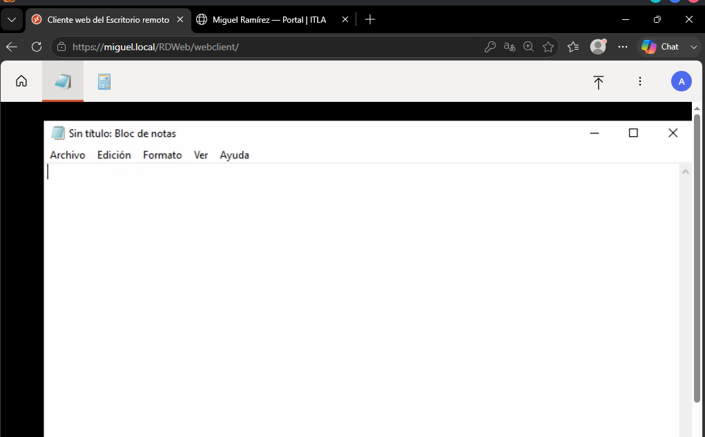

---

## 3. Página Personalizada de IIS

### 3.1 Resultado desde el cliente

**Figura 11** — *Página personalizada de IIS (`https://miguel.local`) mostrando la identificación del portal "ITLA / Seguridad de Redes" y los datos del usuario (Miguel Ramírez, matrícula 2025-1367).*

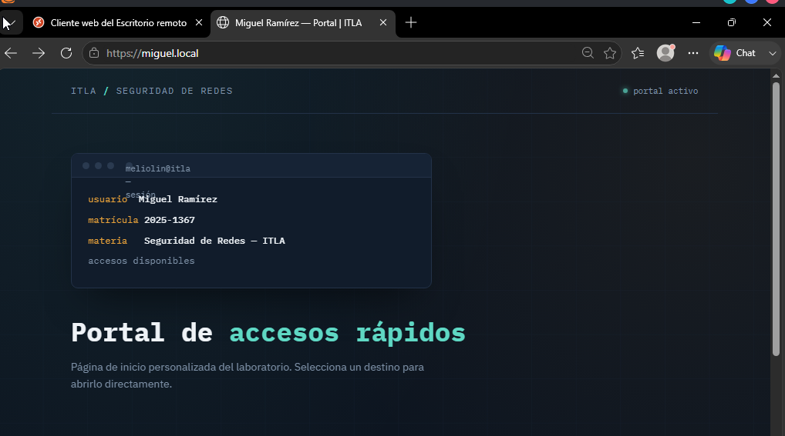

**Figura 12** — *Sección "Accesos" de la página personalizada, con enlaces configurados como página de inicio del servidor, incluyendo el acceso directo al RD Web Client del laboratorio.*

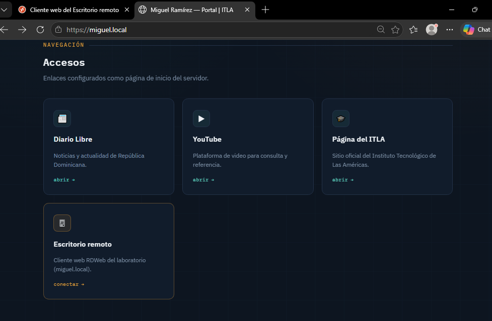

---

## ✅ Conclusión

Las evidencias anteriores confirman que los tres servicios —**RDP RemoteApp**, **RDP RemoteApp Web Client** y la **página personalizada de IIS**— fueron configurados correctamente sobre el dominio `miguel.local` y se encuentran plenamente funcionales: el usuario de dominio puede acceder y ejecutar las aplicaciones publicadas tanto mediante archivos `.rdp` como directamente desde el navegador, además de contar con un portal de acceso centralizado y personalizado.
