<a href="#"></a> **VPN Client‑to‑Site Punto a Multipunto — IPsec (IKEv1) + L2TP — GNS3**

     

<!-- Los badges anteriores son servidos por img.shields.io y, al visualizarse en GitHub, se re-sirven automáticamente a través de camo.githubusercontent.com (proxy de imágenes de GitHub). -->

---

**Estudiante:** Miguel Ramírez Meli — Matrícula 2025-1367
**Carrera:** Seguridad Informática — ITLA
**Materia:** Seguridad de Redes
**Profesor:** Jonathan Rondón

---

## 🎯 De qué trata esto

Este repo es la **demostración** de que la VPN quedó levantada y funcionando de punta a punta: un equipo remoto (`Windows10-1`) se conecta por **L2TP sobre IPsec (IKEv1)** contra un router GNS3 (`R3`) que actúa como servidor VPN, y desde ahí llega cifrado hasta la LAN protegida donde vive `PC2`. No es una guía paso a paso — es la evidencia de que **funcionó**, con capturas reales de cada fase del túnel.

## 🗺️ Topología

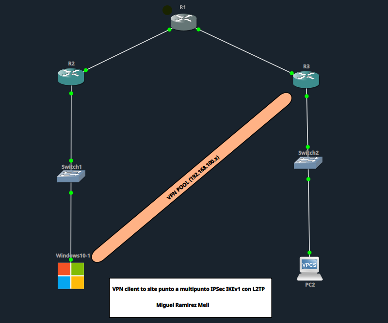

| Rol | Dispositivo |
|---|---|
| Nodo de tránsito (ISP, sin rutas) | R1 |
| Gateway lado cliente | R2 |
| Servidor VPN (LNS) — L2TP/IPsec | R3 |
| Switch lado cliente (VLAN 10) | Switch1 |
| Switch LAN protegida (VLAN 20) | Switch2 |
| Cliente VPN | Windows10-1 |
| Host destino en LAN protegida | PC2 (VPCS) |

**Direccionamiento** (basado en la matrícula 2025-1367 → tercer/cuarto octeto `13.67`):

| Dispositivo | Interfaz | IP | Descripción |
|---|---|---|---|
| R1 | Fa0/0 | 200.13.67.1/30 | Enlace a R2 |
| R1 | Fa0/1 | 200.13.67.5/30 | Enlace a R3 |
| R2 | Fa0/0 | 200.13.67.2/30 | WAN hacia R1 (NAT) |
| R2 | Fa0/1 | 10.13.67.1/24 | LAN cliente — VLAN 10 |
| R3 | Fa0/0 | 200.13.67.6/30 | WAN hacia R1 — IP pública del servidor VPN |
| R3 | Fa0/1 | 20.13.67.1/24 | LAN protegida — VLAN 20 |
| R3 | Virtual-Template1 | Unnumbered (Fa0/1) | Interfaz virtual PPP para clientes L2TP |
| Windows10-1 | NIC1 | 10.13.67.10/24 | Cliente VPN remoto |
| PC2 | NIC | 20.13.67.10/24 | Host protegido destino |
| Pool VPN | — | 192.168.100.10–20 | Asignado dinámicamente por PPP |

## ⚙️ Lo que quedó configurado

**NAT en R2** — el tráfico de `Windows10-1` se traduce por overload hacia la IP pública de R2, ya que R1 (el "ISP") no tiene rutas hacia la red privada del cliente:

```
ip access-list standard NAT_CLIENTE
 permit 10.13.67.0 0.0.0.255
interface FastEthernet0/1
 ip nat inside
interface FastEthernet0/0
 ip nat outside
ip nat inside source list NAT_CLIENTE interface FastEthernet0/0 overload
```

**Fase 1 ISAKMP (IKEv1) en R3:**

```
crypto isakmp policy 10
 encr aes 256
 hash sha
 authentication pre-share
 group 5
 lifetime 86400
crypto isakmp key cisco123 address 0.0.0.0 0.0.0.0
crypto isakmp keepalive 10 3
```

**Fase 2 IPsec (modo transporte) en R3:**

```
crypto ipsec transform-set TSET_L2TP esp-aes 256 esp-sha-hmac
 mode transport
crypto dynamic-map DYNMAP_L2TP 10
 set transform-set TSET_L2TP
 set security-association lifetime seconds 3600
crypto map CMAP_L2TP 10 ipsec-isakmp dynamic DYNMAP_L2TP
interface FastEthernet0/0
 crypto map CMAP_L2TP
```

**AAA, pool y VPDN (L2TP) en R3:**

```
aaa new-model
aaa authentication ppp default local
aaa authorization network default local
username vpnuser password cisco123
ip local pool POOL_L2TP 192.168.100.10 192.168.100.20
vpdn enable
vpdn-group VPDN_L2TP_WINDOWS
 accept-dialin
  protocol l2tp
  virtual-template 1
 no l2tp tunnel authentication
interface Virtual-Template1
 ip unnumbered FastEthernet0/1
 peer default ip address pool POOL_L2TP
 ppp authentication ms-chap-v2 chap pap
 ppp encrypt mppe auto
```

> ⚠️ El usuario se crea con `username vpnuser password cisco123` (no con `secret`), porque MS-CHAPv2 necesita la contraseña en texto reversible para calcular el reto de autenticación.

**Cliente Windows 10** — VPN nativa tipo *L2TP/IPsec con clave previamente compartida*:

| Campo | Valor |
|---|---|
| Nombre de conexión | VPN-R3-L2TP |
| Servidor | 200.13.67.6 |
| Clave precompartida | cisco123 |
| Usuario / Contraseña | vpnuser / cisco123 |

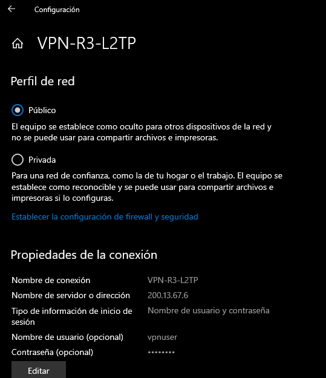 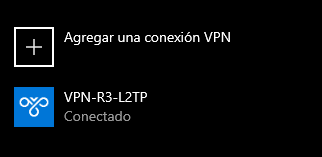

## ✅ Evidencia de que funciona

### NAT activo en R2

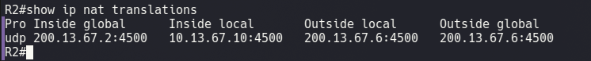

*`show ip nat translations` — traducción activa `10.13.67.10:4500 → 200.13.67.2:4500`.*

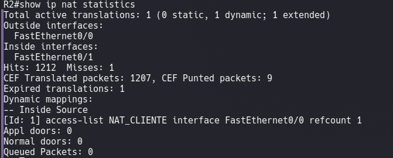

*`show ip nat statistics` — traducción dinámica activa asociada a la ACL `NAT_CLIENTE`.*

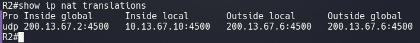
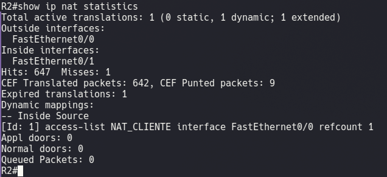

### Fase 1 — ISAKMP SA levantada en R3

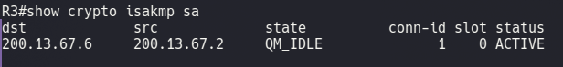

*`show crypto isakmp sa` — SA en estado **QM_IDLE / ACTIVE** entre R3 (200.13.67.6) y la IP traducida del cliente (200.13.67.2).*

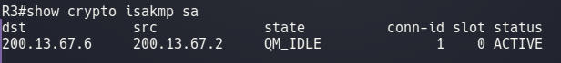

### Fase 2 — IPsec SA en modo transporte

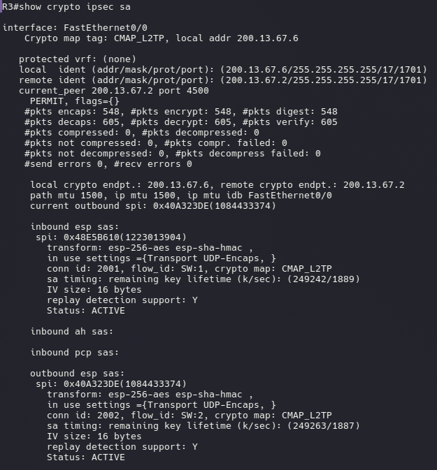

*`show crypto ipsec sa` — SA en modo **Transport UDP-Encaps**, contadores `encaps`/`decaps` incrementando sobre el puerto UDP 4500 (NAT-T).*

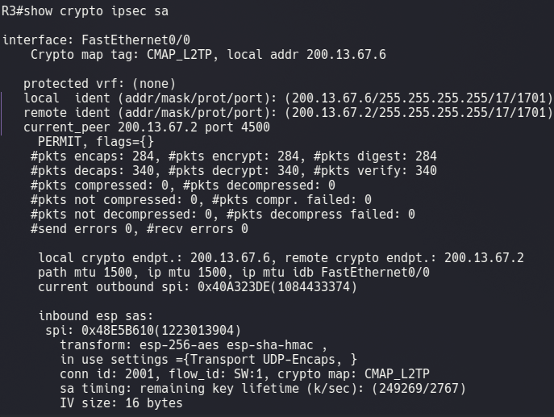

### Sesión L2TP / PPP establecida

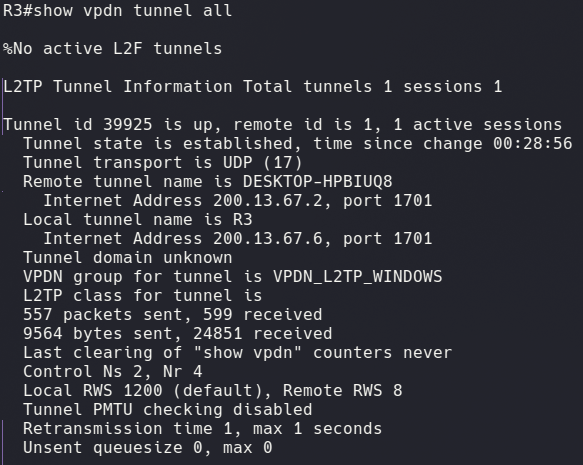

*`show vpdn tunnel all` — túnel L2TP establecido con el cliente Windows10-1.*

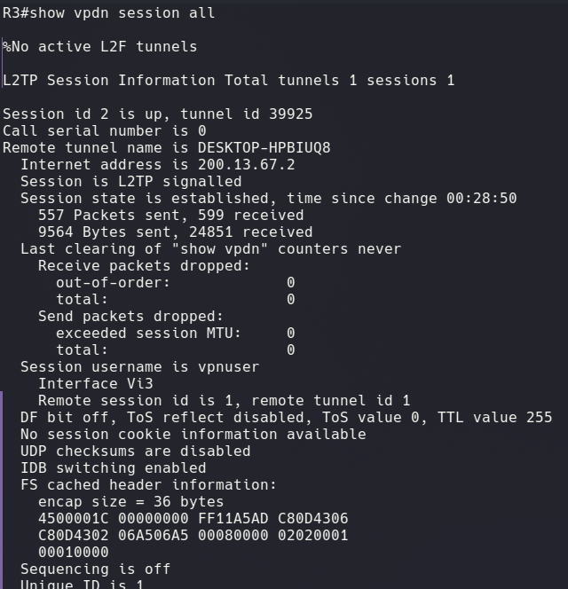

*`show vpdn session all` — sesión establecida, usuario `vpnuser`, interfaz `Vi3`.*

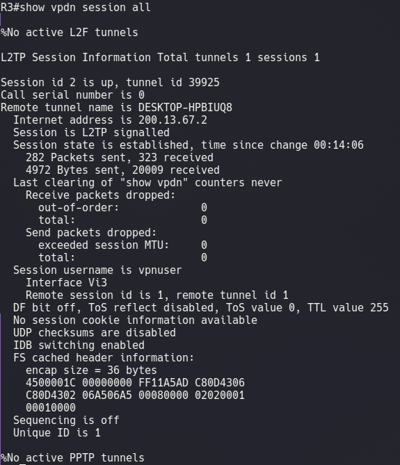

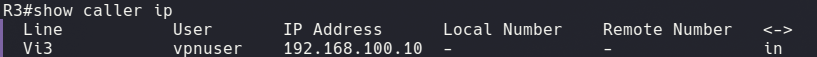

*`show caller ip` — `vpnuser` recibió `192.168.100.10` del pool configurado.*

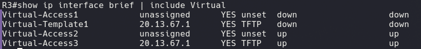

*`show ip interface brief | include Virtual` — `Virtual-Access3` en estado **up/up**.*

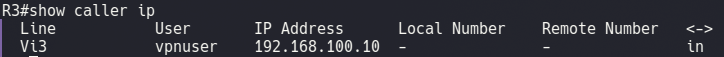

### Verificación en el cliente Windows

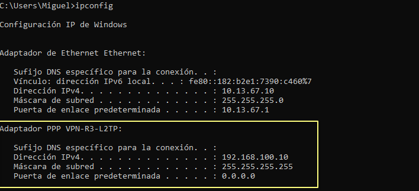

*`ipconfig` — adaptador PPP **VPN-R3-L2TP** con IP `192.168.100.10`, junto al adaptador Ethernet local `10.13.67.10`.*

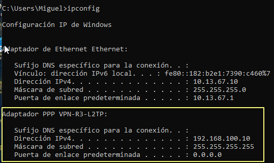

### R1 no ve nada de las redes privadas (confirma que todo pasa por el túnel + NAT)

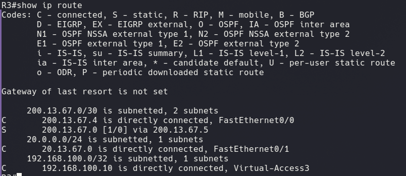

*`show ip route` en R3.*

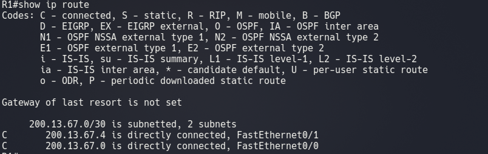

*`show ip route` en R1 — solo sus dos redes conectadas directamente; **cero** visibilidad de las LAN privadas del cliente o de la protegida.*

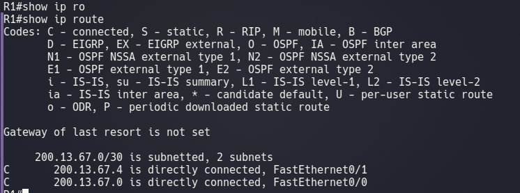

### Conectividad end-to-end sobre el túnel

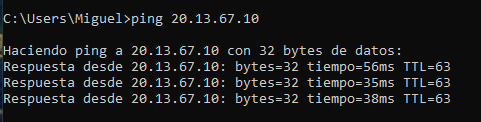

*Ping desde Windows10-1 hacia PC2 (20.13.67.10) — tráfico viajando cifrado por el túnel.*

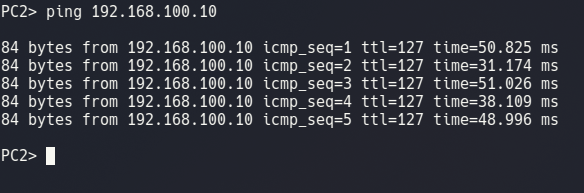

*Ping desde PC2 hacia la IP asignada por VPN (192.168.100.10) — respuesta bidireccional confirmada.*

## 🧪 Comandos usados para comprobar todo esto

| Dispositivo | Comando | Qué confirma |
|---|---|---|
| R2 | `show ip nat translations` | Traducción NAT activa del cliente |
| R2 | `show ip nat statistics` | ACL y estadísticas de NAT |
| R3 | `show crypto isakmp sa` | Fase 1 (ISAKMP) en QM_IDLE |
| R3 | `show crypto ipsec sa` | Fase 2 (IPsec) y tráfico cifrado |
| R3 | `show vpdn tunnel all` | Túnel L2TP establecido |
| R3 | `show vpdn session all` | Sesión L2TP activa |
| R3 | `show caller ip` | Usuario PPP e IP del pool |
| R1 / R2 / R3 | `show ip route` | Enrutamiento (y su ausencia en R1) |
| Windows10-1 | `ipconfig` | IP asignada al adaptador PPP |
| Windows10-1 | `ping 20.13.67.10` | Conectividad hacia la LAN protegida |
| PC2 | `ping 192.168.100.10` | Conectividad hacia el cliente VPN |

## 🏁 Conclusión

La VPN Client-to-Site punto a multipunto sobre **L2TP/IPsec (IKEv1)** quedó **100% funcional**: NAT traduciendo, SA de ISAKMP e IPsec activas, sesión L2TP/PPP autenticada, y ping bidireccional exitoso entre `Windows10-1` y `PC2` a través del túnel cifrado. Objetivo de confidencialidad, autenticación e integridad para acceso remoto seguro: **cumplido**.
