# 🔐 VPN Site-to-Site IPSec IKEv1 Basada en Enrutamiento (Route-Based VTI) — Demostración Funcional

  -0078D4?style=flat-square) 

 

**Estudiante:** Miguel Ramirez Meli
**Matrícula:** 2025-1367
**Asignatura:** Seguridad de Redes – TSI203
**Profesor:** Jonathan Rondon
**Simulador:** GNS3
**Fecha:** 30 de junio de 2026

> Este documento presenta la **evidencia de que la VPN Site-to-Site basada en enrutamiento (Route-Based / VTI) quedó correctamente implementada y operativa**. A diferencia del modelo basado en políticas, aquí no existen ACLs de tráfico interesante: la interfaz virtual de túnel (Tunnel0) con `ip unnumbered` actúa como next-hop de ruteo, y todo el tráfico que pasa por ella se cifra automáticamente. Cada sección muestra el resultado obtenido directamente desde la CLI de los routers PEAR-A y PEAR-B.

---

## 🎯 Objetivo cumplido

Se implementó y se **comprobó en funcionamiento** una VPN Site-to-Site basada en enrutamiento usando IPSec IKEv1 con interfaces virtuales de túnel (VTI) e `ip unnumbered`, demostrando la diferencia con el modelo basado en políticas y verificando la conectividad cifrada entre **PEAR-A** y **PEAR-B** en GNS3.

---

## 🗺️ Topología desplegada

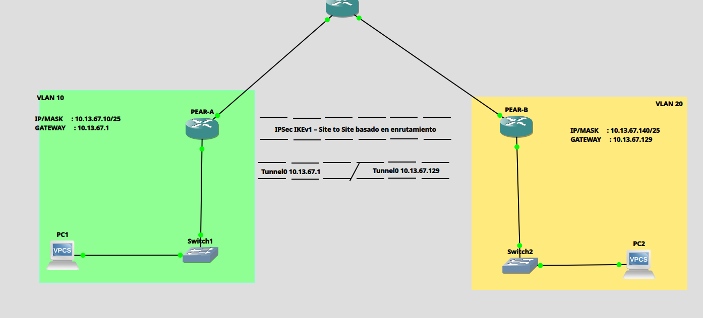

*Figura 1. Topología de red — GNS3*

La topología quedó conformada por dos sedes (PEAR-A y PEAR-B) conectadas a través de un router ISP intermedio, cada una con su interfaz `Tunnel0` levantada sobre `Eth0/1` mediante `ip unnumbered`, actuando como el canal cifrado punto a punto.

### Direccionamiento IP aplicado

| Dispositivo | Interfaz | Dirección IP | Máscara | Descripción |
|---|---|---|---|---|
| ISP | Eth0/0 | 200.13.67.1 | /30 | WAN → PEAR-A |
| ISP | Eth0/1 | 200.13.67.5 | /30 | WAN → PEAR-B |
| PEAR-A | Eth0/0 | 200.13.67.2 | /30 | WAN → ISP |
| PEAR-A | Eth0/1 | 10.13.67.1 | /25 | LAN / VTI unnumbered |
| PEAR-A | Tunnel0 | (unnumbered Eth0/1) | — | VTI IPSec |
| PEAR-B | Eth0/0 | 200.13.67.6 | /30 | WAN → ISP |
| PEAR-B | Eth0/1 | 10.13.67.129 | /25 | LAN / VTI unnumbered |
| PEAR-B | Tunnel0 | (unnumbered Eth0/1) | — | VTI IPSec |
| PC1 | eth0 | 10.13.67.10 | /25 | Host Sede A |
| PC2 | eth0 | 10.13.67.140 | /25 | Host Sede B |

### VLANs

| VLAN ID | Nombre | Switch | Puertos |
|---|---|---|---|
| 10 | LAN_PEAR_A | Switch1 | Eth0/0, Eth0/1 (access) |
| 20 | LAN_PEAR_B | Switch2 | Eth0/0, Eth0/1 (access) |

---

## 🔐 Parámetros criptográficos usados

**Fase 1 — IKEv1 (ISAKMP)**

| Parámetro | Valor |
|---|---|
| Versión IKE | IKEv1 (ISAKMP) |
| Política | 10 |
| Cifrado | AES-256 |
| Hash | SHA-256 |
| Autenticación | Pre-Shared Key |
| Grupo DH | Grupo 14 (2048-bit) |
| PSK | cisco123 |

**Fase 2 — IPSec + Perfil VTI**

| Parámetro | Valor |
|---|---|
| Transform Set | TSET_IKEv1 |
| Cifrado ESP | AES-256 |
| Integridad ESP | SHA-256 HMAC |
| Modo | Tunnel |
| Perfil IPSec | PERFIL_VTI |
| Interfaz Túnel | Tunnel0 (ip unnumbered) |

📂 Scripts completos de configuración disponibles en GitHub:
**https://github.com/miguel34d/VPN-Site-to-Site--Route-Based--IKEv1**

---

## 🧪 Evidencia de funcionamiento (verificación en vivo)

A continuación, la secuencia real de comandos ejecutados en ambos routers, mostrando que la VPN Route-Based quedó **activa, negociada y transmitiendo tráfico cifrado a través de Tunnel0**.

### 1️⃣ Interfaz VTI levantada (`show ip interface brief | include Tunnel0`)

Ambos routers reportan la interfaz **`Tunnel0` en estado `up/up`**, heredando la IP de su LAN correspondiente gracias a `ip unnumbered`.

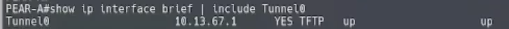
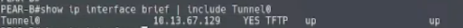

### 2️⃣ Fase 1 — Sesión IKE activa (`show crypto isakmp sa`)

Ambos extremos reportan la sesión ISAKMP en estado **`QM_IDLE` / `ACTIVE`** en ambos sentidos (origen y destino), confirmando que la negociación de Fase 1 se completó con éxito.

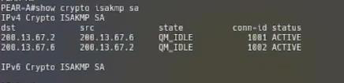
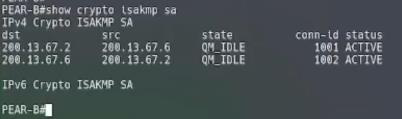

### 3️⃣ Fase 2 — SAs de IPSec activas (`show crypto ipsec sa`)

Los contadores muestran paquetes **encapsulados, cifrados y verificados** sobre la interfaz `Tunnel0`, con transform `esp-256-aes esp-sha256-hmac` y estado **`ACTIVE(ACTIVE)`** vinculado al Crypto Map `Tunnel0-head-0`.

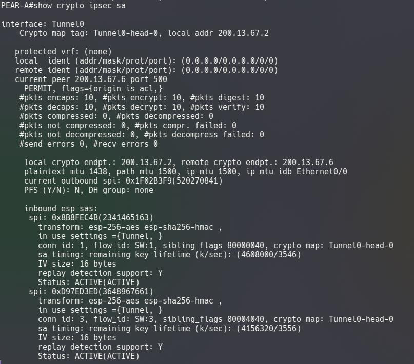
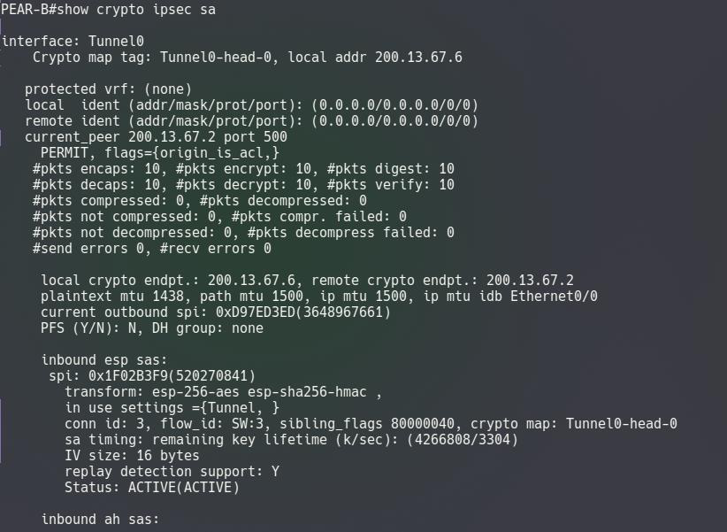

### 4️⃣ Interfaz de túnel operativa y protegida (`show ip route | include Tunnel0`)

Se confirma que `Tunnel0 is up, line protocol is up`, con `Tunnel protection via IPSec (profile "PERFIL_VTI")` aplicado y tráfico real cursando por la interfaz (paquetes de entrada y salida contabilizados).

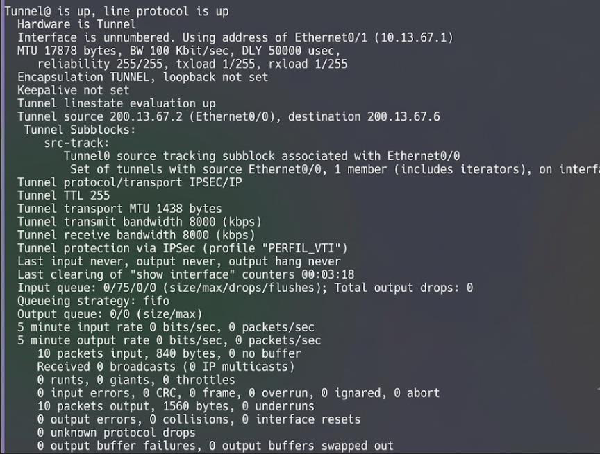
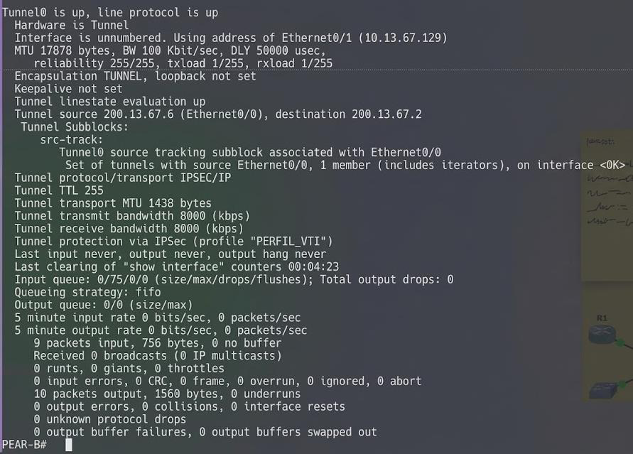

### 5️⃣ Crypto Map como instancia de perfil (`show crypto map`)

A diferencia del modelo basado en políticas, aquí el Crypto Map **`Tunnel0-head-0`** aparece como una instancia de perfil (`PROFILE INSTANCE`) con `access-list permit ip any any`, es decir, sin una ACL de tráfico interesante específica: todo lo que entra al túnel se cifra.

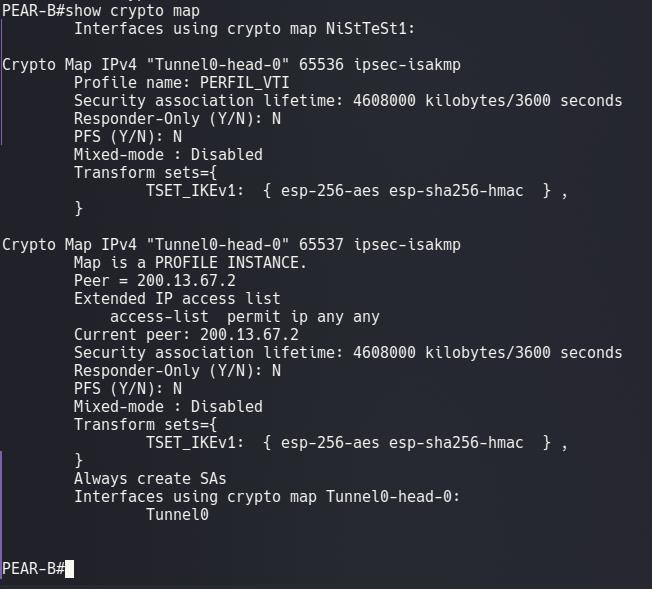
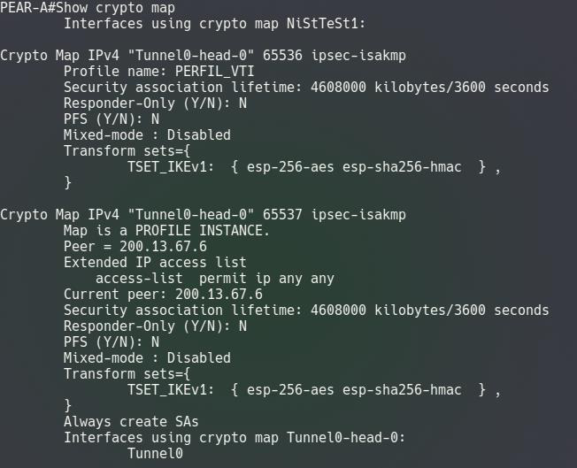

### 6️⃣ Prueba final de conectividad extremo a extremo (ping cifrado)

La prueba definitiva: los hosts de ambas sedes se alcanzan entre sí **a través del túnel Route-Based**, tanto con ping normal como forzando el origen explícitamente por `Tunnel0`.

**PC1 → PC2**
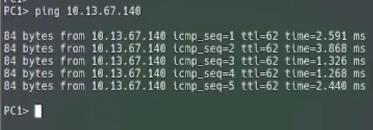

**PC1 → PC2 (origen Tunnel0)**
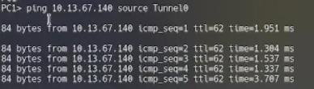

**PC2 → PC1**
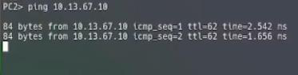

**PC2 → PC1 (origen Tunnel0)**
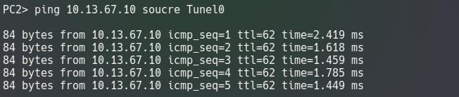

---

## 🎥 Video de la demostración completa

**https://youtu.be/R4bvMTb4Ru8**

---

## 📌 Conclusiones de la demostración

- ✅ La VPN Route-Based usó una interfaz VTI (`Tunnel0`) como next-hop de rutas estáticas, eliminando la necesidad de ACLs de tráfico interesante — confirmado por el `access-list permit ip any any` visto en el Crypto Map.
- ✅ `ip unnumbered` permitió que el túnel heredara la IP de la LAN, simplificando el plan de direccionamiento, tal como se observó en `show ip interface brief`.
- ✅ El perfil IPSec (`crypto ipsec profile PERFIL_VTI`) se aplicó directamente sobre la interfaz `Tunnel0` mediante `tunnel protection`, y quedó reflejado como `Profile name: PERFIL_VTI` en ambos routers.
- ✅ Al ser basada en enrutamiento, el modelo permite escalar fácilmente agregando rutas adicionales sin redefinir políticas.
- ✅ IKEv1 con AES-256 y SHA-256 en grupo 14 garantizó una negociación segura de las SAs, verificada en estado `ACTIVE` en ambos extremos.
- ✅ GNS3 validó el levantamiento de `Tunnel0` en estado `up/up` y la conectividad cifrada real entre los hosts de ambas sedes, incluso forzando el tráfico explícitamente por el túnel.
