# 🔐 VPN Site-to-Site IPSec IKEv2 Basada en Enrutamiento (Route-Based VTI) — Demostración Funcional

  -0078D4?style=flat-square)  

 

**Estudiante:** Miguel Ramirez Meli
**Matrícula:** 2025-1367
**Asignatura:** Seguridad de Redes – TSI203
**Profesor:** Jonathan Rondon
**Simulador:** GNS3
**Fecha:** 30 de junio de 2026

> Este documento presenta la **evidencia de que la VPN Site-to-Site basada en enrutamiento (Route-Based / VTI) con IKEv2 quedó correctamente implementada y operativa**. Combina la negociación moderna y eficiente de IKEv2 con la flexibilidad del modelo route-based: la interfaz virtual de túnel (Tunnel0) con `ip unnumbered` actúa como next-hop, y un perfil IKEv2 unifica ambas fases de la negociación en una sola configuración coherente. Cada sección muestra el resultado obtenido directamente desde la CLI de los routers PEAR-A y PEAR-B.

---

## 🎯 Objetivo cumplido

Se implementó y se **comprobó en funcionamiento** una VPN Site-to-Site basada en enrutamiento usando IPSec IKEv2 con VTI, combinando la modernidad del protocolo IKEv2 con la flexibilidad del modelo route-based, para la comunicación cifrada entre **PEAR-A** y **PEAR-B** en GNS3.

---

## 🗺️ Topología desplegada

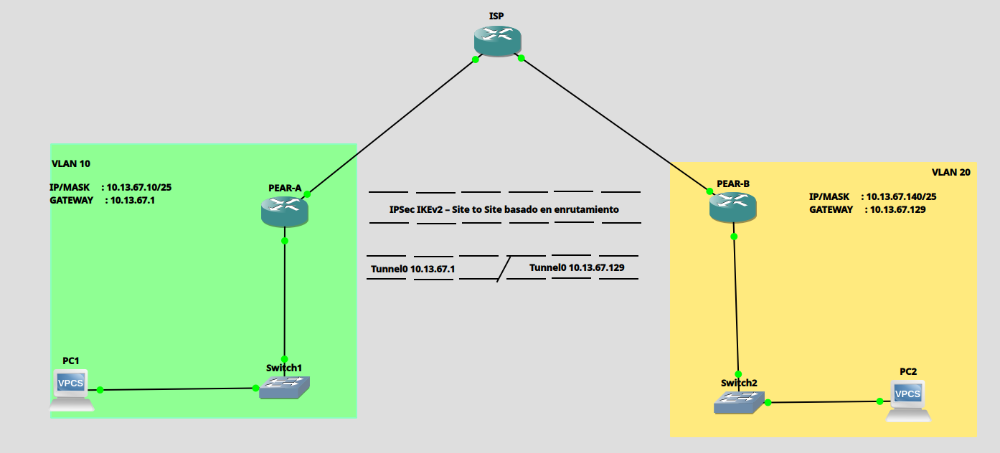

La topología quedó conformada por dos sedes (PEAR-A y PEAR-B) conectadas a través de un router ISP intermedio, cada una con su interfaz `Tunnel0` levantada sobre `Eth0/1` mediante `ip unnumbered`, negociada bajo IKEv2.

### Direccionamiento IP aplicado

| Dispositivo | Interfaz | Dirección IP | Máscara | Descripción |
|---|---|---|---|---|
| ISP | Eth0/0 | 200.13.67.1 | /30 | WAN → PEAR-A |
| ISP | Eth0/1 | 200.13.67.5 | /30 | WAN → PEAR-B |
| PEAR-A | Eth0/0 | 200.13.67.2 | /30 | WAN → ISP |
| PEAR-A | Eth0/1 | 10.13.67.1 | /25 | LAN / VTI unnumbered |
| PEAR-A | Tunnel0 | (unnumbered Eth0/1) | — | VTI IKEv2 |
| PEAR-B | Eth0/0 | 200.13.67.6 | /30 | WAN → ISP |
| PEAR-B | Eth0/1 | 10.13.67.129 | /25 | LAN / VTI unnumbered |
| PEAR-B | Tunnel0 | (unnumbered Eth0/1) | — | VTI IKEv2 |
| PC1 | eth0 | 10.13.67.10 | /25 | Host Sede A |
| PC2 | eth0 | 10.13.67.140 | /25 | Host Sede B |

### VLANs

| VLAN ID | Nombre | Switch | Puertos |
|---|---|---|---|
| 10 | LAN_PEAR_A | Switch1 | Eth0/0, Eth0/1 (access) |
| 20 | LAN_PEAR_B | Switch2 | Eth0/0, Eth0/1 (access) |

---

## 🔐 Parámetros criptográficos usados

**IKEv2 — Propuesta, Política y Perfil**

| Parámetro | Valor |
|---|---|
| Propuesta | PROPOSAL_IKEv2 |
| Cifrado | AES-CBC-256 |
| Integridad | SHA-256 |
| Grupo DH | Grupo 14 (2048-bit) |
| Keyring | KEYRING_IKEv2 |
| PSK | cisco123 |
| Perfil IKEv2 | PROFILE_IKEv2 |
| Perfil IPSec | PERFIL_VTI |

📂 Scripts completos de configuración disponibles en GitHub:
**https://github.com/miguel34d/VPN-Site-to-Site-Route-Based-IKEv2**

---

## 🧪 Evidencia de funcionamiento (verificación en vivo)

A continuación, la secuencia real de comandos ejecutados en ambos routers, mostrando que la VPN Route-Based con IKEv2 quedó **activa, negociada y transmitiendo tráfico cifrado a través de Tunnel0**.

### 1️⃣ Sesión IKEv2 activa (`show crypto ikev2 sa`)

Ambos extremos reportan el túnel IKEv2 en estado **`READY`**, con `Encr: AES-CBC, keysize: 256`, `Hash: SHA256`, `DH Grp:14` y autenticación PSK verificada en ambos sentidos.

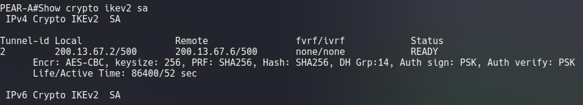
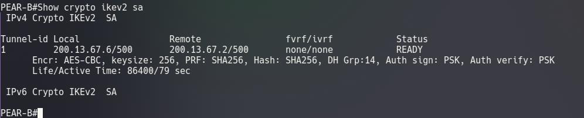

### 2️⃣ Interfaz VTI levantada (`show ip interface brief | include Tunnel0`)

Ambos routers reportan la interfaz **`Tunnel0` en estado `up/up`**, heredando la IP de su LAN correspondiente gracias a `ip unnumbered`.

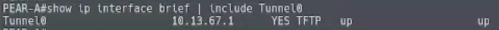

### 3️⃣ Fase 2 — SAs de IPSec activas (`show crypto ipsec sa`)

Los contadores muestran paquetes **encapsulados, cifrados y verificados** sobre la interfaz `Tunnel0`, con transform `esp-256-aes esp-sha256-hmac` y estado **`ACTIVE(ACTIVE)`** vinculado al Crypto Map `Tunnel0-head-0`.

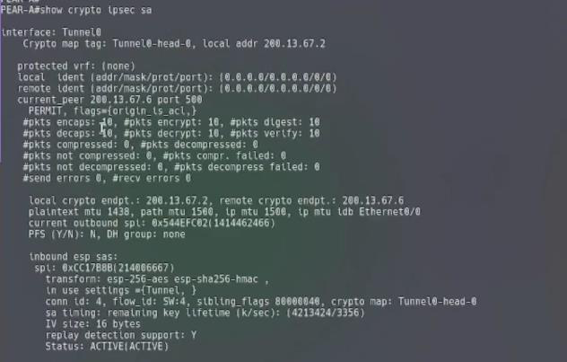
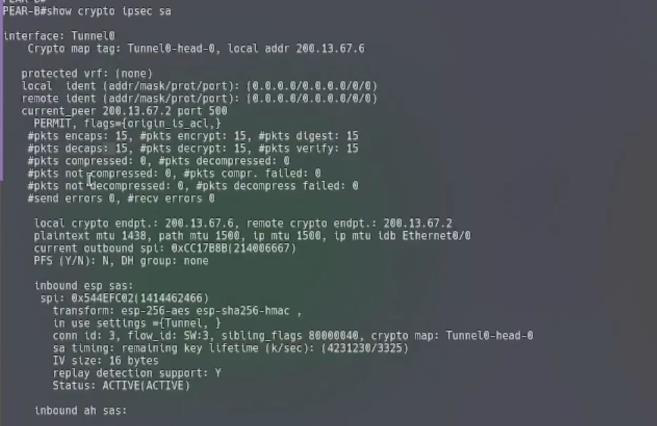

### 4️⃣ Interfaz de túnel operativa y protegida (`show ip route | include Tunnel0`)

Se confirma que `Tunnel0 is up, line protocol is up`, con `Tunnel protection via IPSec (profile "PERFIL_VTI")` aplicado y tráfico real cursando por la interfaz (paquetes de entrada y salida contabilizados).

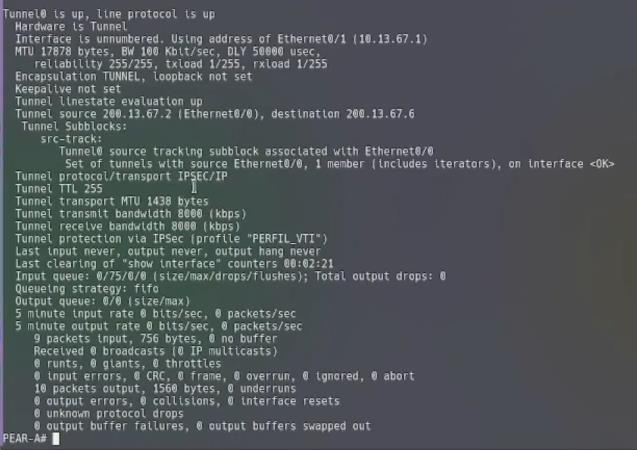
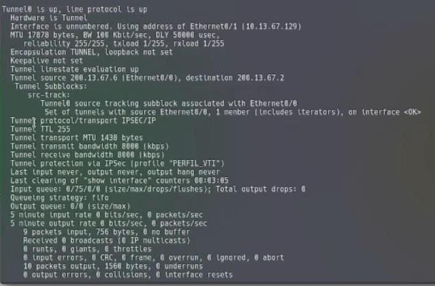

### 5️⃣ Crypto Map vinculado al perfil IKEv2 (`show crypto map`)

Se confirma que el Crypto Map **`Tunnel0-head-0`** queda asociado al `IKEv2 profile: PROFILE_IKEv2`, unificando la política de Fase 1 y el perfil IPSec en un único objeto aplicado sobre `Tunnel0`, sin ACL de tráfico interesante (`access-list permit ip any any`).

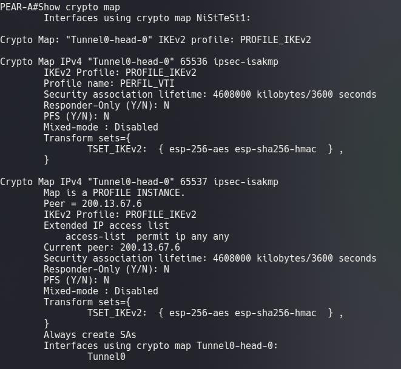
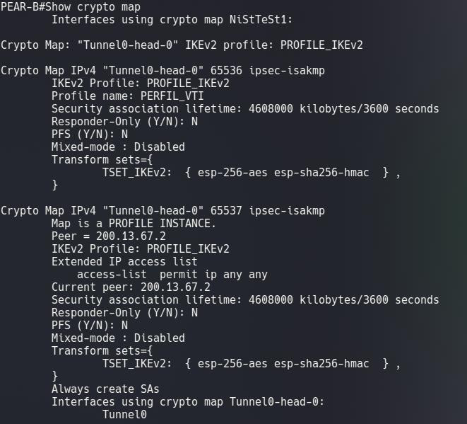

### 6️⃣ Prueba final de conectividad extremo a extremo (ping cifrado)

La prueba definitiva: los hosts de ambas sedes se alcanzan entre sí **a través del túnel Route-Based con IKEv2**, tanto con ping normal como forzando el origen explícitamente por `Tunnel0`.

**PC1 → PC2**
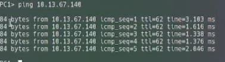

**PC1 → PC2 (origen Tunnel0)**
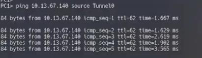

**PC2 → PC1**
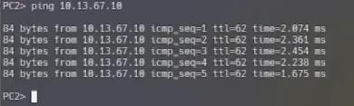

**PC2 → PC1 (origen Tunnel0)**
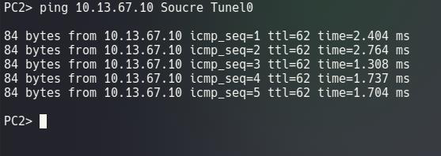

---

## 🎥 Video de la demostración completa

**https://youtu.be/7_YLHANwaVc**

---

## 📌 Conclusiones de la demostración

- ✅ IKEv2 con VTI combinó la modernidad del protocolo de negociación con la flexibilidad del modelo basado en enrutamiento, confirmado por el estado `READY` de la sesión IKEv2.
- ✅ El perfil IPSec (`PERFIL_VTI`) referenció al perfil IKEv2 (`PROFILE_IKEv2`), unificando ambas fases en una configuración coherente, visible directamente en la salida de `show crypto map`.
- ✅ `ip unnumbered` en `Tunnel0` evitó consumir un bloque de direcciones adicional para la interfaz de túnel, verificado en `show ip interface brief`.
- ✅ Las rutas estáticas apuntando a `Tunnel0` permiten agregar nuevas redes remotas sin modificar ninguna política, gracias al modelo route-based.
- ✅ IKEv2 con AES-256, SHA-256 y grupo DH 14 quedó confirmado como la configuración criptográfica activa en las SAs de ambos extremos, superando a IKEv1 en eficiencia de negociación.
- ✅ GNS3 demostró el correcto levantamiento del VTI en estado `up/up` y la transmisión cifrada real de tráfico entre ambas sedes, incluso forzando el tráfico explícitamente por el túnel.
