# ✅ VPN Site-to-Site IPSec IKEv1 Basada en Políticas — Demostración Funcional

**Estudiante:** Miguel Ramirez Meli
**Matrícula:** 2025-1367
**Asignatura:** Seguridad de Redes – TSI203
**Profesor:** Jonathan Rondon
**Simulador:** GNS3
**Fecha:** 30 de junio de 2026
**Estado del laboratorio:** 🟢 **FUNCIONANDO — Túnel IPSec establecido y tráfico cifrado verificado extremo a extremo**

> Este documento no es una guía de configuración paso a paso, sino la **evidencia de que la VPN Site-to-Site basada en políticas quedó correctamente implementada y operativa**. Cada sección muestra el resultado obtenido directamente desde la CLI de los routers PEAR-A y PEAR-B, confirmando que el túnel IKEv1/IPSec cifra y transporta el tráfico entre las dos sedes tal como fue diseñado.

---

## 🎯 Objetivo cumplido

Se implementó y se **comprobó en funcionamiento** una VPN Site-to-Site basada en políticas usando IPSec IKEv1 (Crypto Map + ACL de tráfico interesante), estableciendo un canal cifrado real entre la **VLAN 10 (PEAR-A)** y la **VLAN 20 (PEAR-B)** a través de un ISP simulado en GNS3.

---

## 🗺️ Topología desplegada

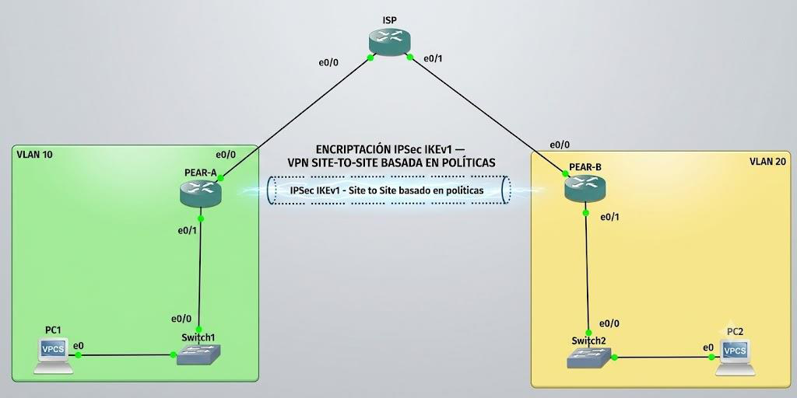

La topología quedó conformada por dos sedes (PEAR-A y PEAR-B) conectadas a través de un router ISP intermedio, cada una con su propia VLAN, switch y host final (PC1 y PC2 simulados con VPCS).

### Direccionamiento IP aplicado

| Dispositivo | Interfaz | Dirección IP | Máscara | Descripción |
|---|---|---|---|---|
| ISP | Eth0/0 | 200.13.67.1 | /30 | WAN → PEAR-A |
| ISP | Eth0/1 | 200.13.67.5 | /30 | WAN → PEAR-B |
| PEAR-A | Eth0/0 | 200.13.67.2 | /30 | WAN → ISP |
| PEAR-A | Eth0/1 | 10.13.67.1 | /25 | LAN Sede A |
| PEAR-B | Eth0/0 | 200.13.67.6 | /30 | WAN → ISP |
| PEAR-B | Eth0/1 | 10.13.67.129 | /25 | LAN Sede B |
| PC1 (VPCS) | eth0 | 10.13.67.10 | /25 | Host Sede A |
| PC2 (VPCS) | eth0 | 10.13.67.140 | /25 | Host Sede B |

### VLANs

| VLAN ID | Nombre | Switch | Puertos |
|---|---|---|---|
| 10 | LAN_PEAR_A | Switch1 | Eth0/0, Eth0/1 (access) |
| 20 | LAN_PEAR_B | Switch2 | Eth0/0, Eth0/1 (access) |

---

## 🔐 Parámetros criptográficos usados

**Fase 1 — IKEv1 (ISAKMP)**

| Parámetro | Valor |
|---|---|
| Versión IKE | IKEv1 (ISAKMP) |
| Política | 10 |
| Cifrado | AES-128 |
| Hash | SHA-1 |
| Autenticación | Pre-Shared Key |
| Grupo DH | Grupo 2 (1024-bit) |
| Lifetime | 86400 s |
| PSK | cisco123 |

**Fase 2 — IPSec Transform Set**

| Parámetro | Valor |
|---|---|
| Transform Set | TSET |
| Cifrado ESP | AES-128 |
| Integridad ESP | SHA-1 HMAC |
| Modo | Tunnel |
| Crypto Map | MAPA_VPN — Seq 10 |
| ACL Tráfico | access-list 100 |

📂 Scripts completos de configuración disponibles en GitHub:
**https://github.com/miguel34d/VPN-Site-to-Site--Policy-Based--IKEv1**

---

## 🧪 Evidencia de funcionamiento (verificación en vivo)

A continuación, la secuencia real de comandos ejecutados en ambos routers, mostrando que la VPN quedó **activa, negociada y transmitiendo tráfico cifrado**.

### 1️⃣ Fase 1 — Sesión IKE establecida (`show crypto isakmp sa`)

Ambos extremos reportan la sesión ISAKMP en estado **`QM_IDLE` / `ACTIVE`**, confirmando que la negociación de Fase 1 se completó con éxito.

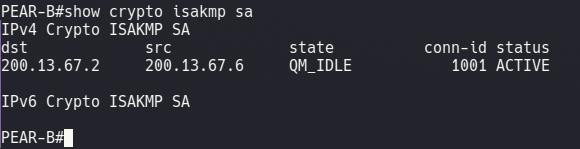
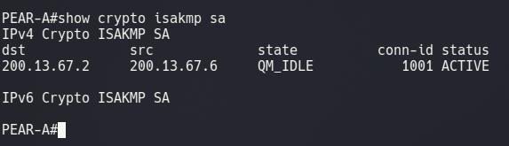

### 2️⃣ Fase 2 — SAs de IPSec activas (`show crypto ipsec sa`)

Los contadores muestran paquetes **encapsulados, cifrados y verificados** en ambos sentidos (`#pkts encaps`, `#pkts encrypt`, `#pkts decaps`, `#pkts decrypt`), con el estado **`ACTIVE(ACTIVE)`** en las SAs entrantes ESP.

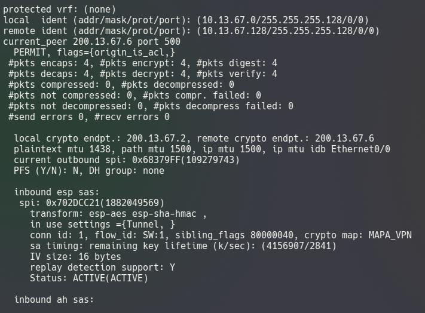
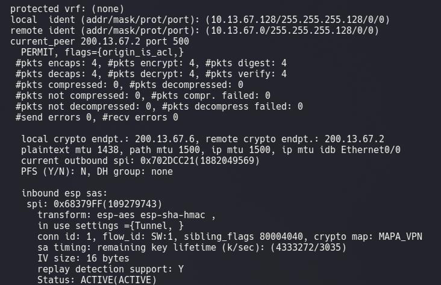

### 3️⃣ Crypto Map aplicado correctamente (`show crypto map`)

Se confirma que el Crypto Map **MAPA_VPN** está vinculado a la interfaz `Ethernet0/0` en ambos routers, con el peer correcto, el transform-set `TSET` y la ACL 100 asociada.

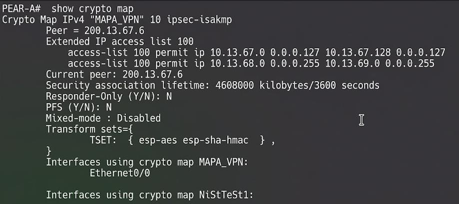
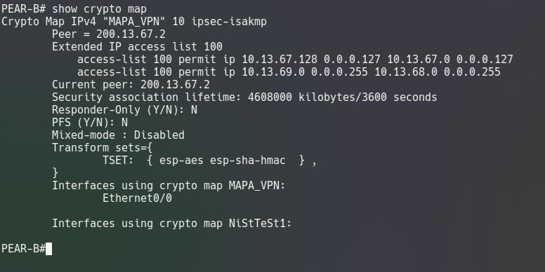

### 4️⃣ Tráfico interesante coincidiendo (`show ip access-lists 100`)

Los contadores de coincidencias (**9 matches** en PEAR-A, **10 matches** en PEAR-B) demuestran que el tráfico real generado por los hosts activó la ACL y disparó el túnel IPSec como estaba previsto.

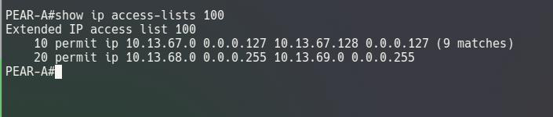
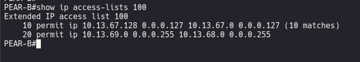

### 5️⃣ Sesión criptográfica UP-ACTIVE (`show crypto session`)

Ambos routers reportan **`Session status: UP-ACTIVE`**, con las IPSEC FLOW correspondientes a la subred de origen y destino, y SAs activas contabilizadas.

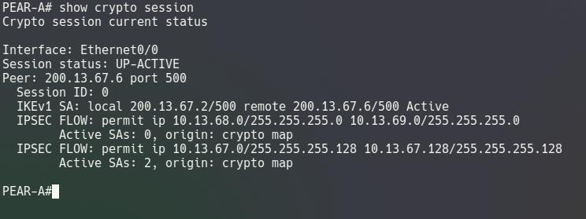
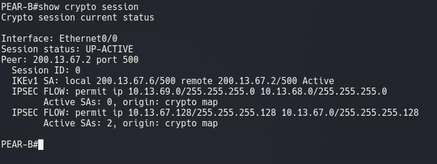

### 6️⃣ Prueba final de conectividad extremo a extremo (ping cifrado)

La prueba definitiva: los hosts de ambas sedes se alcanzan entre sí **a través del túnel cifrado**, con respuesta ICMP exitosa.

**PC2 → PC1**
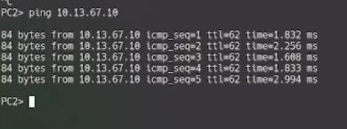

**PC1 → PC2**
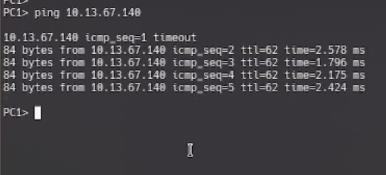

---

## 🎥 Video de la demostración completa

**https://youtu.be/McwecqQMtpc**

---

## 📌 Conclusiones de la demostración

- ✅ La VPN basada en políticas usó ACLs para definir el tráfico interesante que activó el túnel IPSec, y esto se confirmó con los contadores de "matches".
- ✅ El Crypto Map vinculó correctamente la ACL, el transform-set y el peer en un solo objeto aplicado a la interfaz WAN de cada router.
- ✅ IKEv1 negoció la seguridad en dos fases (ISAKMP y IPSec SA), y ambas quedaron en estado activo en los dos extremos.
- ✅ El modo túnel encapsuló completamente el paquete IP original, protegiéndolo extremo a extremo.
- ✅ Las VLANs permitieron segmentar correctamente el tráfico LAN en cada sede.
- ✅ GNS3 permitió simular el entorno completo, validando el establecimiento correcto y el funcionamiento real de la VPN mediante pruebas de ping exitosas entre PC1 y PC2.

---

## 📁 Estructura de este proyecto

```
proyecto/
├── README.md
└── imagenes/
    ├── 01-topologia-red.png
    ├── 02-isakmp-sa-pearB.png
    ├── 03-isakmp-sa-pearA.png
    ├── 04-ipsec-sa-pearA.png
    ├── 05-ipsec-sa-pearB.png
    ├── 06-crypto-map-pearA.png
    ├── 07-crypto-map-pearB.png
    ├── 08-acl-trafico-pearA.png
    ├── 09-acl-trafico-pearB.png
    ├── 10-crypto-session-pearA.png
    ├── 11-crypto-session-pearB.png
    ├── 12-ping-pc2-to-pc1.png
    └── 13-ping-pc1-to-pc2.png
```

> 💡 **Nota sobre hosting en GitHub:** las imágenes se referencian arriba con rutas relativas (`./imagenes/...`), que funcionan tanto abriendo la carpeta localmente como al subir este mismo `README.md` a tu repositorio (por ejemplo, dentro de `VPN-Site-to-Site--Policy-Based--IKEv1`), siempre que la carpeta `imagenes/` viaje junto al archivo. Si en algún momento prefieres apuntar a las imágenes ya alojadas en GitHub (por ejemplo desde otro documento o para incrustarlas en otro sitio), GitHub las sirve a través de su CDN de imágenes en **`https://raw.githubusercontent.com/miguel34d/VPN-Site-to-Site--Policy-Based--IKEv1/main/imagenes/NOMBRE_DE_IMAGEN.png`** (y las muestra internamente a través de su proxy de caché `camo.githubusercontent.com` cuando se renderizan en un README o Issue).
