# 🔐 VPN Site-to-Site IPSec IKEv2 Basada en Políticas — Demostración Funcional

   

 

**Estudiante:** Miguel Ramirez Meli
**Matrícula:** 2025-1367
**Asignatura:** Seguridad de Redes – TSI203
**Profesor:** Jonathan Rondon
**Simulador:** GNS3
**Fecha:** 30 de junio de 2026

> Este documento presenta la **evidencia de que la VPN Site-to-Site basada en políticas con IKEv2 quedó correctamente implementada y operativa**. Cada sección muestra el resultado obtenido directamente desde la CLI de los routers PEAR-A y PEAR-B, confirmando que el túnel IKEv2/IPSec cifra y transporta el tráfico entre las dos sedes con algoritmos modernos (AES-256, SHA-256, DH Grupo 14).

---

## 🎯 Objetivo cumplido

Se implementó y se **comprobó en funcionamiento** una VPN Site-to-Site basada en políticas usando IPSec IKEv2 (Crypto Map + keyring + perfil IKEv2), estableciendo comunicación cifrada con algoritmos modernos entre la **VLAN 10 (PEAR-A)** y la **VLAN 20 (PEAR-B)** en GNS3.

---

## 🗺️ Topología desplegada

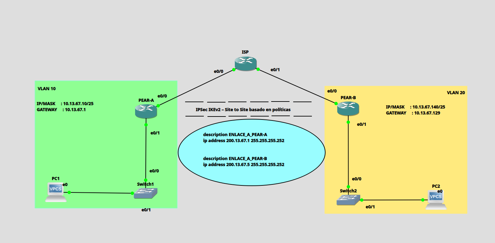

La topología quedó conformada por dos sedes (PEAR-A y PEAR-B) conectadas a través de un router ISP intermedio, cada una con su propia VLAN, switch y host final (PC1 y PC2 simulados con VPCS).

### Direccionamiento IP aplicado

| Dispositivo | Interfaz | Dirección IP | Máscara | Descripción |
|---|---|---|---|---|
| ISP | Eth0/0 | 200.13.67.1 | /30 | WAN → PEAR-A |
| ISP | Eth0/1 | 200.13.67.5 | /30 | WAN → PEAR-B |
| PEAR-A | Eth0/0 | 200.13.67.2 | /30 | WAN → ISP |
| PEAR-A | Eth0/1 | 10.13.67.1 | /25 | LAN Sede A |
| PEAR-B | Eth0/0 | 200.13.67.6 | /30 | WAN → ISP |
| PEAR-B | Eth0/1 | 10.13.67.129 | /25 | LAN Sede B |
| PC1 (VPCS) | eth0 | 10.13.67.10 | /25 | Host Sede A |
| PC2 (VPCS) | eth0 | 10.13.67.140 | /25 | Host Sede B |

### VLANs

| VLAN ID | Nombre | Switch | Puertos |
|---|---|---|---|
| 10 | LAN_PEAR_A | Switch1 | Eth0/0, Eth0/1 (access) |
| 20 | LAN_PEAR_B | Switch2 | Eth0/0, Eth0/1 (access) |

---

## 🔐 Parámetros criptográficos usados

**Propuesta y Política IKEv2**

| Parámetro | Valor |
|---|---|
| Versión IKE | IKEv2 |
| Propuesta | PROP_IKEv2_TOP |
| Cifrado | AES-CBC-256 |
| Integridad | SHA-256 |
| Grupo DH | Grupo 14 (2048-bit) |
| Keyring | KEYRING_PEAR |
| PSK | cisco123 |
| Perfil IKEv2 | PERFIL_IKEv2_PEAR |

**Fase 2 — Transform Set**

| Parámetro | Valor |
|---|---|
| Transform Set | TSET_IKEv2 |
| Cifrado ESP | AES-256 |
| Integridad ESP | SHA-256 HMAC |
| Modo | Tunnel |
| Crypto Map | MAPA_IKEv2_POL — Seq 10 |
| ACL Tráfico | access-list 102 |

📂 Scripts completos de configuración disponibles en GitHub:
**https://github.com/miguel34d/-VPN-Site-to-Site--Policy-Based--IKEv2**

---

## 🧪 Evidencia de funcionamiento (verificación en vivo)

A continuación, la secuencia real de comandos ejecutados en ambos routers, mostrando que la VPN quedó **activa, negociada y transmitiendo tráfico cifrado** con IKEv2.

### 1️⃣ Sesión IKEv2 activa (`show crypto ikev2 sa`)

Ambos extremos reportan el túnel IKEv2 en estado **`READY`**, con `Encr: AES-CBC, keysize: 256`, `Hash: SHA256`, `DH Grp:14` y autenticación PSK verificada en ambos sentidos.

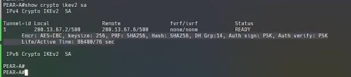
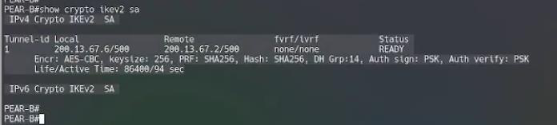

### 2️⃣ Fase 2 — SAs de IPSec activas (`show crypto ipsec sa`)

Los contadores muestran paquetes **encapsulados, cifrados y verificados** en ambos sentidos (`#pkts encaps`, `#pkts encrypt`, `#pkts decaps`, `#pkts decrypt`), con transform `esp-256-aes esp-sha256-hmac` y estado **`ACTIVE(ACTIVE)`** vinculado al Crypto Map `MAPA_IKEv2_POL`.

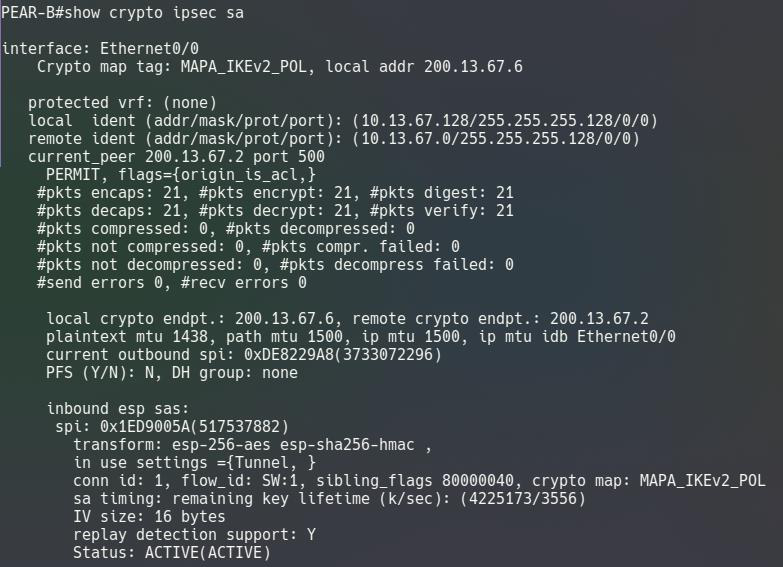
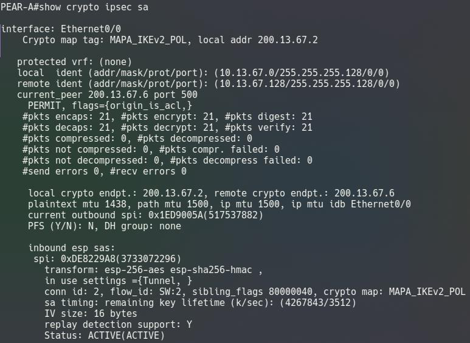

### 3️⃣ Sesión criptográfica con perfil IKEv2 (`show crypto session`)

Ambos routers reportan **`Session status: UP-ACTIVE`**, con el `Profile: PERFIL_IKEv2_PEAR` correctamente asociado y las IPSEC FLOW activas entre las subredes de cada sede.

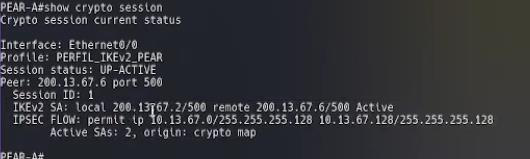
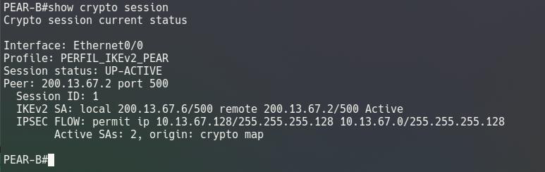

### 4️⃣ Prueba final de conectividad extremo a extremo (ping cifrado)

La prueba definitiva: los hosts de ambas sedes se alcanzan entre sí **a través del túnel cifrado con IKEv2**, con respuesta ICMP exitosa.

**PC1 → PC2**
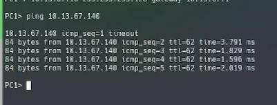

**PC2 → PC1**
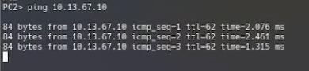

### 5️⃣ Tráfico interesante coincidiendo (`show ip access-lists 102`)

Los contadores de coincidencias (**21 matches** en PEAR-B, **26 matches** en PEAR-A) demuestran que el tráfico real generado por los hosts activó la ACL 102 y disparó el cifrado IPSec como estaba previsto.

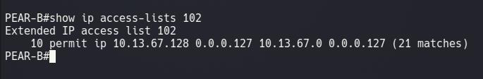
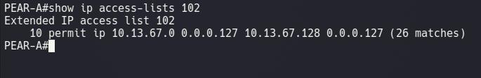

---

## 🎥 Video de la demostración completa

**https://youtu.be/5fqYufqy8y4**

---

## 📌 Conclusiones de la demostración

- ✅ IKEv2 simplificó la negociación, reduciendo los mensajes de intercambio de 9 a 4 en comparación con IKEv1, y esto se reflejó en el estado `READY` inmediato de la sesión.
- ✅ El keyring de IKEv2 permitió gestionar la clave pre-compartida de forma modular por peer.
- ✅ El perfil IKEv2 (`PERFIL_IKEv2_PEAR`) asoció correctamente la política, el keyring y el método de autenticación en un único objeto reutilizable, confirmado en `show crypto session`.
- ✅ La ACL 102 de tráfico interesante definió con precisión qué flujos activaron el cifrado IPSec, con coincidencias reales registradas en ambos routers.
- ✅ AES-256 con SHA-256 y grupo DH 14 quedaron confirmados como la configuración criptográfica activa en las SAs de ambos extremos.
- ✅ GNS3 permitió validar la negociación IKEv2 completa y la conectividad cifrada real entre ambas sedes mediante pruebas de ping exitosas entre PC1 y PC2.

