# 🔐 VPN Site-to-Site con Túnel GRE sobre IPSec IKEv1 — Demostración Funcional

    

 

**Estudiante:** Miguel Ramirez Meli
**Matrícula:** 2025-1367
**Asignatura:** Seguridad de Redes – TSI203
**Profesor:** Jonathan Rondon
**Simulador:** GNS3
**Fecha:** 30 de junio de 2026

> Este documento presenta la **evidencia de que el túnel GRE encapsulado sobre IPSec IKEv1 quedó correctamente implementado y operativo**. GRE provee el canal lógico de transporte capa 3 (con IP propia 172.16.0.0/30), mientras que IPSec en **modo transport** cifra específicamente el tráfico GRE entre los endpoints públicos, filtrado por una ACL de tráfico interesante. Cada sección muestra el resultado obtenido directamente desde la CLI de los routers PEAR-A y PEAR-B.

---

## 🎯 Objetivo cumplido

Se configuró y se **comprobó en funcionamiento** un túnel GRE encapsulado sobre IPSec IKEv1 para establecer una VPN Site-to-Site entre **PEAR-A** y **PEAR-B**. El túnel GRE provee el canal lógico de transporte mientras IPSec cifra el tráfico GRE mediante una ACL de tráfico interesante y un Crypto Map en modo transport.

---

## 🗺️ Topología desplegada

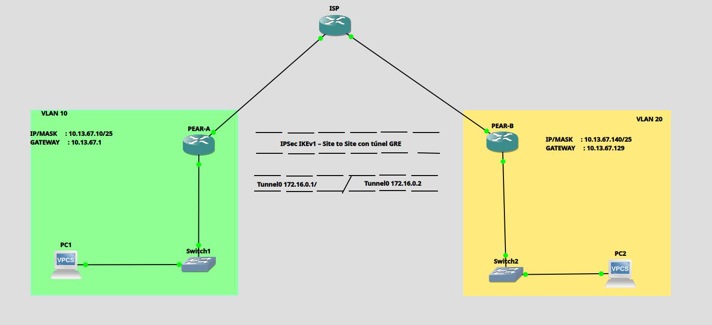

La topología quedó conformada por dos sedes (PEAR-A y PEAR-B) conectadas a través de un router ISP intermedio, cada una con su interfaz `Tunnel0` GRE (red `172.16.0.0/30`) cifrada mediante IPSec en modo transport.

### Direccionamiento IP aplicado

| Dispositivo | Interfaz | Dirección IP | Máscara | Descripción |
|---|---|---|---|---|
| ISP | Eth0/0 | 200.13.67.1 | /30 | WAN → PEAR-A |
| ISP | Eth0/1 | 200.13.67.5 | /30 | WAN → PEAR-B |
| PEAR-A | Eth0/0 | 200.13.67.2 | /30 | WAN → ISP |
| PEAR-A | Eth0/1 | 10.13.67.1 | /25 | LAN Sede A |
| PEAR-A | Tunnel0 | 172.16.0.1 | /30 | Túnel GRE |
| PEAR-B | Eth0/0 | 200.13.67.6 | /30 | WAN → ISP |
| PEAR-B | Eth0/1 | 10.13.67.129 | /25 | LAN Sede B |
| PEAR-B | Tunnel0 | 172.16.0.2 | /30 | Túnel GRE |
| PC1 (VPCS) | eth0 | 10.13.67.10 | /25 | Host Sede A |
| PC2 (VPCS) | eth0 | 10.13.67.140 | /25 | Host Sede B |

### VLANs

| VLAN ID | Nombre | Switch | Puertos |
|---|---|---|---|
| 10 | LAN_PEAR_A | Switch1 | Eth0/0, Eth0/1 (access) |
| 20 | LAN_PEAR_B | Switch2 | Eth0/0, Eth0/1 (access) |

---

## 🔐 Parámetros criptográficos usados

**IPSec IKEv1 — Fase 1**

| Parámetro | Valor |
|---|---|
| Versión IKE | IKEv1 (ISAKMP) |
| Cifrado | AES-256 |
| Hash | SHA-256 |
| Autenticación | Pre-Shared Key |
| Grupo DH | Grupo 14 |
| PSK | cisco123 |

**IPSec Fase 2 + Túnel GRE**

| Parámetro | PEAR-A | PEAR-B |
|---|---|---|
| Transform Set | TSET_GRE | TSET_GRE |
| Modo IPSec | Transport | Transport |
| ACL | GRE 200.13.67.2→.6 | GRE 200.13.67.6→.2 |
| IP Tunnel0 | 172.16.0.1/30 | 172.16.0.2/30 |
| Tunnel Source | Eth0/0 | Eth0/0 |
| Tunnel Destination | 200.13.67.6 | 200.13.67.2 |
| Modo GRE | gre ip | gre ip |

📂 Scripts completos de configuración disponibles en GitHub:
**https://github.com/miguel34d/VPN-Site-to-Site-con-T-nel-GRE-sobreIPsec-IKEv1**

---

## 🧪 Evidencia de funcionamiento (verificación en vivo)

A continuación, la secuencia real de comandos ejecutados en ambos routers, mostrando que el túnel GRE quedó **levantado, cifrado por IPSec y transmitiendo tráfico real entre ambas sedes**.

### 1️⃣ Estado del túnel GRE (`show ip interface brief | include Tunnel0`)

Ambos routers reportan la interfaz **`Tunnel0` en estado `up/up`**, con su propia dirección IP dentro de la red `172.16.0.0/30`.

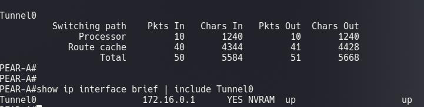
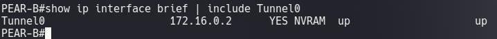

### 2️⃣ Detalle de la interfaz GRE (`show interfaces Tunnel0`)

Se confirma `Tunnel protocol/transport GRE/IP`, la dirección IP del túnel y los contadores de paquetes de entrada y salida, evidenciando tráfico real cursando por el encapsulado GRE.

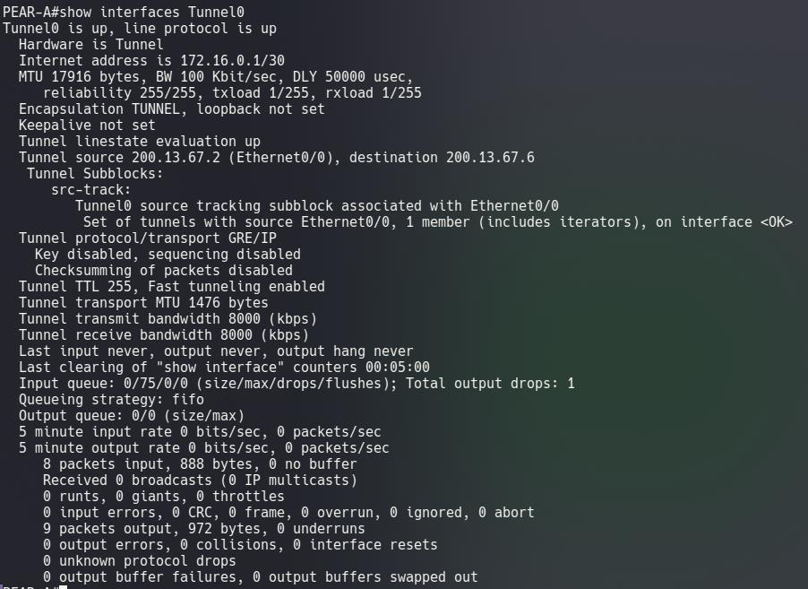
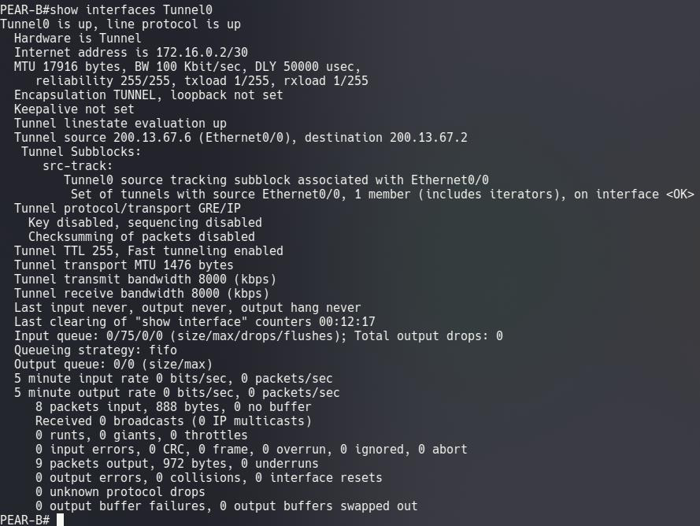

### 3️⃣ Fase 1 — Sesión IKE activa (`show crypto isakmp sa`)

Ambos extremos reportan la sesión ISAKMP en estado **`QM_IDLE` / `ACTIVE`**, confirmando que la negociación de Fase 1 entre las IPs públicas 200.13.67.2 y 200.13.67.6 se completó con éxito.

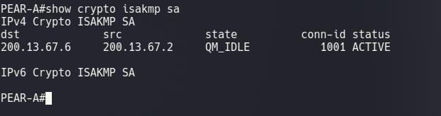
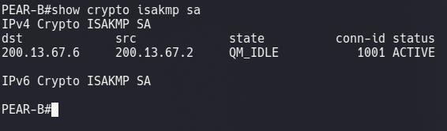

### 4️⃣ Fase 2 — SAs de IPSec activas en modo transport (`show crypto ipsec sa`)

Los contadores muestran paquetes **encapsulados, cifrados y verificados**, con `in use settings ={Transport, }` confirmando que IPSec cifra únicamente el payload GRE (protocolo 47), manteniendo el encabezado IP público visible, vinculado al Crypto Map `CMAP_GRE`.

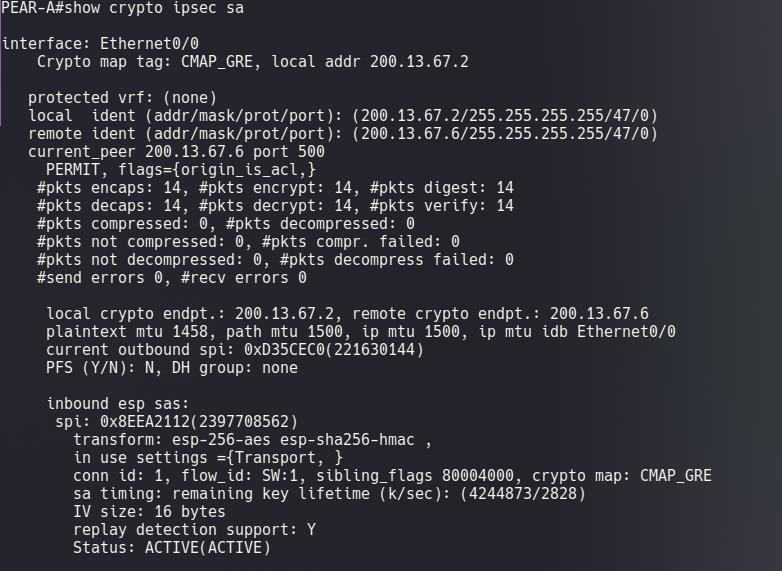
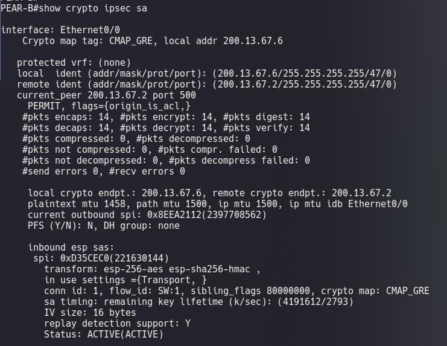

### 5️⃣ Conectividad entre extremos del túnel GRE (`ping` con origen explícito)

Ping directo entre las IPs del túnel (172.16.0.1 ↔ 172.16.0.2), confirmando **100% de éxito** en ambos sentidos y validando que el encapsulado GRE cifrado por IPSec transporta correctamente el tráfico ICMP.

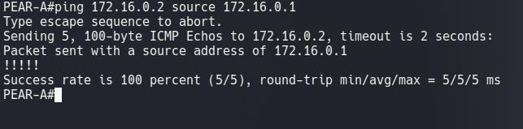
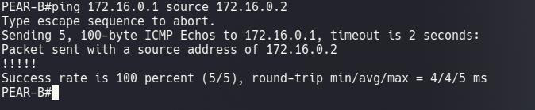

### 6️⃣ Prueba final de conectividad extremo a extremo (LAN y vía Tunnel0)

La prueba definitiva: los hosts de ambas sedes se alcanzan entre sí tanto usando su IP de LAN como origen como forzando el origen explícitamente por `Tunnel0`, confirmando que el tráfico de usuario también cursa cifrado por el túnel GRE/IPSec.

**PC1 → PC2 (origen LAN y origen Tunnel0)**
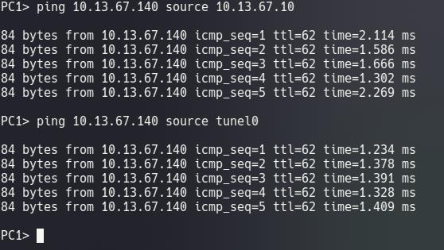

**PC2 → PC1 (origen LAN y origen Tunnel0)**
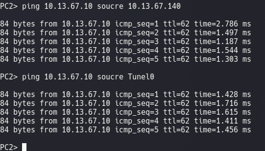

---

## 🎥 Video de la demostración completa

**https://youtu.be/9YSejDTNiQ4**

---

## 📌 Conclusiones de la demostración

- ✅ GRE proveyó un canal de capa 3 capaz de transportar cualquier protocolo, mientras IPSec añadió la capa de cifrado y autenticación, confirmado por el estado `up/up` de `Tunnel0` y las SAs `ACTIVE(ACTIVE)`.
- ✅ El modo transport de IPSec cifró solo el payload (el paquete GRE), manteniendo el encabezado IP original visible — verificado con `in use settings ={Transport, }` en ambos routers.
- ✅ La ACL de tráfico interesante filtró específicamente el protocolo GRE entre los endpoints públicos para activar IPSec, según lo reflejado en `local/remote ident ... /47/0` (protocolo 47 = GRE).
- ✅ El túnel GRE mantuvo su propia dirección IP (172.16.0.x/30), lo que permitió usarlo como next-hop, confirmado con los pings directos entre 172.16.0.1 y 172.16.0.2.
- ✅ La combinación GRE+IPSec, validada aquí extremo a extremo, es la base de soluciones DMVPN ampliamente usadas en redes empresariales Cisco.
- ✅ GNS3 validó el encadenamiento correcto: tráfico LAN → GRE → cifrado IPSec → transporte WAN, confirmado con pings exitosos entre PC1 y PC2 tanto por la LAN como forzando el origen por `Tunnel0`.
