# 🔐 VPN Site-to-Site GRE sobre IPSec IKEv2 — Demostración Funcional

     

 

**Estudiante:** Miguel Ramirez Meli
**Matrícula:** 2025-1367
**Asignatura:** Seguridad de Redes – TSI203
**Profesor:** Jonathan Rondon
**Simulador:** GNS3
**Fecha:** 30 de junio de 2026

> Este documento presenta la **evidencia de que el túnel GRE encapsulado sobre IPSec IKEv2 quedó correctamente implementado y operativo**. Se combina la flexibilidad del túnel GRE con la negociación moderna de IKEv2 (keyring, propuesta y perfil), cifrando el tráfico GRE mediante un Crypto Map en **modo transport**. Cada sección muestra el resultado obtenido directamente desde la CLI de los routers PEAR-A y PEAR-B.

---

## 🎯 Objetivo cumplido

Se configuró y se **comprobó en funcionamiento** un túnel GRE encapsulado sobre IPSec IKEv2 para establecer comunicación cifrada entre **PEAR-A** y **PEAR-B**, combinando la flexibilidad del túnel GRE con la negociación moderna de IKEv2 usando keyring, propuesta y perfil IKEv2, cifrando el tráfico GRE mediante Crypto Map en modo transport.

---

## 🗺️ Topología desplegada

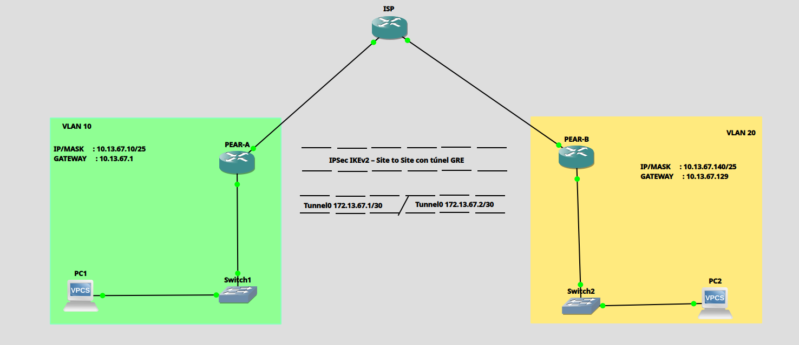

La topología quedó conformada por dos sedes (PEAR-A y PEAR-B) conectadas a través de un router ISP intermedio, cada una con su interfaz `Tunnel0` GRE (red `172.13.67.0/30`) cifrada mediante IPSec IKEv2 en modo transport.

### Direccionamiento IP aplicado

| Dispositivo | Interfaz | Dirección IP | Máscara | Descripción |
|---|---|---|---|---|
| ISP | Eth0/0 | 200.13.67.1 | /30 | WAN → PEAR-A |
| ISP | Eth0/1 | 200.13.67.5 | /30 | WAN → PEAR-B |
| PEAR-A | Eth0/0 | 200.13.67.2 | /30 | WAN → ISP |
| PEAR-A | Eth0/1 | 10.13.67.1 | /25 | LAN Sede A |
| PEAR-A | Tunnel0 | 172.13.67.1 | /30 | Túnel GRE |
| PEAR-B | Eth0/0 | 200.13.67.6 | /30 | WAN → ISP |
| PEAR-B | Eth0/1 | 10.13.67.129 | /25 | LAN Sede B |
| PEAR-B | Tunnel0 | 172.13.67.2 | /30 | Túnel GRE |
| PC1 (VPCS) | eth0 | 10.13.67.10 | /25 | Host Sede A |
| PC2 (VPCS) | eth0 | 10.13.67.140 | /25 | Host Sede B |

### VLANs

| VLAN ID | Nombre | Switch | Puertos |
|---|---|---|---|
| 10 | LAN_PEAR_A | Switch1 | Eth0/0, Eth0/1 (access) |
| 20 | LAN_PEAR_B | Switch2 | Eth0/0, Eth0/1 (access) |

---

## 🔐 Parámetros criptográficos usados

**IKEv2 — Propuesta y Perfil**

| Parámetro | Valor |
|---|---|
| Propuesta | PROP_IKEv2 |
| Cifrado | AES-CBC-256 |
| Integridad | SHA-256 |
| Grupo DH | Grupo 14 |
| Keyring | KEYRING_IKEv2 |
| PSK | cisco123 |
| Perfil IKEv2 | PROF_IKEv2 |

**IPSec Fase 2 + Túnel GRE**

| Parámetro | PEAR-A | PEAR-B |
|---|---|---|
| Transform Set | TSET_GRE | TSET_GRE |
| Modo IPSec | Transport | Transport |
| IP Tunnel0 | 172.13.67.1/30 | 172.13.67.2/30 |
| Tunnel Source | Eth0/0 | Eth0/0 |
| Tunnel Destination | 200.13.67.6 | 200.13.67.2 |
| Modo GRE | gre ip | gre ip |

📂 Scripts completos de configuración disponibles en GitHub:
**https://github.com/miguel34d/VPN-Site-to-Site-GRE-sobre-IPSec-IKEv2-**

---

## 🧪 Evidencia de funcionamiento (verificación en vivo)

A continuación, la secuencia real de comandos ejecutados en ambos routers, mostrando que el túnel GRE sobre IKEv2 quedó **activo, negociado y transmitiendo tráfico cifrado**.

### 1️⃣ Sesión IKEv2 activa (`show crypto ikev2 sa`)

Ambos extremos reportan el túnel IKEv2 en estado **`READY`**, con `Encr: AES-CBC, keysize: 256`, `Hash: SHA256`, `DH Grp:14` y autenticación PSK verificada en ambos sentidos.

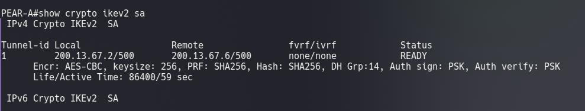
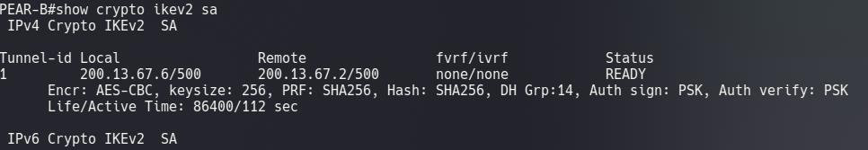

### 2️⃣ Fase 2 — SAs de IPSec activas en modo transport (`show crypto ipsec sa`)

Los contadores muestran paquetes **encapsulados, cifrados y verificados**, con `in use settings ={Transport, }` confirmando que IPSec cifra únicamente el payload GRE (protocolo 47) entre las IPs públicas, con estado **`ACTIVE(ACTIVE)`** vinculado al Crypto Map `CMAP_GRE`.

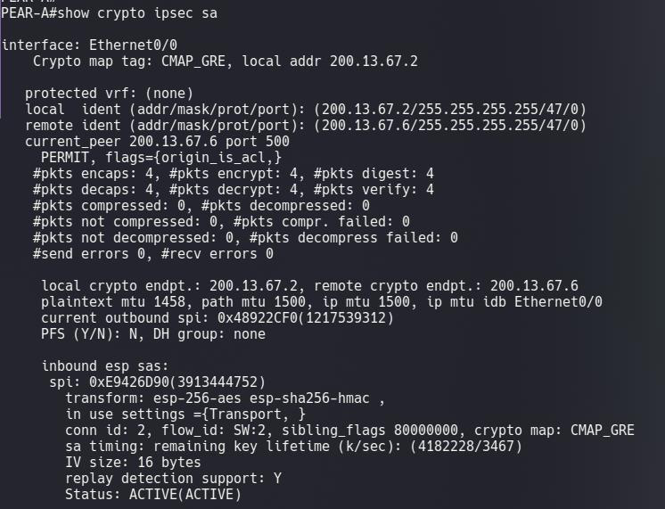
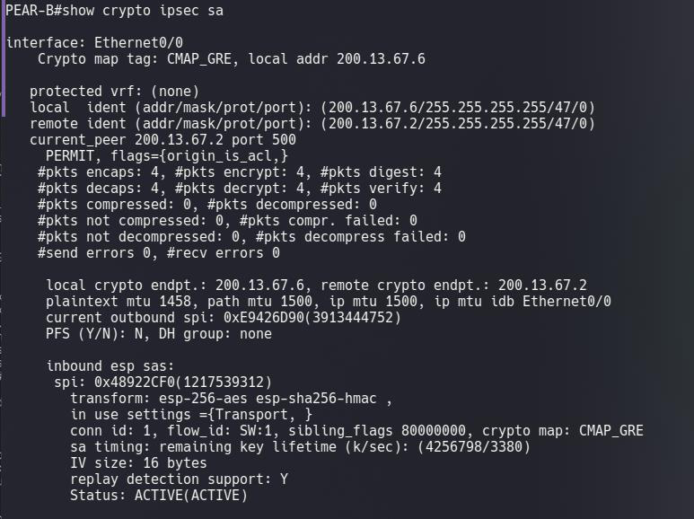

### 3️⃣ Estado de la interfaz GRE (`show interfaces Tunnel0`)

Se confirma `Tunnel0 is up, line protocol is up`, con `Tunnel protocol/transport GRE/IP` y la dirección IP correspondiente en cada extremo del túnel.

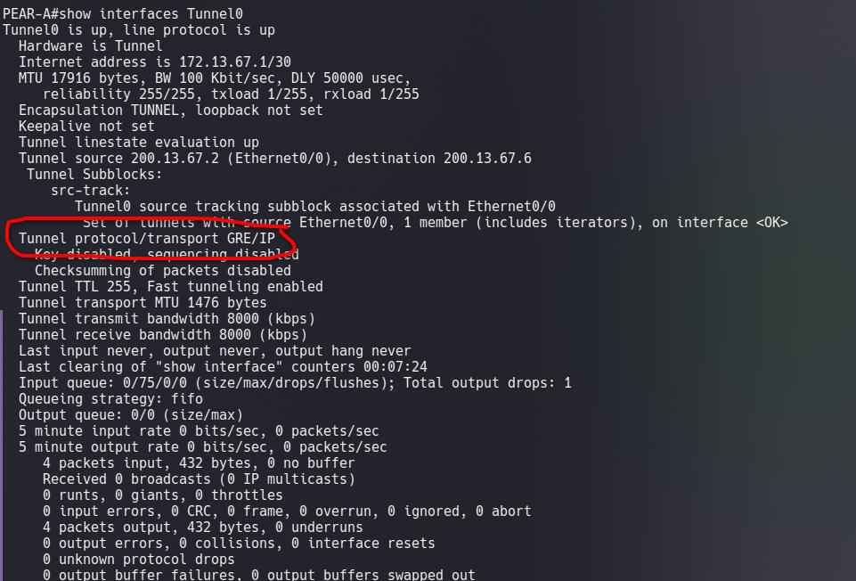
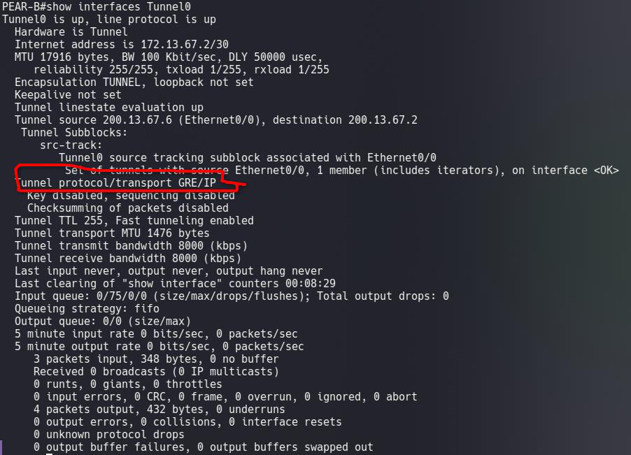

### 4️⃣ Crypto Map vinculado al perfil IKEv2 (`show crypto map`)

El Crypto Map **`CMAP_GRE`** queda asociado al `IKEv2 Profile: PROF_IKEv2`, con la ACL 100 filtrando específicamente el tráfico GRE entre las IPs públicas (`access-list 100 permit gre host 200.13.67.2 host 200.13.67.6`) como disparador preciso del cifrado.

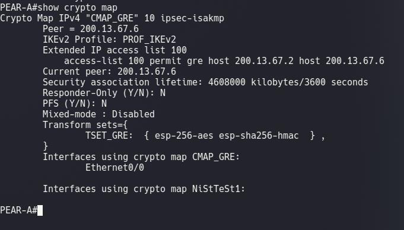

### 5️⃣ Estado del túnel GRE (`show ip interface brief | include Tunnel0`)

Ambos routers reportan la interfaz **`Tunnel0` en estado `up/up`**, con su propia dirección IP dentro de la red `172.13.67.0/30`.

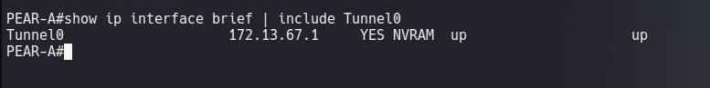
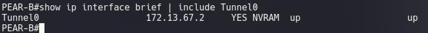

### 6️⃣ Conectividad entre extremos del túnel GRE (`ping` con origen explícito)

Ping directo entre las IPs del túnel (172.13.67.1 ↔ 172.13.67.2), confirmando **100% de éxito** en ambos sentidos.

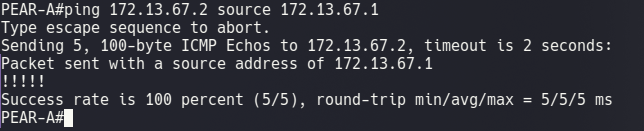
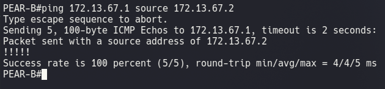

### 7️⃣ Prueba final de conectividad extremo a extremo (LAN y vía Tunnel0)

La prueba definitiva: los hosts de ambas sedes se alcanzan entre sí tanto usando su IP de LAN como origen como forzando el origen explícitamente por `Tunnel0`.

**PC1 → PC2 (origen LAN y origen Tunnel0)**
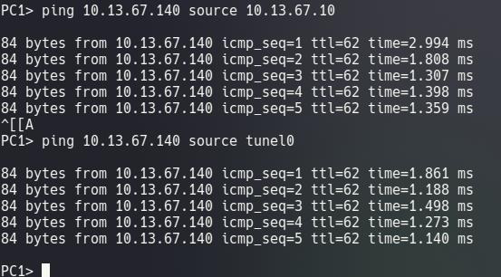

**PC2 → PC1 (origen LAN y origen Tunnel0)**
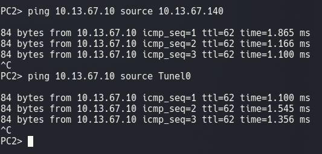

---

## 🎥 Video de la demostración completa

**https://youtu.be/A1IiSh4tu5I**

---

## 📌 Conclusiones de la demostración

- ✅ GRE+IKEv2 representó la combinación más moderna y robusta entre encapsulamiento flexible y negociación de claves eficiente, confirmado por el estado `READY` inmediato de la sesión IKEv2.
- ✅ IKEv2 negoció la sesión en 4 mensajes (vs 9 de IKEv1), reduciendo la latencia de establecimiento del túnel.
- ✅ El perfil IKEv2 (`PROF_IKEv2`) referenciado en el Crypto Map unificó la configuración de autenticación y política en un solo objeto, visible directamente en `show crypto map`.
- ✅ El modo transport de IPSec resultó ideal al ya contar GRE con su propio encabezado de túnel, evitando doble encapsulación de cabeceras — confirmado con `in use settings ={Transport, }`.
- ✅ La ACL que filtra tráfico GRE entre IPs públicas fue el disparador preciso que activó el cifrado IPSec, con coincidencias reales verificadas en los contadores de paquetes.
- ✅ GNS3 demostró la correcta operación de las tres capas — enrutamiento, encapsulación GRE y cifrado IPSec con IKEv2 — validada con pings exitosos entre extremos del túnel y entre los hosts de ambas sedes.
