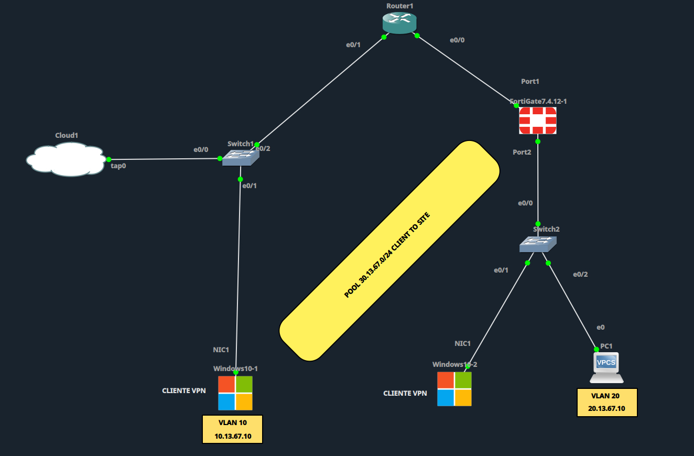

# Configuración VPN Site-to-Site

## Resumen de estado


## Diagrama de topología



## Topología y Direccionamiento

| Elemento | Dirección | Interfaz/VLAN |
|---|---|---|
| VPCS1 (LAN Site1) | DHCP — rango 10.13.67.10-254/24 | VLAN 10 |
| FortiGate1 Port2 (LAN / DHCP server) | 10.13.67.1/24 | port2 |
| FortiGate1 Port1 (WAN) | 200.13.67.2/30 | port1 |
| ISP e0/0 (hacia FortiGate1) | 200.13.67.1/30 | e0/0 |
| ISP e0/1 (hacia FortiGate2) | 200.13.67.5/30 | e0/1 |
| FortiGate2 Port1 (WAN) | 200.13.67.6/30 | port1 |
| FortiGate2 Port2 (LAN / DHCP server) | 20.13.67.1/24 | port2 |
| VPCS2 (LAN Site2) | DHCP — rango 20.13.67.10-254/24 | VLAN 20 |
| PC anfitriona (Cloud1) | 10.10.10.1/24 | tap0 |
| ISP e0/2 (hacia Cloud1) | 10.10.10.2/24 | e0/2 |

> Cambio respecto al lab Client-to-Site: ya no hay un pool de clientes remotos ni Router-ISP haciendo de gateway de LAN. Ahora cada FortiGate es el gateway de su propia LAN, y el túnel IPsec conecta directamente las dos redes 10.13.67.0/24 y 20.13.67.0/24 a través del ISP.

---

## 1. FortiGate1 - Interfaces

**GUI: Network > Interfaces > port1**

| Campo | Valor |
|---|---|
| Interface Name | port1 |
| Role | WAN |
| Addressing mode | Manual |
| IP/Netmask | 200.13.67.2/255.255.255.252 |
| Access | PING, HTTPS, FGFM |

**GUI: Network > Interfaces > port2**

| Campo | Valor |
|---|---|
| Interface Name | port2 |
| Role | LAN |
| Addressing mode | Manual |
| IP/Netmask | 10.13.67.1/255.255.255.0 |
| Access | PING, HTTPS, HTTP |
| DHCP Server | Activado |

Al activar **DHCP Server** en port2, se despliegan estos campos (dejarlos así):

| Campo | Valor |
|---|---|
| Address Range | 10.13.67.10-10.13.67.254 |
| Netmask | 255.255.255.0 |
| Default Gateway | Same as Interface IP (10.13.67.1) |
| DNS Server | Same as System DNS |

**CLI**

```
config system interface
    edit "port1"
        set mode static
        set ip 200.13.67.2 255.255.255.252
        set allowaccess ping https fgfm
    next
    edit "port2"
        set mode static
        set ip 10.13.67.1 255.255.255.0
        set allowaccess ping https http
    next
end

config system dhcp server
    edit 1
        set interface "port2"
        set default-gateway 10.13.67.1
        set netmask 255.255.255.0
        set dns-service default
        config ip-range
            edit 1
                set start-ip 10.13.67.10
                set end-ip 10.13.67.254
            next
        end
    next
end
```

---

## 2. FortiGate1 - Ruta Estática por Defecto

**GUI: Network > Static Routes > Create New**

| Campo | Valor |
|---|---|
| Destination | 0.0.0.0/0.0.0.0 |
| Interface | port1 |
| Gateway | 200.13.67.1 |

**CLI**

```
config router static
    edit 1
        set gateway 200.13.67.1
        set device "port1"
    next
end
```

---

## 3. FortiGate1 - VPN IPsec Site-to-Site (Wizard)

**GUI: VPN > IPsec Wizard > Create New**

| Campo | Valor |
|---|---|
| Name | Site-To-Site |
| Template type | Site to Site |
| Remote device type | FortiGate |

**Paso 2 - Authentication**

| Campo | Valor |
|---|---|
| IP Address | 200.13.67.6 (WAN de FortiGate2) |
| Outgoing Interface | port1 |
| Authentication Method | Pre-shared Key |
| Pre-shared key | Fortinet123! |

**Paso 3 - Policy & Routing**

| Campo | Valor |
|---|---|
| Local Interface | port2 |
| Local Subnets | 10.13.67.0/24 |
| Remote Subnets | 20.13.67.0/24 |

**Paso 4**: Review Settings > Create

> El wizard en modo "Site to Site" crea automáticamente las políticas de firewall en ambos sentidos (túnel-LAN y LAN-túnel) y, si está habilitado, la ruta estática hacia la subred remota vía la interfaz del túnel. Verificar ambas cosas manualmente en las secciones 5 y 7.

**CLI**

```
config vpn ipsec phase1-interface
    edit "Site-To-Site"
        set interface "port1"
        set ike-version 2
        set peertype any
        set net-device disable
        set proposal des-sha256
        set dhgrp 14
        set remote-gw 200.13.67.6
        set psksecret Fortinet123!
    next
end

config vpn ipsec phase2-interface
    edit "Site-To-Site"
        set phase1name "Site-To-Site"
        set proposal des-sha256
        set dhgrp 14
        set src-subnet 10.13.67.0 255.255.255.0
        set dst-subnet 20.13.67.0 255.255.255.0
    next
end
```

---

## 4. FortiGate1 - Ajustar Fase 1 y Fase 2 del Túnel

**GUI: VPN > IPsec Tunnels > Site-To-Site > Edit**

**Phase 1 Proposal**

| Campo | Valor |
|---|---|
| Encryption | DES |
| Authentication | SHA256 |
| Diffie-Hellman Groups | 14 |
| Key Lifetime (seconds) | 86400 |

**Phase 2 Selectors**

| Campo | Valor |
|---|---|
| Local Address | 10.13.67.0/24 |
| Remote Address | 20.13.67.0/24 |
| Encryption | DES |
| Authentication | SHA256 |
| Diffie-Hellman Group | 14 |
| Enable PFS | Activado |
| Key Lifetime | 43200 segundos |

---

## 5. FortiGate1 - Ruta hacia la LAN remota vía túnel

> Punto crítico: sin esta ruta, el tráfico hacia 20.13.67.0/24 sigue la ruta por defecto (sección 2) y sale por port1 hacia el ISP sin cifrar, en lugar de entrar al túnel. El wizard a veces la crea solo; confirmar siempre.

**GUI: Network > Static Routes > Create New**

| Campo | Valor |
|---|---|
| Destination | 20.13.67.0/255.255.255.0 |
| Interface | Site-To-Site (tunnel) |

**CLI**

```
config router static
    edit 2
        set dst 20.13.67.0 255.255.255.0
        set device "Site-To-Site"
    next
end
```

---

## 6. FortiGate1 - Políticas de Firewall

**GUI: Policy & Objects > Firewall Policy > Create New**

**Política LAN -> Túnel**

| Campo | Valor |
|---|---|
| Name | LAN-TO-VPN |
| Incoming Interface | port2 |
| Outgoing Interface | Site-To-Site (tunnel) |
| Source | all |
| Destination | all |
| Schedule | always |
| Service | ALL |
| Action | ACCEPT |
| NAT | Desactivado |

**Política Túnel -> LAN**

| Campo | Valor |
|---|---|
| Name | VPN-TO-LAN |
| Incoming Interface | Site-To-Site (tunnel) |
| Outgoing Interface | port2 |
| Source | all |
| Destination | all |
| Schedule | always |
| Service | ALL |
| Action | ACCEPT |
| NAT | Desactivado |

**CLI**

```
config firewall policy
    edit 1
        set name "LAN-TO-VPN"
        set srcintf "port2"
        set dstintf "Site-To-Site"
        set srcaddr "all"
        set dstaddr "all"
        set action accept
        set schedule "always"
        set service "ALL"
        set nat disable
    next
    edit 2
        set name "VPN-TO-LAN"
        set srcintf "Site-To-Site"
        set dstintf "port2"
        set srcaddr "all"
        set dstaddr "all"
        set action accept
        set schedule "always"
        set service "ALL"
        set nat disable
    next
end
```

---

## 7. FortiGate2 - Interfaces

**GUI: Network > Interfaces > port1**

| Campo | Valor |
|---|---|
| Interface Name | port1 |
| Role | WAN |
| Addressing mode | Manual |
| IP/Netmask | 200.13.67.6/255.255.255.252 |
| Access | PING, HTTPS, FGFM |

**GUI: Network > Interfaces > port2**

| Campo | Valor |
|---|---|
| Interface Name | port2 |
| Role | LAN |
| Addressing mode | Manual |
| IP/Netmask | 20.13.67.1/255.255.255.0 |
| Access | PING, HTTPS, HTTP |
| DHCP Server | Activado |

Al activar **DHCP Server** en port2, se despliegan estos campos (dejarlos así):

| Campo | Valor |
|---|---|
| Address Range | 20.13.67.10-20.13.67.254 |
| Netmask | 255.255.255.0 |
| Default Gateway | Same as Interface IP (20.13.67.1) |
| DNS Server | Same as System DNS |

**CLI**

```
config system interface
    edit "port1"
        set mode static
        set ip 200.13.67.6 255.255.255.252
        set allowaccess ping https fgfm
    next
    edit "port2"
        set mode static
        set ip 20.13.67.1 255.255.255.0
        set allowaccess ping https http
    next
end

config system dhcp server
    edit 1
        set interface "port2"
        set default-gateway 20.13.67.1
        set netmask 255.255.255.0
        set dns-service default
        config ip-range
            edit 1
                set start-ip 20.13.67.10
                set end-ip 20.13.67.254
            next
        end
    next
end
```

---

## 8. FortiGate2 - Ruta Estática por Defecto

**CLI**

```
config router static
    edit 1
        set gateway 200.13.67.5
        set device "port1"
    next
end
```

---

## 9. FortiGate2 - VPN IPsec Site-to-Site (Wizard)

**GUI: VPN > IPsec Wizard > Create New** (configuración espejo de FortiGate1)

| Campo | Valor |
|---|---|
| Name | Site-To-Site |
| Template type | Site to Site |
| Remote device type | FortiGate |
| IP Address | 200.13.67.2 (WAN de FortiGate1) |
| Outgoing Interface | port1 |
| Pre-shared key | Fortinet123! |
| Local Interface | port2 |
| Local Subnets | 20.13.67.0/24 |
| Remote Subnets | 10.13.67.0/24 |

**CLI**

```
config vpn ipsec phase1-interface
    edit "Site-To-Site"
        set interface "port1"
        set ike-version 2
        set peertype any
        set net-device disable
        set proposal des-sha256
        set dhgrp 14
        set remote-gw 200.13.67.2
        set psksecret Fortinet123!
    next
end

config vpn ipsec phase2-interface
    edit "Site-To-Site"
        set phase1name "Site-To-Site"
        set proposal des-sha256
        set dhgrp 14
        set src-subnet 20.13.67.0 255.255.255.0
        set dst-subnet 10.13.67.0 255.255.255.0
    next
end
```

Fase 1 y Fase 2 se ajustan igual que en la sección 4 (DES-SHA256, DH 14, PFS activado, lifetimes 86400/43200).

---

## 10. FortiGate2 - Ruta hacia la LAN remota vía túnel

**CLI**

```
config router static
    edit 2
        set dst 10.13.67.0 255.255.255.0
        set device "Site-To-Site"
    next
end
```

---

## 11. FortiGate2 - Políticas de Firewall

**CLI**

```
config firewall policy
    edit 1
        set name "LAN-TO-VPN"
        set srcintf "port2"
        set dstintf "Site-To-Site"
        set srcaddr "all"
        set dstaddr "all"
        set action accept
        set schedule "always"
        set service "ALL"
        set nat disable
    next
    edit 2
        set name "VPN-TO-LAN"
        set srcintf "Site-To-Site"
        set dstintf "port2"
        set srcaddr "all"
        set dstaddr "all"
        set action accept
        set schedule "always"
        set service "ALL"
        set nat disable
    next
end
```

---

## 12. ISP (CLI)

> El ISP solo hace de tránsito entre las dos subredes /30. No necesita rutas estáticas hacia esas subredes porque quedan directamente conectadas; tampoco necesita NAT para el tráfico entre sitios, ya que va cifrado dentro del túnel IPsec. La interfaz e0/2 hacia Cloud1 se deja para salida/acceso desde la PC anfitriona (host), fuera del alcance del túnel Site-to-Site — para eso se agrega una ruta por defecto apuntando a la PC (10.10.10.1).

```
enable
configure terminal
!
hostname ISP
!
no ip domain-lookup
!
interface Ethernet0/0
 description hacia-FortiGate1-Port1
 ip address 200.13.67.1 255.255.255.252
 duplex auto
 no shutdown
!
interface Ethernet0/1
 description hacia-FortiGate2-Port1
 ip address 200.13.67.5 255.255.255.252
 duplex auto
 no shutdown
!
interface Ethernet0/2
 description hacia-Cloud1-Host
 ip address 10.10.10.2 255.255.255.0
 duplex auto
 no shutdown
!
ip route 0.0.0.0 0.0.0.0 10.10.10.1
!
line con 0
 logging synchronous
line vty 0 4
 login
 transport input telnet ssh
!
end
write memory
```

---

## 13. Switch1 (CLI)

```
enable
configure terminal
!
hostname Switch1
!
no ip domain-lookup
!
vlan 10
 name VLAN-LAN-SITE1
exit
!
interface Ethernet0/0
 description hacia-FortiGate1-Port2
 switchport mode access
 switchport access vlan 10
 no shutdown
exit
!
interface Ethernet0/1
 description hacia-VPCS1
 switchport mode access
 switchport access vlan 10
 no shutdown
exit
!
line con 0
 logging synchronous
line vty 0 4
 login
 transport input telnet ssh
!
end
write memory
```

---

## 14. Switch2 (CLI)

```
enable
configure terminal
!
hostname Switch2
!
no ip domain-lookup
!
vlan 20
 name VLAN-LAN-SITE2
exit
!
interface Ethernet0/0
 description hacia-FortiGate2-Port2
 switchport mode access
 switchport access vlan 20
 no shutdown
exit
!
interface Ethernet0/1
 description hacia-VPCS2
 switchport mode access
 switchport access vlan 20
 no shutdown
exit
!
line con 0
 logging synchronous
line vty 0 4
 login
 transport input telnet ssh
!
end
write memory
```

---

## 15. VPCS - Direccionamiento (DHCP)

**VPCS1**

```
ip dhcp
```

**VPCS2**

```
ip dhcp
```

> Cada VPCS recibirá una IP dentro del rango DHCP configurado en el port2 del FortiGate correspondiente (10.13.67.10-254 o 20.13.67.10-254). Confirmar con `show ip` en la consola de VPCS antes de hacer las pruebas de conectividad, ya que la IP asignada puede no ser exactamente `.10` si hay más de un cliente en la red.

---

## 16. Prueba de Conectividad - Trace-route

Con el túnel levantado (verificar en **Monitor > IPsec Monitor** que el estado sea "Up" en ambos FortiGate), primero confirmar la IP asignada por DHCP en cada VPCS con `show ip`, y luego probar la ruta cruzada (se asume `.10` en ambos casos, ajustar si el DHCP asignó otra IP):

**Desde VPCS1 hacia VPCS2**

```
trace 20.13.67.10
```

**Desde VPCS2 hacia VPCS1**

```
trace 10.13.67.10
```

**Qué revisar en el resultado**

| Verificación | Correcto | Señal de ruta por defecto mal aplicada |
|---|---|---|
| Primer salto | Gateway local (10.13.67.1 o 20.13.67.1) | — |
| Segundo salto | Directo a la IP destino (10.13.67.10 / 20.13.67.10) | Aparece la IP del otro port1 (200.13.67.x) o del ISP como salto intermedio |
| Cantidad de saltos | 2 saltos | 3+ saltos, o timeout total |

Si el traceroute muestra el ISP o el port1 remoto como salto visible, o si se pierde el paquete, la causa casi siempre es que la ruta estática hacia la subred remota (secciones 5 y 10) no está creada o quedó con métrica peor que la ruta por defecto (0.0.0.0/0) hacia port1 — revisar que la ruta al túnel sea más específica (/24) que la ruta por defecto (/0) y que ambas rutas apunten al dispositivo correcto (interfaz del túnel vs. port1).

También verificar con `ping` simple antes del traceroute:

```
ping 20.13.67.10
```
