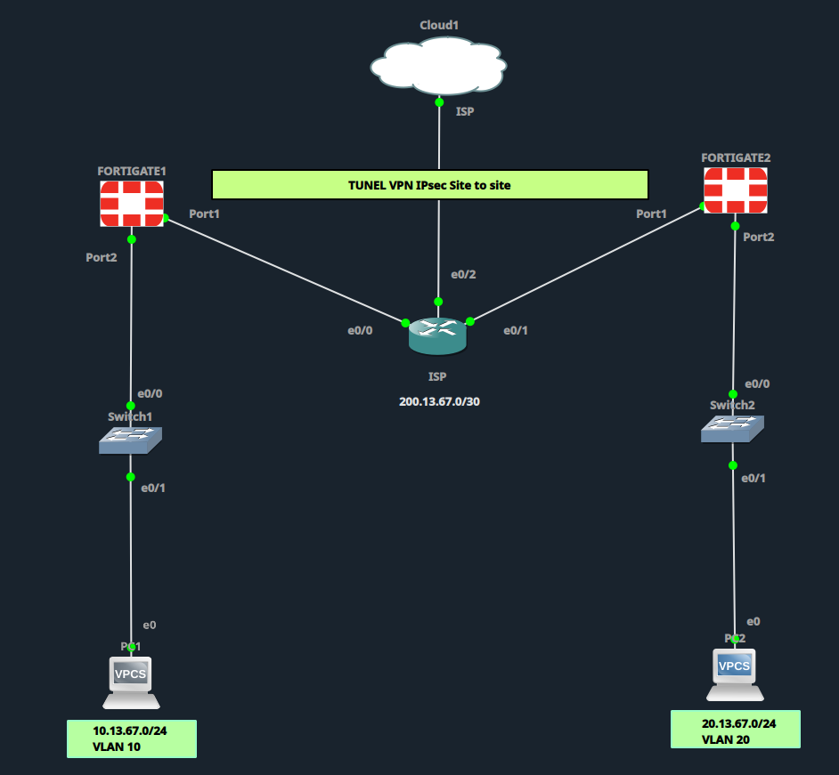

# Configuración VPN Site-to-Site

## Resumen de estado


## Diagrama de topología



## Topología y Direccionamiento

| Elemento | Dirección | Interfaz/VLAN |
|---|---|---|
| VPCS1 (LAN Site1) | DHCP — rango 10.13.67.10-254/24 | VLAN 10 |
| FortiGate1 Port2 (LAN / DHCP server) | 10.13.67.1/24 | port2 |
| FortiGate1 Port1 (WAN) | 200.13.67.2/30 | port1 |
| ISP e0/0 (hacia FortiGate1) | 200.13.67.1/30 | e0/0 |
| ISP e0/1 (hacia FortiGate2) | 200.13.67.5/30 | e0/1 |
| FortiGate2 Port1 (WAN) | 200.13.67.6/30 | port1 |
| FortiGate2 Port2 (LAN / DHCP server) | 20.13.67.1/24 | port2 |
| VPCS2 (LAN Site2) | DHCP — rango 20.13.67.10-254/24 | VLAN 20 |
| PC anfitriona (Cloud1) | 10.10.10.1/24 | tap0 |
| ISP e0/2 (hacia Cloud1) | 10.10.10.2/24 | e0/2 |

> Cambio respecto al lab Client-to-Site: ya no hay un pool de clientes remotos ni Router-ISP haciendo de gateway de LAN. Ahora cada FortiGate es el gateway de su propia LAN, y el túnel IPsec conecta directamente las dos redes 10.13.67.0/24 y 20.13.67.0/24 a través del ISP.

> ⚠️ **Nota sobre licencia de evaluación (permanent-trial):** si tu FortiGate-VM corre con la licencia de evaluación gratuita (verificable con `get system status` — típicamente muestra `1 CPU/1 allowed` y `~2GB RAM/2048 MB allowed`), Fortinet limita esa licencia a un **máximo de 3 interfaces, 3 políticas de firewall y 3 rutas estáticas**. El IPsec Wizard crea automáticamente 3 rutas (default + ruta hacia la LAN remota + blackhole), lo que satura el límite y produce el error `Maximum number of entries has been reached. Object set operator error, -4 discard the setting.` al intentar guardar. Ver detalle y solución en las secciones 5 y 10.

---

## 1. FortiGate1 - Interfaces

**GUI: Network > Interfaces > port1**

| Campo | Valor |
|---|---|
| Interface Name | port1 |
| Role | WAN |
| Addressing mode | Manual |
| IP/Netmask | 200.13.67.2/255.255.255.252 |
| Access | PING, HTTPS, FGFM |

**GUI: Network > Interfaces > port2**

| Campo | Valor |
|---|---|
| Interface Name | port2 |
| Role | LAN |
| Addressing mode | Manual |
| IP/Netmask | 10.13.67.1/255.255.255.0 |
| Access | PING, HTTPS, HTTP |
| DHCP Server | Activado |

Al activar **DHCP Server** en port2, se despliegan estos campos (dejarlos así):

| Campo | Valor |
|---|---|
| Address Range | 10.13.67.10-10.13.67.254 |
| Netmask | 255.255.255.0 |
| Default Gateway | Same as Interface IP (10.13.67.1) |
| DNS Server | Same as System DNS |

> ⚠️ **Ver Apéndice A** antes de dar por buena esta sección: si el DHCP server queda con `vci-match enable`, los clientes normales (VPCS, PCs) no reciben IP aunque el servidor esté corriendo.

**CLI**

```
config system interface
    edit "port1"
        set mode static
        set ip 200.13.67.2 255.255.255.252
        set allowaccess ping https fgfm
    next
    edit "port2"
        set mode static
        set ip 10.13.67.1 255.255.255.0
        set allowaccess ping https http
    next
end

config system dhcp server
    edit 1
        set interface "port2"
        set default-gateway 10.13.67.1
        set netmask 255.255.255.0
        set dns-service default
        config ip-range
            edit 1
                set start-ip 10.13.67.10
                set end-ip 10.13.67.254
            next
        end
    next
end
```

---

## 2. FortiGate1 - Ruta Estática por Defecto

**GUI: Network > Static Routes > Create New**

| Campo | Valor |
|---|---|
| Destination | 0.0.0.0/0.0.0.0 |
| Interface | port1 |
| Gateway | 200.13.67.1 |

**CLI**

```
config router static
    edit 1
        set gateway 200.13.67.1
        set device "port1"
    next
end
```

---

## 3. FortiGate1 - VPN IPsec Site-to-Site (Wizard)

**GUI: VPN > IPsec Wizard > Create New**

| Campo | Valor |
|---|---|
| Name | Site-To-Site |
| Template type | Site to Site |
| Remote device type | FortiGate |

**Paso 2 - Authentication**

| Campo | Valor |
|---|---|
| Remote IP address | 200.13.67.6 (WAN de FortiGate2) |
| Outgoing Interface | port1 |
| Authentication Method | Pre-shared Key |
| Pre-shared key | Fortinet123! |
| Version | 2 |

**Paso 3 - Policy & Routing**

| Campo | Valor |
|---|---|
| Local Interface | port2 |
| Local Subnets | 10.13.67.0/24 |
| Remote Subnets | 20.13.67.0/24 |

**Paso 4**: Review Settings > Create

El wizard genera automáticamente:

| Objeto | Nombre |
|---|---|
| Phase 1 interface | Site-To-Site |
| Local address group | Site-To-Site_local |
| Remote address group | Site-To-Site_remote |
| Phase 2 interface | Site-To-Site |
| Static route | #2 |
| Blackhole route | #3 |
| Local to remote policy | vpn_Site-To-Site_local_0 |
| Remote to local policy | vpn_Site-To-Site_remote_0 |

> ⚠️ **Ver Apéndice B** antes de continuar: si el pre-shared key no coincide carácter por carácter entre FortiGate1 y FortiGate2, la Fase 1 sube hasta el paso AUTH y falla ahí (`PSK auth failed: probable pre-shared key mismatch`), aunque la conectividad IP entre las WAN esté perfecta.

**CLI**

```
config vpn ipsec phase1-interface
    edit "Site-To-Site"
        set interface "port1"
        set ike-version 2
        set peertype any
        set net-device disable
        set proposal des-sha256
        set dhgrp 14
        set remote-gw 200.13.67.6
        set psksecret Fortinet123!
    next
end

config vpn ipsec phase2-interface
    edit "Site-To-Site"
        set phase1name "Site-To-Site"
        set proposal des-sha256
        set dhgrp 14
        set src-subnet 10.13.67.0 255.255.255.0
        set dst-subnet 20.13.67.0 255.255.255.0
    next
end
```

---

## 4. FortiGate1 - Ajustar Fase 1 y Fase 2 del Túnel

**GUI: VPN > IPsec Tunnels > Site-To-Site > Edit**

**Phase 1 Proposal**

| Campo | Valor |
|---|---|
| Encryption | DES |
| Authentication | SHA256 |
| Diffie-Hellman Group | 14 |
| Key Lifetime (seconds) | 86400 |

**Phase 2 Selectors**

| Campo | Valor |
|---|---|
| Local Address | Site-To-Site_local (10.13.67.0/24) |
| Remote Address | Site-To-Site_remote (20.13.67.0/24) |

**Phase 2 Proposal (Advanced)**

| Campo | Valor |
|---|---|
| Encryption | DES |
| Authentication | SHA256 |
| Enable Replay Detection | Activado |
| Enable PFS | Activado |
| Diffie-Hellman Group | 14 |
| Key Lifetime | 43200 segundos |

---

## 5. FortiGate1 - Ruta hacia la LAN remota vía túnel

Creada automáticamente por el wizard (Static Route #2), junto con una ruta **Blackhole** (#3) hacia la misma subred remota como respaldo de seguridad (evita que el tráfico se filtre por la ruta por defecto si el túnel cae).

**GUI: Network > Static Routes**

| Campo | Valor |
|---|---|
| Destination | 20.13.67.0/255.255.255.0 |
| Interface | Site-To-Site (tunnel) |

**CLI**

```
config router static
    edit 2
        set dst 20.13.67.0 255.255.255.0
        set device "Site-To-Site"
    next
end
```

> **Si tienes licencia de evaluación (permanent-trial, límite de 3 rutas):**
> El wizard crea 3 rutas de golpe (default + Site-To-Site_remote + Blackhole) y satura el límite, dando el error `Maximum number of entries has been reached`. Solución:
> 1. Ve a **Network > Static Routes**.
> 2. Selecciona la fila con Interface = **Blackhole** (Comments: "VPN: Site-To-Site (Created by VPN wizard)").
> 3. Click **Delete**.
> 4. Confirma que te quedan solo 2 rutas: la default (0.0.0.0/0 por port1) y la de Site-To-Site_remote por la interfaz del túnel. Esto deja espacio dentro del límite de 3 y el túnel sigue funcionando igual, ya que la ruta hacia el túnel es la que realmente enruta el tráfico — la blackhole es solo un respaldo, no es indispensable.
>
> **Si tienes una licencia más amplia (registrada / sin el límite de 3 rutas):**
> No hace falta eliminar nada. Deja la ruta Blackhole tal cual la creó el wizard, y si necesitas una ruta adicional (por ejemplo, hacia otra subred o un tercer sitio), simplemente ve a **Network > Static Routes > Create New** y complétala con los mismos criterios (Destination = subred remota, Interface = la del túnel correspondiente).

---

## 6. FortiGate1 - Políticas de Firewall

Creadas automáticamente por el wizard.

| Nombre | Incoming | Outgoing |
|---|---|---|
| vpn_Site-To-Site_local_0 | port2 | Site-To-Site (tunnel) |
| vpn_Site-To-Site_remote_0 | Site-To-Site (tunnel) | port2 |

**CLI**

```
config firewall policy
    edit 1
        set name "vpn_Site-To-Site_local_0"
        set srcintf "port2"
        set dstintf "Site-To-Site"
        set srcaddr "Site-To-Site_local"
        set dstaddr "Site-To-Site_remote"
        set action accept
        set schedule "always"
        set service "ALL"
        set nat disable
    next
    edit 2
        set name "vpn_Site-To-Site_remote_0"
        set srcintf "Site-To-Site"
        set dstintf "port2"
        set srcaddr "Site-To-Site_remote"
        set dstaddr "Site-To-Site_local"
        set action accept
        set schedule "always"
        set service "ALL"
        set nat disable
    next
end
```

---

## 7. FortiGate2 - Interfaces

**GUI: Network > Interfaces > port1**

| Campo | Valor |
|---|---|
| Interface Name | port1 |
| Role | WAN |
| Addressing mode | Manual |
| IP/Netmask | 200.13.67.6/255.255.255.252 |
| Access | PING, HTTPS, FGFM |

**GUI: Network > Interfaces > port2**

| Campo | Valor |
|---|---|
| Interface Name | port2 |
| Role | LAN |
| Addressing mode | Manual |
| IP/Netmask | 20.13.67.1/255.255.255.0 |
| Access | PING, HTTPS, HTTP |
| DHCP Server | Activado |

Al activar **DHCP Server** en port2, se despliegan estos campos (dejarlos así):

| Campo | Valor |
|---|---|
| Address Range | 20.13.67.10-20.13.67.254 |
| Netmask | 255.255.255.0 |
| Default Gateway | Same as Interface IP (20.13.67.1) |
| DNS Server | Same as System DNS |

> ⚠️ **Ver Apéndice A**: mismo riesgo de `vci-match` que en FortiGate1 — verifícalo también aquí con `show system dhcp server`.

**CLI**

```
config system interface
    edit "port1"
        set mode static
        set ip 200.13.67.6 255.255.255.252
        set allowaccess ping https fgfm
    next
    edit "port2"
        set mode static
        set ip 20.13.67.1 255.255.255.0
        set allowaccess ping https http
    next
end

config system dhcp server
    edit 1
        set interface "port2"
        set default-gateway 20.13.67.1
        set netmask 255.255.255.0
        set dns-service default
        config ip-range
            edit 1
                set start-ip 20.13.67.10
                set end-ip 20.13.67.254
            next
        end
    next
end
```

---

## 8. FortiGate2 - Ruta Estática por Defecto

**GUI: Network > Static Routes > Create New**

| Campo | Valor |
|---|---|
| Destination | 0.0.0.0/0.0.0.0 |
| Interface | port1 |
| Gateway | 200.13.67.5 |

**CLI**

```
config router static
    edit 1
        set gateway 200.13.67.5
        set device "port1"
    next
end
```

---

## 9. FortiGate2 - VPN IPsec Site-to-Site (Wizard)

**GUI: VPN > IPsec Wizard > Create New**

| Campo | Valor |
|---|---|
| Name | Site-To-Site |
| Template type | Site to Site |
| Remote device type | FortiGate |

**Paso 2 - Authentication**

| Campo | Valor |
|---|---|
| Remote IP address | 200.13.67.2 (WAN de FortiGate1) |
| Outgoing Interface | port1 |
| Authentication Method | Pre-shared Key |
| Pre-shared key | Fortinet123! |
| Version | 2 |

**Paso 3 - Policy & Routing**

| Campo | Valor |
|---|---|
| Local Interface | port2 |
| Local Subnets | 20.13.67.0/24 |
| Remote Subnets | 10.13.67.0/24 |

**Paso 4**: Review Settings > Create

El wizard genera automáticamente los mismos objetos que en FortiGate1 (ver tabla en sección 3): Phase 1 interface, address groups, Phase 2 interface, static route, blackhole route y políticas `vpn_Site-To-Site_local_0` / `vpn_Site-To-Site_remote_0`.

> ⚠️ **El pre-shared key debe ser IDÉNTICO, carácter por carácter, al que pusiste en FortiGate1 (sección 3).** Este fue el punto de falla real en esta configuración — ver Apéndice B para el procedimiento de verificación y el error exacto que produce en los logs de debug.

**CLI**

```
config vpn ipsec phase1-interface
    edit "Site-To-Site"
        set interface "port1"
        set ike-version 2
        set peertype any
        set net-device disable
        set proposal des-sha256
        set dhgrp 14
        set remote-gw 200.13.67.2
        set psksecret Fortinet123!
    next
end

config vpn ipsec phase2-interface
    edit "Site-To-Site"
        set phase1name "Site-To-Site"
        set proposal des-sha256
        set dhgrp 14
        set src-subnet 20.13.67.0 255.255.255.0
        set dst-subnet 10.13.67.0 255.255.255.0
    next
end
```

Fase 1 y Fase 2 se ajustan igual que en la sección 4 (mismos campos: DES-SHA256, DH 14, PFS activado, lifetimes 86400/43200), reemplazando las direcciones locales/remotas por las de este sitio.

---

## 10. FortiGate2 - Ruta hacia la LAN remota vía túnel

Creada automáticamente por el wizard, junto con una ruta **Blackhole** hacia la misma subred remota.

**GUI: Network > Static Routes**

| Campo | Valor |
|---|---|
| Destination | 10.13.67.0/255.255.255.0 |
| Interface | Site-To-Site (tunnel) |

**CLI**

```
config router static
    edit 2
        set dst 10.13.67.0 255.255.255.0
        set device "Site-To-Site"
    next
end
```

> **Si tienes licencia de evaluación (permanent-trial, límite de 3 rutas):**
> Aplica el mismo criterio que en la sección 5: ve a **Network > Static Routes**, elimina la fila con Interface = **Blackhole**, y deja solo la ruta por defecto (0.0.0.0/0 por port1) y la ruta hacia 10.13.67.0/24 por la interfaz Site-To-Site. Con eso quedas dentro del límite de 3 rutas.
>
> **Si tienes una licencia más amplia:**
> Deja la ruta Blackhole como la generó el wizard, y agrega rutas adicionales desde **Network > Static Routes > Create New** si tu topología lo requiere (por ejemplo, para un tercer sitio o una subred adicional detrás de FortiGate2).

---

## 11. FortiGate2 - Políticas de Firewall

Creadas automáticamente por el wizard.

| Nombre | Incoming | Outgoing |
|---|---|---|
| vpn_Site-To-Site_local_0 | port2 | Site-To-Site (tunnel) |
| vpn_Site-To-Site_remote_0 | Site-To-Site (tunnel) | port2 |

**CLI**

```
config firewall policy
    edit 1
        set name "vpn_Site-To-Site_local_0"
        set srcintf "port2"
        set dstintf "Site-To-Site"
        set srcaddr "Site-To-Site_local"
        set dstaddr "Site-To-Site_remote"
        set action accept
        set schedule "always"
        set service "ALL"
        set nat disable
    next
    edit 2
        set name "vpn_Site-To-Site_remote_0"
        set srcintf "Site-To-Site"
        set dstintf "port2"
        set srcaddr "Site-To-Site_remote"
        set dstaddr "Site-To-Site_local"
        set action accept
        set schedule "always"
        set service "ALL"
        set nat disable
    next
end
```

---

## 12. ISP (CLI)

> El ISP solo hace de tránsito entre las dos subredes /30. No necesita rutas estáticas hacia esas subredes porque quedan directamente conectadas; tampoco necesita NAT para el tráfico entre sitios, ya que va cifrado dentro del túnel IPsec. La interfaz e0/2 hacia Cloud1 se deja para salida/acceso desde la PC anfitriona (host), fuera del alcance del túnel Site-to-Site — para eso se agrega una ruta por defecto apuntando a la PC (10.10.10.1).

```
enable
configure terminal
!
hostname ISP
!
no ip domain-lookup
!
interface Ethernet0/0
 description hacia-FortiGate1-Port1
 ip address 200.13.67.1 255.255.255.252
 duplex auto
 no shutdown
!
interface Ethernet0/1
 description hacia-FortiGate2-Port1
 ip address 200.13.67.5 255.255.255.252
 duplex auto
 no shutdown
!
interface Ethernet0/2
 description hacia-Cloud1-Host
 ip address 10.10.10.2 255.255.255.0
 duplex auto
 no shutdown
!
ip route 0.0.0.0 0.0.0.0 10.10.10.1
!
line con 0
 logging synchronous
line vty 0 4
 login
 transport input telnet ssh
!
end
write memory
```

---

## 13. Switch1 (CLI)

```
enable
configure terminal
!
hostname Switch1
!
no ip domain-lookup
!
vlan 10
 name VLAN-LAN-SITE1
exit
!
interface Ethernet0/0
 description hacia-FortiGate1-Port2
 switchport mode access
 switchport access vlan 10
 no shutdown
exit
!
interface Ethernet0/1
 description hacia-VPCS1
 switchport mode access
 switchport access vlan 10
 no shutdown
exit
!
line con 0
 logging synchronous
line vty 0 4
 login
 transport input telnet ssh
!
end
write memory
```

---

## 14. Switch2 (CLI)

```
enable
configure terminal
!
hostname Switch2
!
no ip domain-lookup
!
vlan 20
 name VLAN-LAN-SITE2
exit
!
interface Ethernet0/0
 description hacia-FortiGate2-Port2
 switchport mode access
 switchport access vlan 20
 no shutdown
exit
!
interface Ethernet0/1
 description hacia-VPCS2
 switchport mode access
 switchport access vlan 20
 no shutdown
exit
!
line con 0
 logging synchronous
line vty 0 4
 login
 transport input telnet ssh
!
end
write memory
```

---

## 15. VPCS - Direccionamiento (DHCP)

**VPCS1**

```
ip dhcp
```

**VPCS2**

```
ip dhcp
```

> Cada VPCS recibirá una IP dentro del rango DHCP configurado en el port2 del FortiGate correspondiente (10.13.67.10-254 o 20.13.67.10-254). Confirmar con `show ip` en la consola de VPCS antes de hacer las pruebas de conectividad, ya que la IP asignada puede no ser exactamente `.10` si hay más de un cliente en la red.
>
> ⚠️ Si aparece el error `Can't find dhcp server`, ver **Apéndice A** — no es un problema de switch ni de VLAN en la mayoría de los casos.

---

## 16. Prueba de Conectividad - Trace-route

Con el túnel levantado (verificar en **Monitor > IPsec Monitor** que el estado sea "Up" en ambos FortiGate), primero confirmar la IP asignada por DHCP en cada VPCS con `show ip`, y luego probar la ruta cruzada (se asume `.10` en ambos casos, ajustar si el DHCP asignó otra IP):

**Desde VPCS1 hacia VPCS2**

```
trace 20.13.67.10
```

**Desde VPCS2 hacia VPCS1**

```
trace 10.13.67.10
```

**Qué revisar en el resultado**

| Verificación | Correcto | Señal de ruta por defecto mal aplicada |
|---|---|---|
| Primer salto | Gateway local (10.13.67.1 o 20.13.67.1) | — |
| Segundo salto | Directo a la IP destino (10.13.67.10 / 20.13.67.10) | Aparece la IP del otro port1 (200.13.67.x) o del ISP como salto intermedio |
| Cantidad de saltos | 2 saltos | 3+ saltos, o timeout total |

Si el traceroute muestra el ISP o el port1 remoto como salto visible, o si se pierde el paquete, la causa casi siempre es que la ruta estática hacia la subred remota (secciones 5 y 10) no está creada o quedó con métrica peor que la ruta por defecto (0.0.0.0/0) hacia port1 — revisar que la ruta al túnel sea más específica (/24) que la ruta por defecto (/0) y que ambas rutas apunten al dispositivo correcto (interfaz del túnel vs. port1).

También verificar con `ping` simple antes del traceroute:

```
ping 20.13.67.10
```

---

## 17. Nota - Límite de rutas en licencia de evaluación FortiGate-VM

Si tu FortiGate-VM corre en modo **permanent-trial** (licencia de evaluación gratuita, no registrada con FortiCare), Fortinet impone estos límites permanentes:

- Máximo de **3 interfaces**, **3 políticas de firewall** y **3 rutas estáticas**.
- Solo cifrado de baja intensidad.
- Máximo 1 CPU y 2 GiB de RAM.
- Sin soporte FortiCare.

Puedes confirmar si tu VM está en este modo corriendo `get system status`: si ves algo como `VM Resources: 1 CPU/1 allowed, ~2007 MB RAM/2048 MB allowed`, es señal de licencia de evaluación.

**Con licencia de evaluación:** después de correr el IPsec Wizard, elimina la ruta con Interface = Blackhole (Network > Static Routes) para no exceder el límite de 3 rutas. La ruta hacia la subred remota vía el túnel es la que realmente importa; la blackhole es un respaldo opcional.

**Con licencia registrada / más amplia:** no es necesario eliminar nada. Si necesitas rutas adicionales (otro sitio, otra subred), créalas normalmente desde **Network > Static Routes > Create New**, sin restricción de cantidad.

---

## Apéndice A — DHCP no entrega IP (`Can't find dhcp server`)

Síntoma en el VPCS:

```
PC1> ip dhcp
DDD
Can't find dhcp server
```

**Causa real (confirmada en este lab):** el DHCP server del FortiGate puede quedar con el filtro de Vendor Class Identifier activado, por ejemplo:

```
show system dhcp server
config system dhcp server
    edit 1
        ...
        set vci-match enable
        set vci-string "FortiSwitch" "FortiExtender"
    next
end
```

Con `vci-match enable`, el servidor **solo responde** a clientes cuyo VCI sea FortiSwitch o FortiExtender (se usa normalmente para aprovisionamiento automático de equipos Fortinet). Un VPCS o PC normal no tiene ese VCI, así que el servidor ignora su solicitud aunque esté "corriendo" — por eso el DHCP parece activo en la GUI pero nunca asigna nada.

**Diagnóstico**

```
show system dhcp server
```

Si aparece `set vci-match enable`, esa es la causa.

**Solución**

```
config system dhcp server
    edit 1
        set vci-match disable
    next
end
```

O por GUI: **Network > Interfaces > port2 > DHCP Server**, en la configuración avanzada, desmarcar el filtro por VCI.

Aplica el mismo chequeo en **ambos** FortiGate — es un valor por interfaz, no algo que se hereda de una configuración a otra.

Verifica después con:
```
PC1> ip dhcp
PC1> show ip
```

---

## Apéndice B — Túnel sube pero falla la autenticación (`PSK auth failed`)

Síntoma: `diagnose vpn tunnel list` muestra `status=down`, y `Monitor > IPsec Monitor` no sube el túnel aunque las WAN se hagan ping perfectamente entre sí.

**Diagnóstico paso a paso**

1. Confirmar conectividad IP básica entre las dos WAN:
```
execute ping 200.13.67.6    (desde FortiGate1)
execute ping 200.13.67.2    (desde FortiGate2)
```
Si esto falla, el problema es de ruteo/ISP, no de IPsec — resolver eso primero.

2. Si las WAN se ven bien, activar debug de IKE en uno de los dos FortiGate:
```
diagnose debug reset
diagnose debug application ike -1
diagnose debug enable
```

3. Forzar la negociación:
```
diagnose vpn tunnel up Site-To-Site
```

4. Revisar el log. La línea que confirma la causa exacta es:
```
PSK auth failed: probable pre-shared key mismatch
```
Esto significa que la Fase 1 sí completó el intercambio SA_INIT y llegó hasta el mensaje AUTH (o sea: la conectividad, el proposal de cifrado — DES-SHA256/DH14 — y el remote-gw están bien), pero el **pre-shared key no coincide** entre los dos FortiGate.

**Solución**

Reescribir el PSK en ambos lados, sin asumir que "ya estaba bien":

```
config vpn ipsec phase1-interface
    edit "Site-To-Site"
        set psksecret Fortinet123!
    next
end
```
(igual en FortiGate1 y FortiGate2 — el valor debe ser idéntico carácter por carácter)

**Causas típicas del mismatch**

- Espacio en blanco al inicio/final al pegar el PSK en uno de los dos lados.
- El símbolo `!` se pierde o se duplica al copiar/pegar en la consola de GNS3.
- Diferencia de mayúsculas/minúsculas (el PSK es case-sensitive).
- Se configuró por GUI en un FortiGate y por CLI en el otro, y quedó una diferencia sin notar.

**Recomendación:** escribe el PSK directamente en la consola en ambos lados en vez de pegarlo desde el portapapeles — evita el problema de caracteres que se pierden al pegar en GNS3.

**Verificación final**

```
diagnose vpn tunnel up Site-To-Site
diagnose vpn tunnel list
```
Debe mostrar `status=up`. Luego, para confirmar tráfico real cruzando (no solo el túnel negociado), usar el sniffer mientras se hace ping desde un VPCS:

```
diagnose sniffer packet any 'icmp' 4
```

Un ping exitoso a través del túnel se ve así en el sniffer del FortiGate que recibe la solicitud:

```
port2      in  20.13.67.10 -> 10.13.67.10: icmp: echo request
Site-To-Site out 20.13.67.10 -> 10.13.67.10: icmp: echo request
Site-To-Site in  10.13.67.10 -> 20.13.67.10: icmp: echo reply
port2      out 10.13.67.10 -> 20.13.67.10: icmp: echo reply
```

Entra por la LAN (port2), sale por el túnel, vuelve la respuesta por el túnel, y sale de nuevo por la LAN — confirma el túnel funcionando de punta a punta.

> Nota: probar con `execute ping` directamente desde el FortiGate hacia la LAN remota puede dar falsos negativos (100% packet loss) incluso con el túnel ya "up", porque el tráfico originado en el propio FortiGate no siempre atraviesa las mismas políticas que el tráfico real de la LAN. La prueba definitiva es siempre desde un host detrás de la LAN (VPCS o PC), no desde la CLI del FortiGate.
