# Demostración de Funcionamiento — VPN Site-to-Site (FortiGate / GNS3)

**Estudiante:** Miguel Ramírez Meli
**Matrícula:** 20251367
**Institución:** ITLA
**Profesor:** Jonathan Rondón

---

## Resumen de estado


> **Este documento no es una guía de configuración.** Es la **demostración de que el laboratorio de VPN IPsec Site-to-Site quedó completado y funcional**, con evidencia capturada directamente del entorno (GNS3 + FortiGate-VM).

---

## Diagrama de topología implementada


| Elemento | Dirección |
|---|---|
| VPCS1 (LAN Site1 / VLAN 10) | 10.13.67.0/24 |
| FortiGate1 Port2 (LAN) | 10.13.67.1/24 |
| FortiGate1 Port1 (WAN) | 200.13.67.2/30 |
| ISP e0/0 ↔ e0/1 | 200.13.67.0/30 |
| FortiGate2 Port1 (WAN) | 200.13.67.6/30 |
| FortiGate2 Port2 (LAN) | 20.13.67.1/24 |
| VPCS2 (LAN Site2 / VLAN 20) | 20.13.67.0/24 |

---

## 1. Estado del túnel IPsec — UP en ambos extremos

La verificación más importante: el túnel **Site-To-Site** aparece con **estado "Up"** en el `IPsec Monitor` tanto de FortiGate2 (`200.13.67.6`) como de FortiGate1 (`200.13.67.2`), con referencias activas (`Ref. 5`), confirmando que la Fase 1 y la Fase 2 completaron la negociación IKEv2 correctamente.

**FortiGate2 (200.13.67.6) — Túnel Up**


**FortiGate1 (200.13.67.2) — Túnel Up**

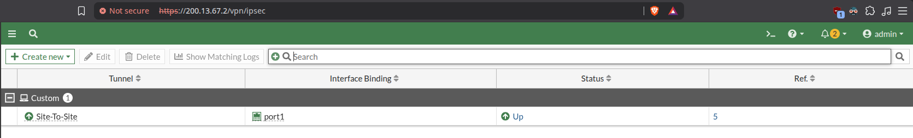

---

## 2. Interfaces configuradas en ambos FortiGate

Las interfaces WAN (`port1`) y LAN (`port2`) quedaron activas con las direcciones planificadas, y el DHCP server de cada `port2` entregando arrendamientos (1 cliente activo en cada uno, visible en la columna *DHCP Clients*).

**FortiGate2 — port1 (200.13.67.6/30) y port2 (20.13.67.1/24, DHCP activo)**

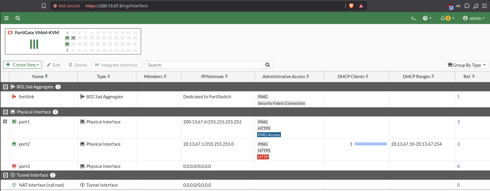

**FortiGate1 — port1 (200.13.67.2/30) y port2 (10.13.67.1/24, DHCP activo)**


---

## 3. Políticas de firewall generadas y activas

El wizard de IPsec creó correctamente las dos políticas cruzadas (`port2 → Site-To-Site` y `Site-To-Site → port2`) en ambos equipos, permitiendo el tráfico bidireccional entre las LAN a través del túnel.

**FortiGate2**

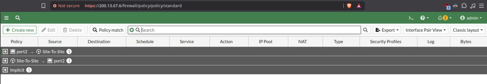

**FortiGate1**

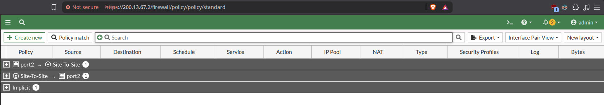

---

## 4. Tabla de rutas estáticas final

Cada FortiGate quedó con su ruta por defecto hacia el ISP y su ruta específica hacia la subred remota a través de la interfaz del túnel (`Site-To-Site`), confirmando que el tráfico hacia el otro sitio se enruta por el túnel y no por la ruta por defecto.

**FortiGate1 (200.13.67.2)** — ruta por defecto vía `200.13.67.1` + ruta a `20.13.67.0/24` vía `Site-To-Site`


**FortiGate2 (200.13.67.6)** — ruta por defecto vía `200.13.67.5` + ruta a `10.13.67.0/24` vía `Site-To-Site`

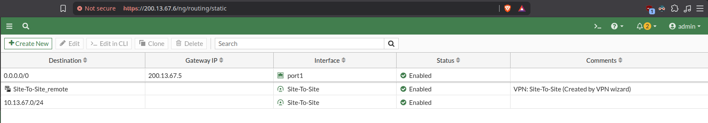

---

## 5. Asignación DHCP en las LAN de cada sitio

Ambos VPCS recibieron IP automáticamente desde el FortiGate correspondiente, confirmando que el DHCP server de cada `port2` está operativo y sin restricciones (VCI) que bloqueen la asignación.

**VPCS1 — recibe 10.13.67.10/24, gateway 10.13.67.1**

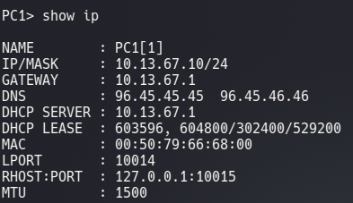

**VPCS2 — recibe 20.13.67.10/24, gateway 20.13.67.1**

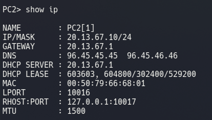

---

## 6. Prueba de conectividad — Ping cruzado entre sitios

Ping exitoso en ambas direcciones, con 0% de pérdida y latencia estable (~2–8 ms), confirmando el tránsito de tráfico real cifrado por el túnel IPsec entre las dos LAN.

**Desde VPCS1 (10.13.67.10) hacia VPCS2 (20.13.67.10)**

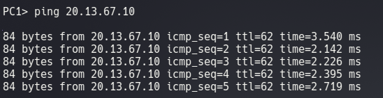

**Desde VPCS2 (20.13.67.10) hacia VPCS1 (10.13.67.10)**

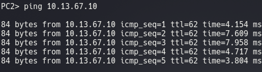

---

## 7. Traceroute cruzado

El traceroute desde VPCS2 hacia VPCS1 muestra el primer salto en el gateway local (`20.13.67.1`) y confirma alcance al destino final (`10.13.67.10`) con respuesta de *Destination port unreachable* — comportamiento normal del mecanismo de traceroute basado en UDP de VPCS al llegar al host final, y consistente con una ruta directa a través del túnel (sin exponer saltos intermedios del ISP ni del `port1` remoto).

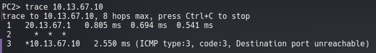

---

## 8. Verificación definitiva — Sniffer del tráfico cruzando el túnel

Esta es la prueba más concluyente: con `diagnose sniffer packet any icmp 4` corriendo en el FortiGate mientras se hace ping entre los VPCS, se observa el paquete **entrando por `port2`**, **saliendo cifrado por la interfaz `Site-To-Site`**, la **respuesta entrando de vuelta por `Site-To-Site`**, y **saliendo finalmente por `port2`** hacia la LAN — el patrón exacto de un túnel IPsec funcionando de punta a punta:

```
port2      in  10.13.67.10 -> 20.13.67.10: icmp: echo request
Site-To-Site out 10.13.67.10 -> 20.13.67.10: icmp: echo request
Site-To-Site in  20.13.67.10 -> 10.13.67.10: icmp: echo reply
port2      out 20.13.67.10 -> 10.13.67.10: icmp: echo reply
```

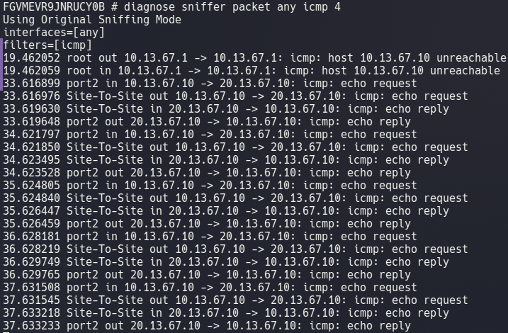

---

## Conclusión

Con las evidencias anteriores queda demostrado que:

- El túnel IPsec **Site-To-Site** negoció correctamente Fase 1 (IKEv2, DES-SHA256) y Fase 2, y se mantiene **Up** en ambos extremos.
- Las interfaces, políticas de firewall y rutas estáticas quedaron configuradas según el diseño y operativas.
- Ambas LAN (`10.13.67.0/24` y `20.13.67.0/24`) reciben direccionamiento DHCP correctamente.
- Existe **conectividad real y bidireccional** entre VPCS1 y VPCS2, confirmada por ping, traceroute y captura de tráfico (`sniffer`), verificando que el tráfico efectivamente **atraviesa el túnel cifrado** y no una ruta alterna.

✅ **VPN Site-to-Site funcionando correctamente de extremo a extremo.**
