# 📸 Evidencia de Implementación — Wazuh SIEM

---

## 1. Topología final (interfaces reales)

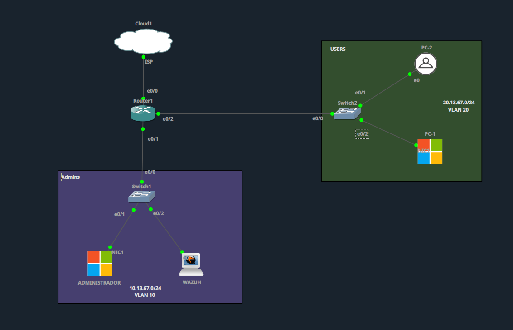

Router1 (e0/0 → Cloud1, e0/1 → Switch1/Admins, e0/2 → Switch2/Users), Switch1 y Switch2 con sus respectivos hosts.

## 2. Descarga del instalador de Wazuh

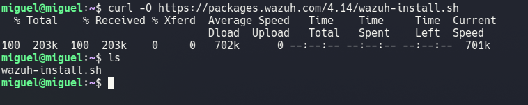

`curl -O https://packages.wazuh.com/4.14/wazuh-install.sh` ejecutado en el servidor WAZUH (10.13.67.10).

## 3. Instalación en progreso (indexer + manager + dashboard)

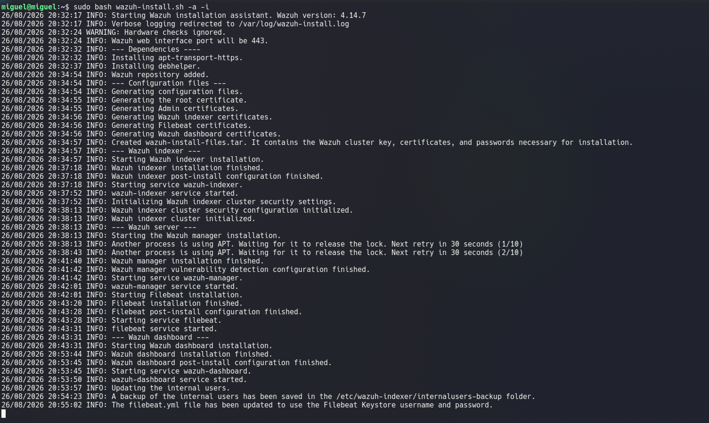

`sudo bash wazuh-install.sh -a -i` — Wazuh 4.14.7 instalando los tres componentes de forma automática.

## 4. Instalación finalizada con credenciales generadas

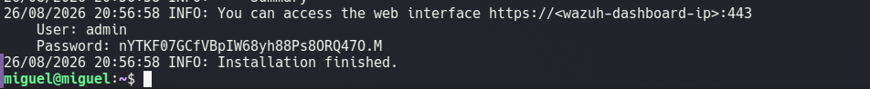

Instalación completada, contraseña inicial del usuario `admin` generada por el instalador.

## 5. Conectividad validada desde ADMINISTRADOR

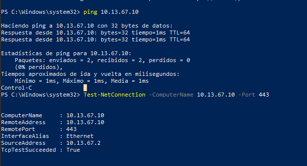

Desde ADMINISTRADOR (10.13.67.2): `ping` exitoso y `Test-NetConnection -Port 443` con `TcpTestSucceeded: True`.

## 6. Acceso al portal Wazuh desde ADMINISTRADOR

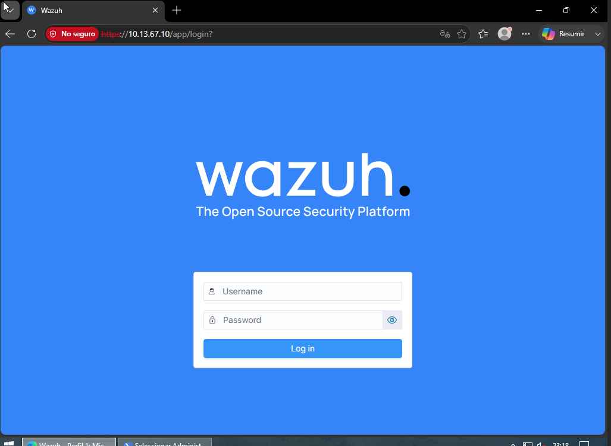

Portal cargando correctamente en `https://10.13.67.10` desde el equipo autorizado por la ACL.

## 7. Instalación del agente en PC-1 (Windows)

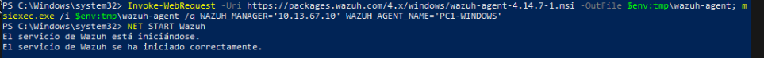

Comando generado por el dashboard ejecutado en PowerShell, con `WAZUH_MANAGER='10.13.67.10'` corregido, y servicio iniciado con `NET START Wazuh`.

## 8. PC1-WINDOWS activo en el dashboard

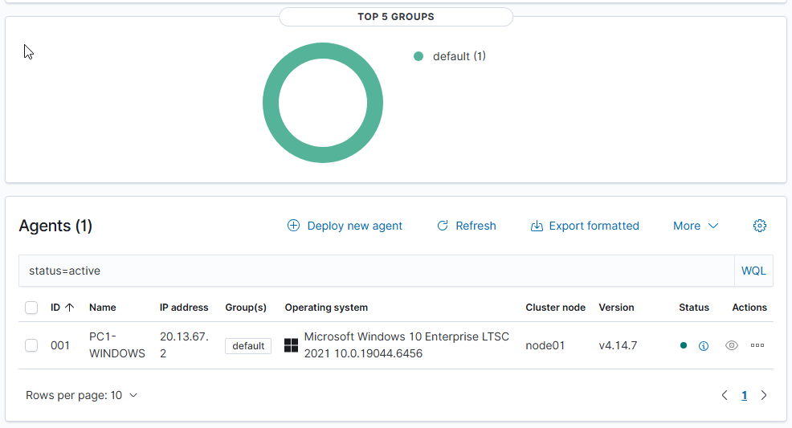

Agente `001 - PC1-WINDOWS` reportando como **Active**.

## 9. Instalación del agente en PC-2 (Kali)

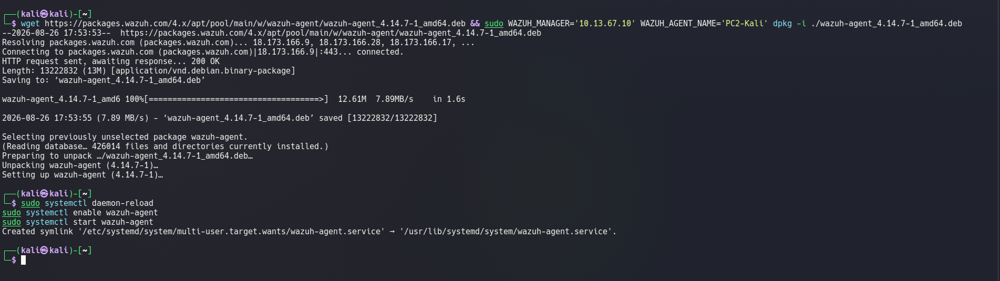

Descarga e instalación del agente vía `wget` + `dpkg`, con `WAZUH_MANAGER` corregido a `10.13.67.10`.

## 10. Agentes activos (PC1 y PC2)

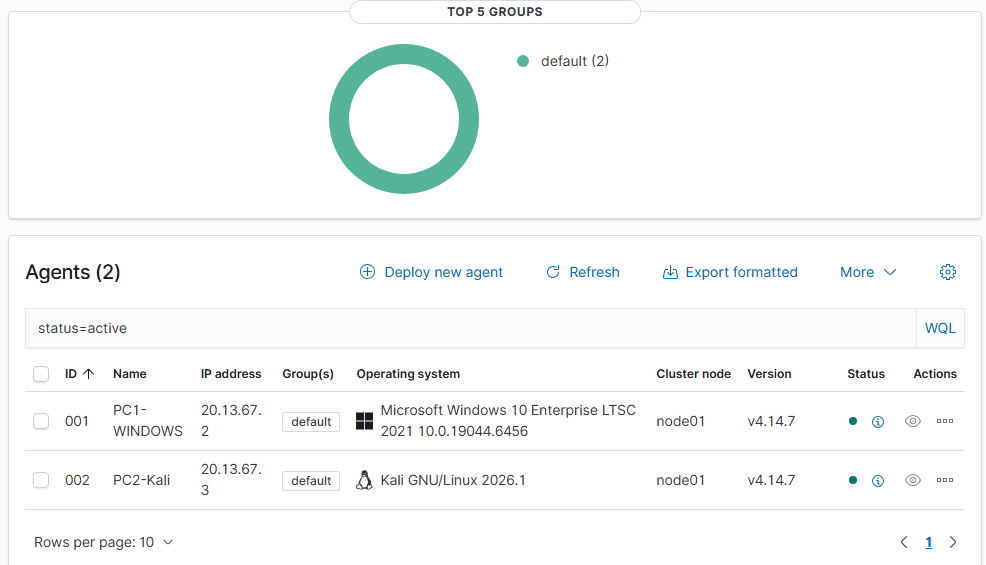

Dashboard mostrando `Agents (2)`: PC1-WINDOWS y PC2-Kali, ambos **Active**.

## 11. ACL bloqueando el portal desde PC-2 (puerto 443)

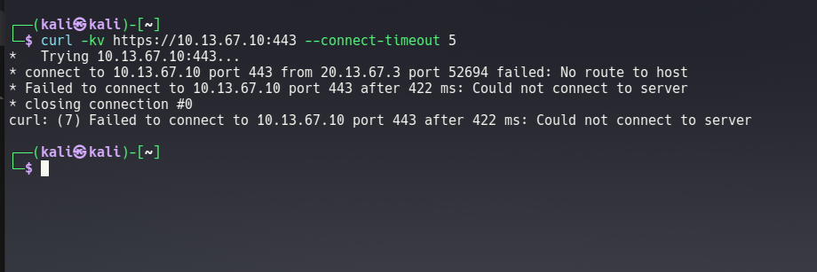

`curl` desde PC-2 (VLAN Users) contra `10.13.67.10:443` → `No route to host`, confirmando que la ACL del router bloquea el acceso al portal.

## 12. Puerto SSH (22) expuesto intencionalmente

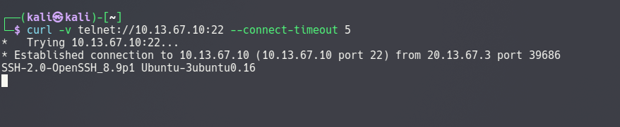

`curl` contra `10.13.67.10:22` desde PC-2 conecta sin problema (banner OpenSSH visible) — puerto usado luego para la simulación de ataque.

## 13. ACL bloqueando el portal desde PC-1 (navegador)

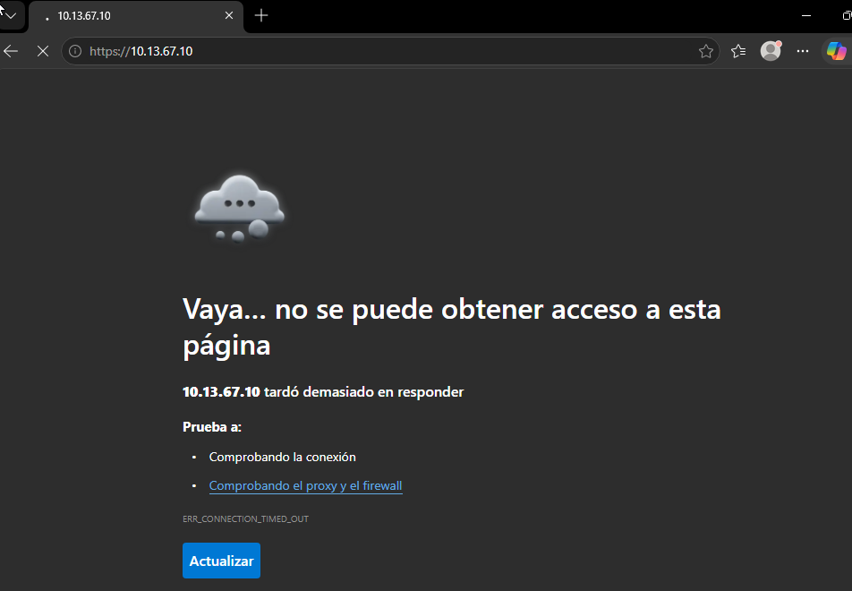

Desde PC-1 (Windows, VLAN Users), `https://10.13.67.10` → `ERR_CONNECTION_TIMED_OUT`, confirmando el bloqueo también por navegador.

## 14. Lista de agentes en el manager

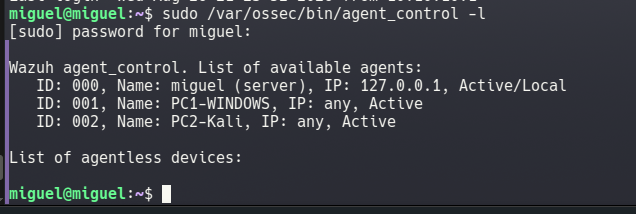

`agent_control -l` en el servidor WAZUH: agente `000` (el propio manager), `001` (PC1-WINDOWS) y `002` (PC2-Kali), todos **Active**.

## 15. Simulación de ataque (fuerza bruta SSH)

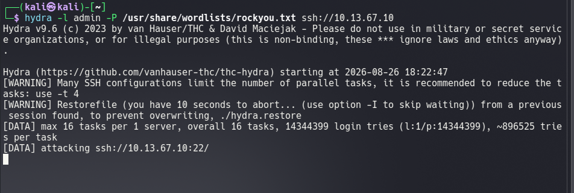

`hydra -l admin -P /usr/share/wordlists/rockyou.txt ssh://10.13.67.10` ejecutado desde PC-2 (Kali) contra el servidor WAZUH.

## 16. Alerta detectada en el dashboard (severidad alta)

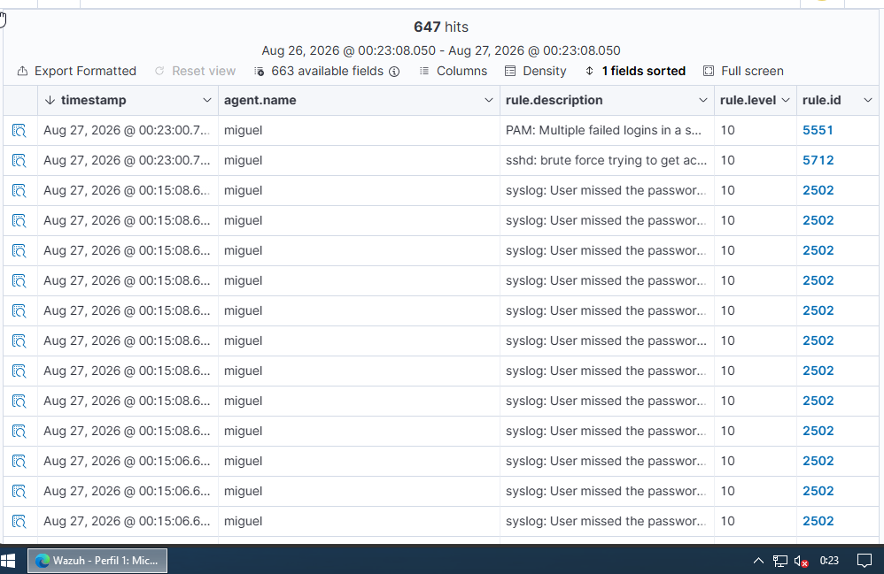

647 eventos capturados, nivel de regla **10** (alto), incluyendo:
- **5551** — PAM: múltiples logins fallidos
- **5712** — sshd: fuerza bruta detectada
- **2502** — intentos individuales de contraseña incorrecta

---

## ✅ Resumen de validación

| Prueba | Resultado |
|---|---|
| Instalación de Wazuh (indexer + manager + dashboard) | ✅ Exitosa |
| Acceso al portal desde ADMINISTRADOR | ✅ Permitido |
| Acceso al portal desde PC-1 (Windows) | ⛔ Bloqueado por ACL |
| Acceso al portal desde PC-2 (Kali) | ⛔ Bloqueado por ACL |
| Agentes PC1-WINDOWS y PC2-Kali | ✅ Activos |
| Ataque simulado (fuerza bruta SSH) | ✅ Detectado (nivel 10) |

---

**Autor:** Miguel Ramírez Meli
