<div align="center">

# 📸 Evidencia de Implementación — Segmentación WAN/DMZ/LAN + SIEM Wazuh


</div>

> Acompaña a [`README.md`](../README.md). Documenta paso a paso la instalación del SIEM, el despliegue de agentes en los 3 endpoints (🐳 Docker, 🪟 Windows, 🐧 Ubuntu Server), y el escenario de ataque simulado desde **KaliDocker-1** contra **WEB-1**.

---

## Parte 1 — Preparación e instalación de Wazuh Manager (UbuntuServer-1)

### 1. Ampliación de disco en UbuntuServer-1

Redimensionamiento del volumen lógico (LVM) de 49 GB a 98 GB para garantizar espacio suficiente para el Wazuh Indexer (OpenSearch).

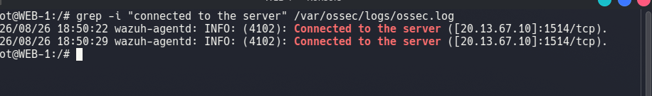

### 2. Primer intento de instalación — validación de requisitos mínimos

El instalador rechaza continuar por no cumplir el mínimo recomendado de 4GB RAM / 2 CPU, mostrando la opción de forzar con `-i`.

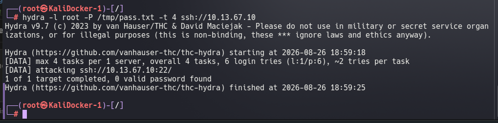

### 3. Descarga del instalador oficial

```bash
curl -O https://packages.wazuh.com/4.9/wazuh-install.sh
```

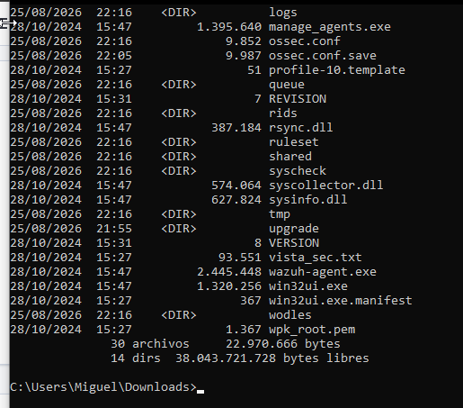

### 4. Instalación en progreso

Generación de certificados, configuración del indexer y arranque de los servicios del stack Wazuh.

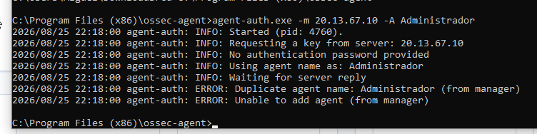

### 5. Resumen final y credenciales de acceso

Confirmación de instalación exitosa con URL del dashboard y contraseña autogenerada del usuario `admin`.

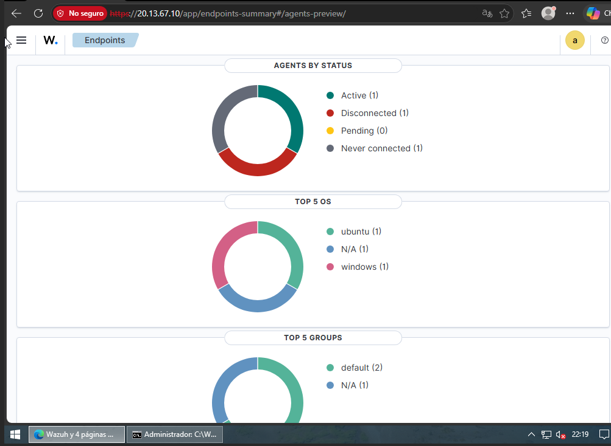

### 6. Verificación del servicio wazuh-manager

`systemctl status wazuh-manager` confirmando el servicio `active (running)`.

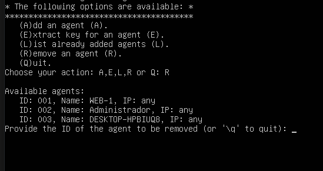

### 7. Primer acceso al dashboard

Vista `Overview` del dashboard recién instalado, sin agentes registrados todavía.

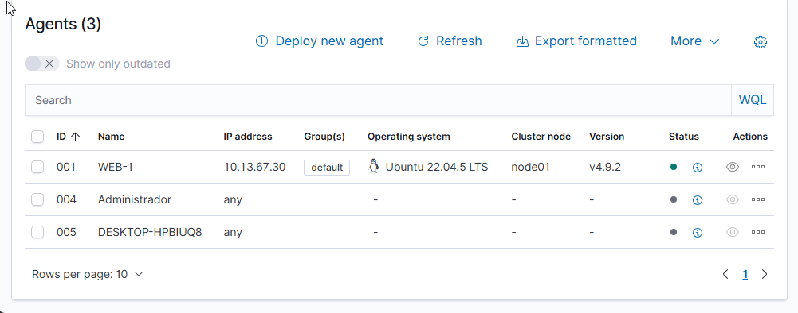

---

## Parte 2 — Despliegue de agentes en los endpoints

### 8. 🐳 Instalación del agente en WEB-1 (Docker, DMZ)

Descarga e instalación del `.deb` del agente dentro del contenedor Docker.

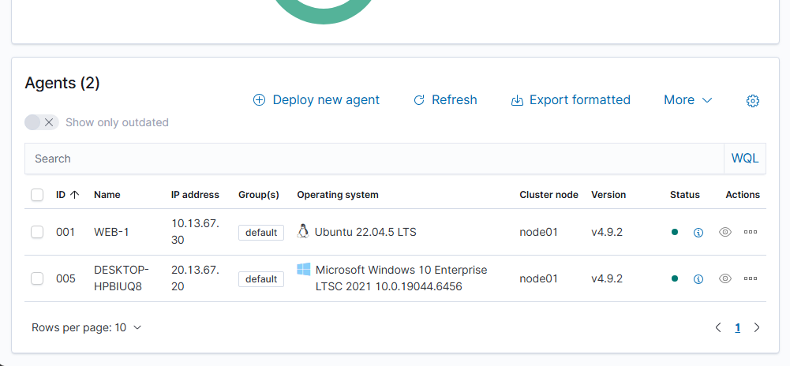

### 9. 🐳 Conexión exitosa del agente WEB-1

Log confirmando `Connected to the server ([20.13.67.10]:1514/tcp)` tras corregir IP del manager y la excepción de ACL.

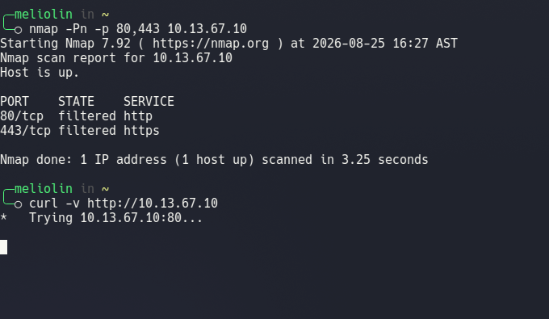

### 10. 🪟 Agente Windows — servicio en ejecución

GUI del Wazuh Agent en Windows10-1 mostrando `Status: Running`.

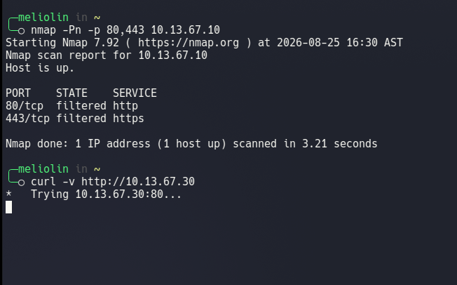

### 11. 🪟 Configuración del Manager IP en Windows

Panel del agente con IP del manager (`20.13.67.10`) y llave de autenticación cargada.

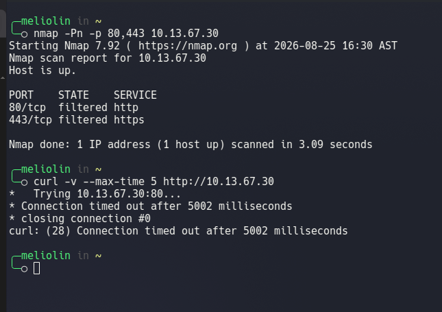

### 12. Confirmación de agente activo en el dashboard

Vista de **Endpoints** con el agente `WEB-1` enrolado y comunicándose con el manager.

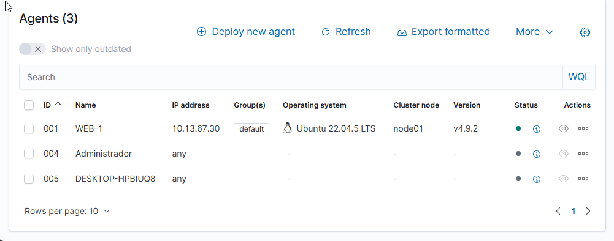

---

## Parte 3 — Escenario de ataque simulado (KaliDocker-1 como atacante)

### 13. 🐉 Topología final con KaliDocker-1 incorporado

Diagrama GNS3 con `KaliDocker-1` conectado a `SwitchDMZ`, representando un atacante que ya comprometió la DMZ.

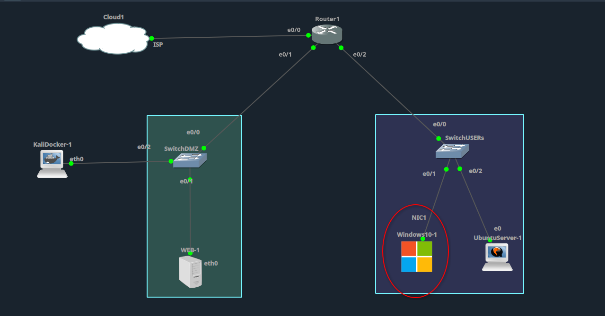

### 14. Ataque de fuerza bruta SSH contra WEB-1

Ejecución de Hydra desde KaliDocker-1 (`10.13.67.20`) contra SSH de WEB-1 (`10.13.67.10`).

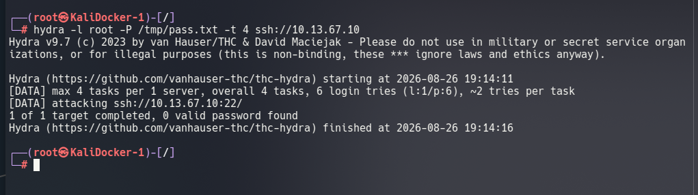

### 15. Registro del ataque en el sistema comprometido

`/var/log/auth.log` de WEB-1 con eventos `Failed password for root from 10.13.67.20`.

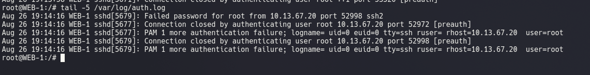

### 16. Detección del ataque en el dashboard de Wazuh

Filtro `agent.name:WEB-1 AND sshd` — 14 alertas correlacionadas con la ventana del ataque.

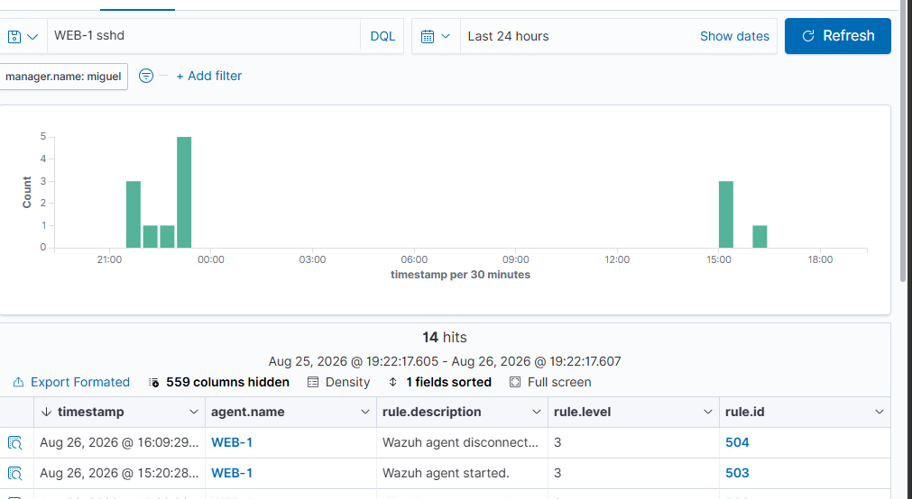

### 17. Correlación temporal del ataque

Gráfica "Alerts evolution - Top 5 agents" con picos de actividad de `WEB-1` coincidiendo con las rondas de ataque.

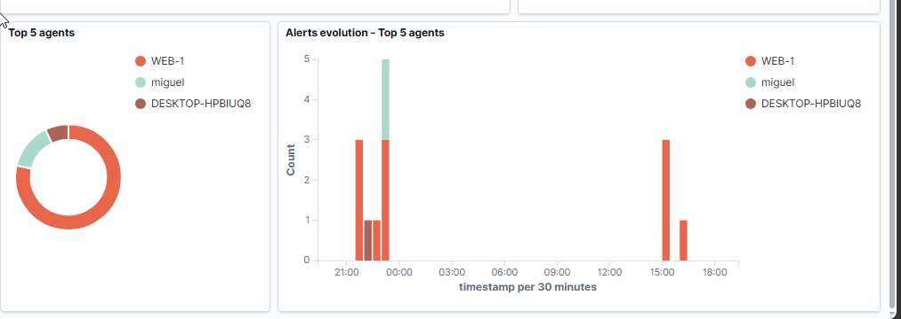

### 18. Verificación de aislamiento — DMZ no alcanza la LAN

Prueba de conectividad desde la DMZ hacia hosts de la LAN, confirmando bloqueo por `ACL_DMZ_IN` incluso durante el ataque activo.

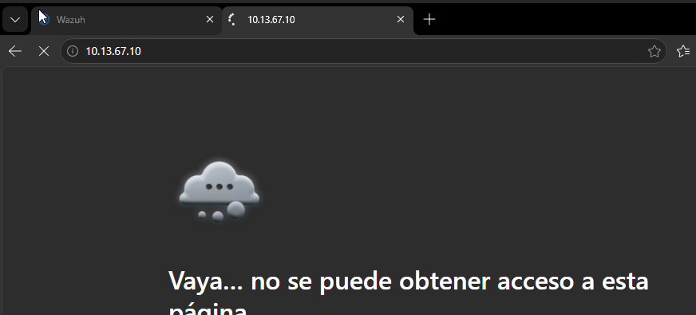

---

## 📋 Resumen de evidencia por fase

| Fase | Capturas | Resultado |
|---|---|---|
| Preparación e instalación del SIEM | 1 – 7 | Wazuh Manager operativo en UbuntuServer-1 |
| Despliegue de agentes | 8 – 12 | Agentes activos en WEB-1 (Docker) y Windows10-1 |
| Ataque simulado y detección | 13 – 17 | Fuerza bruta SSH detectada y correlacionada en el SIEM |
| Validación de segmentación | 18 | DMZ→LAN bloqueado incluso bajo ataque activo |

---

## Nota técnica

El conteo de alertas de "Authentication failure" en el widget resumen fue menor al número real de intentos de Hydra por ronda. Esto es consistente con una limitación del entorno: `WEB-1` corre como contenedor Docker minimalista sin `systemd`, y `rsyslog` se instaló y arrancó manualmente después de que el agente Wazuh ya estaba activo, por lo que el `logcollector` no capturó el 100% de los eventos de la primera ráfaga. Aun así, la detección quedó confirmada tanto a nivel de sistema operativo (`auth.log`) como en el SIEM (capturas 16 y 17).

---

<div align="center">

**Miguel Ramirez Meli** · Matrícula 2025-1367 · ITLA · Seguridad de Redes

</div>
