# Monitoreo de Red con SNMP y Zabbix — Demostración

**Estudiante:** Miguel Ramirez Meli
**Matrícula:** 2025-1367
**Asignatura:** Seguridad de Redes
**Práctica:** Tarea Semana 11 — Monitoreo con SNMP y Zabbix

---

## 1. Topología

Router1 conectado a Switch1, con Windows10-1 como cliente DHCP y Zabbix-1 como servidor de monitoreo.

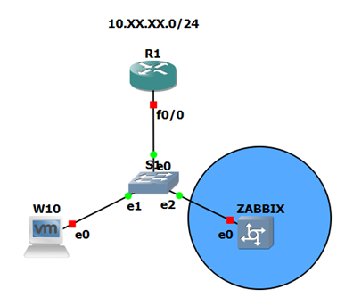

| Equipo | Interfaz | IP |
|---|---|---|
| Router1 | f0/0 | `10.13.67.1/24` |
| Switch1 | VLAN1 | `10.13.67.2/24` |
| Zabbix-1 | eth0 | DHCP |
| Windows10-1 | NIC1 | DHCP |

Comunidad SNMP de solo lectura: **`20251367`**

---

## 2. Direccionamiento IP y Comunidad SNMP en Router1 y Switch1

Configuración aplicada en ambos dispositivos:

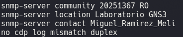

Verificación del servicio SNMP activo en Switch1, con la comunidad `20251367` registrada como `active` y estadísticas reales de paquetes SNMP procesados:

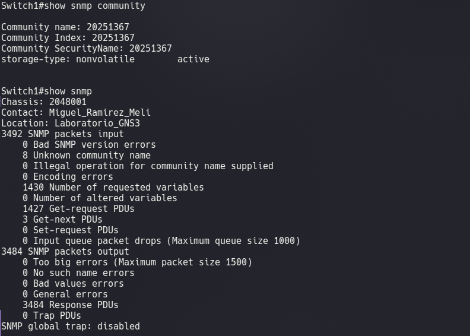

---

## 3. Servidor DHCP para la red LAN — Cliente en Windows10-1

Windows10-1 recibiendo dirección IP automáticamente desde el pool DHCP configurado en Router1:

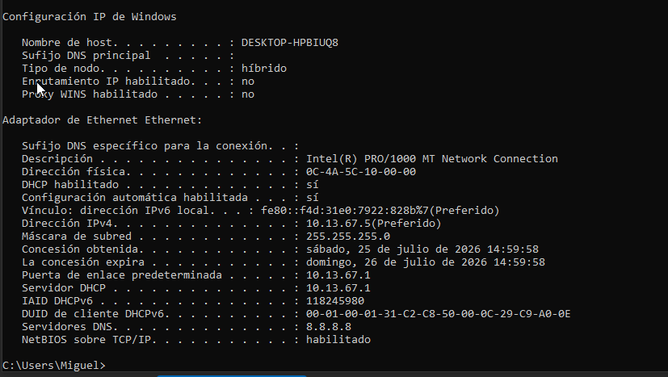

---

## 4. Verificación de datos SNMP desde el PC Cliente

Consulta SNMP (Walk) realizada desde iReasoning MIB Browser hacia Router1, mostrando datos reales como `sysDescr`, `sysContact`, `sysLocation`, `sysName` y `sysUpTime`:

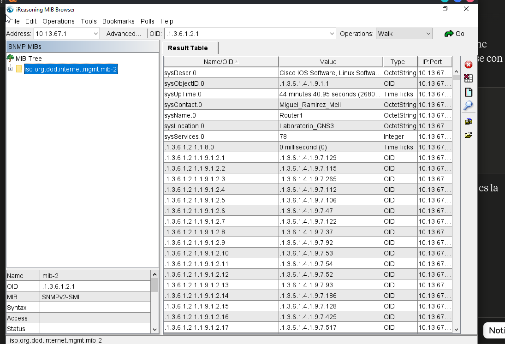

---

## 5. Configuración del Servidor Zabbix

Acceso al frontend web de Zabbix:

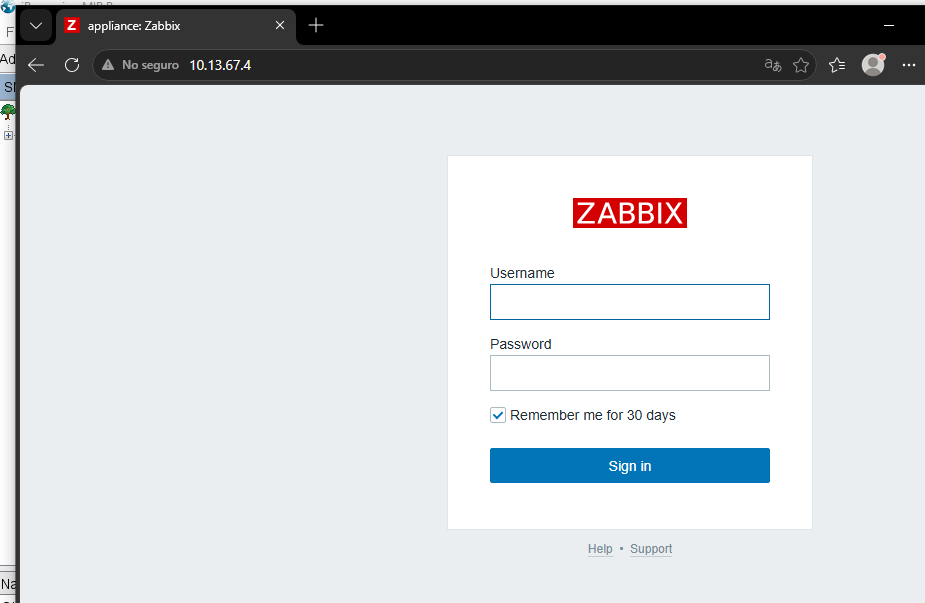

### 5.1 Creación del host Router1

Host `Router1` configurado con su grupo y template `Network Generic Device by SNMP`:

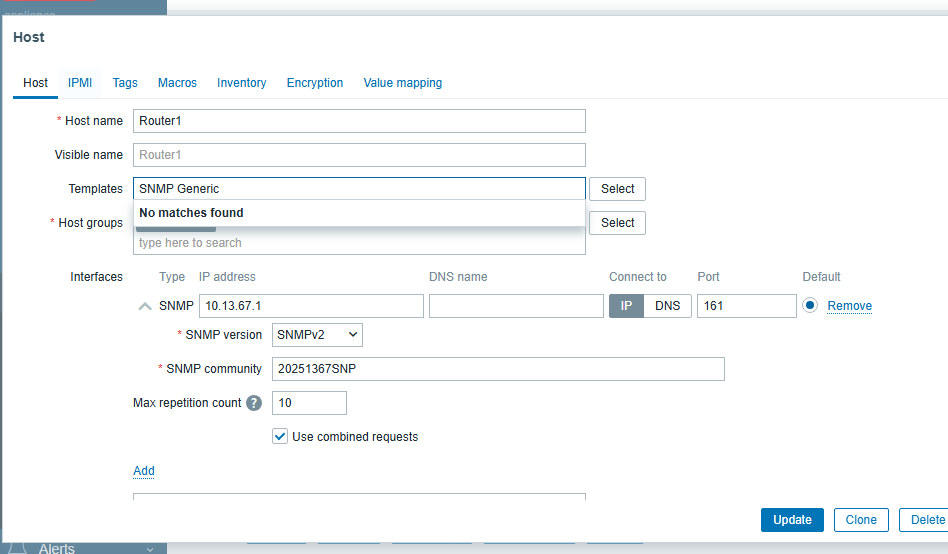

### 5.2 Interfaz SNMP configurada

Interfaz de tipo SNMP asignada a Router1, con versión `SNMPv2` y comunidad `20251367`:

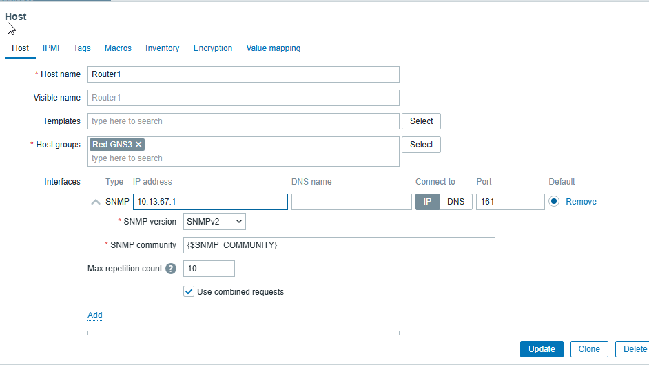

---

## 6. Datos en tiempo real (Monitoring → Latest data)

### 6.1 Switch1 — ítems recolectados por SNMP

Zabbix recolectando datos activos del Switch1 (165 ítems con datos, incluyendo interfaces, componentes de red y sistema):

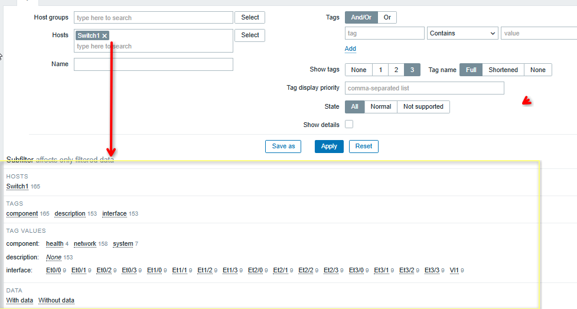

### 6.2 Router1 — ítems recolectados por SNMP

Zabbix recolectando datos activos del Router1 (22 ítems con datos, interfaz Fa0/0 y variables de sistema):

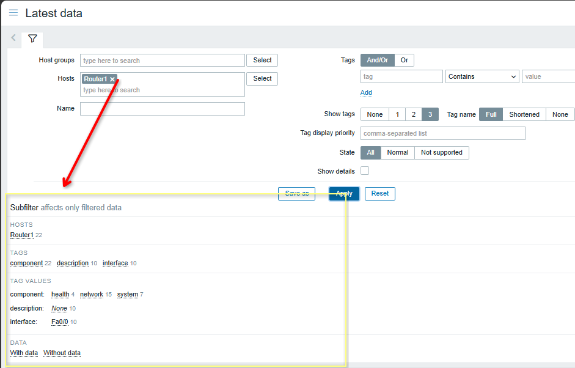

---

## 7. Verificación de eventos del Router y el Switch (Monitoring → Problems)

Eventos reales generados y detectados por Zabbix para ambos dispositivos:

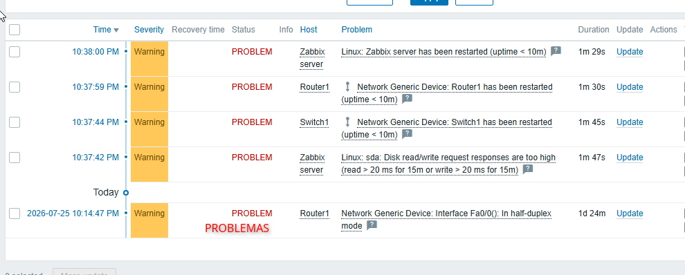

- `Router1: has been restarted (uptime < 10m)`
- `Switch1: has been restarted (uptime < 10m)`
- `Router1: Interface Fa0/0(): In half-duplex mode`

---

## 8. Resumen de cumplimiento

| Requisito | Estado |
|---|---|
| Direccionamiento IP en Router y Switch | ✅ |
| Servidor DHCP para la red LAN | ✅ |
| Comunidad SNMP de solo lectura | ✅ |
| Cliente DHCP en PC | ✅ |
| Verificación de datos SNMP desde el PC | ✅ |
| Servidor Zabbix configurado | ✅ |
| Verificación de eventos del Router y Switch en Zabbix | ✅ |
